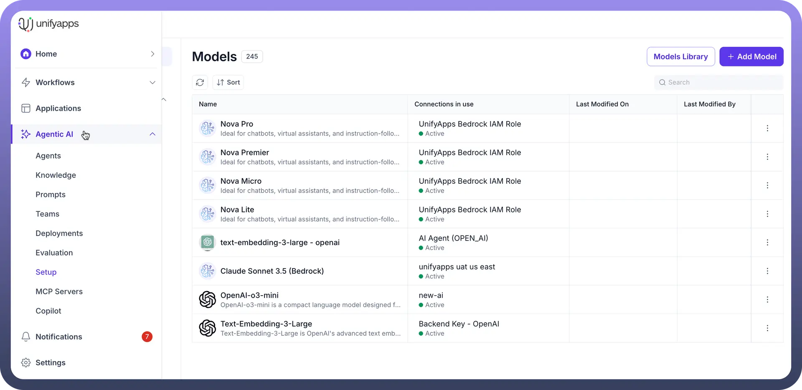
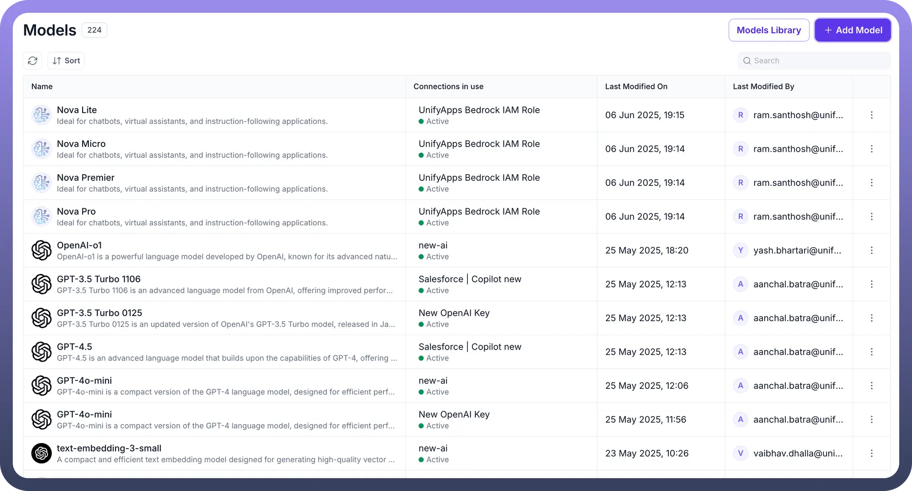
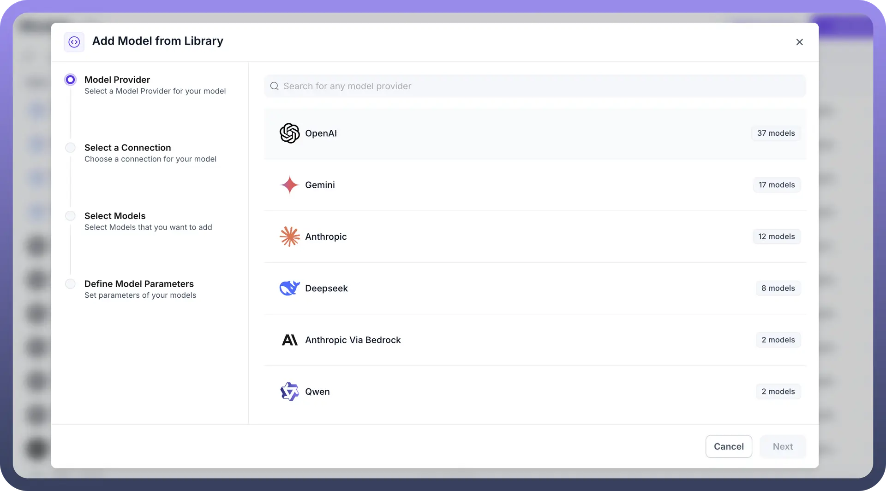
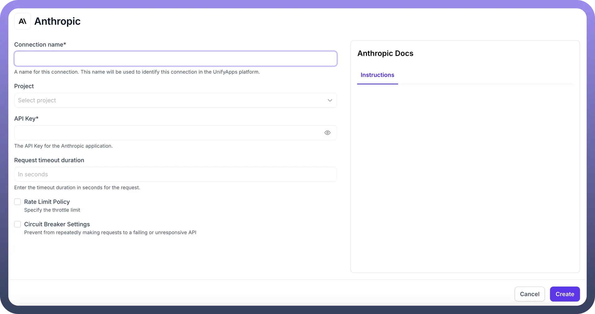
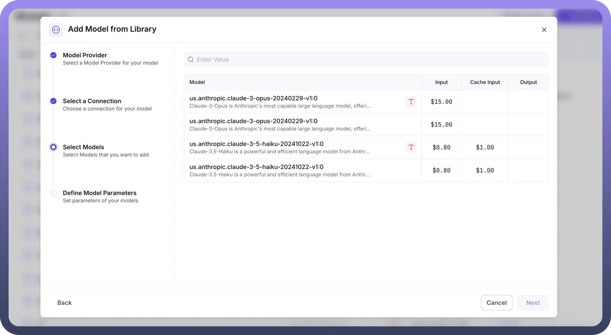
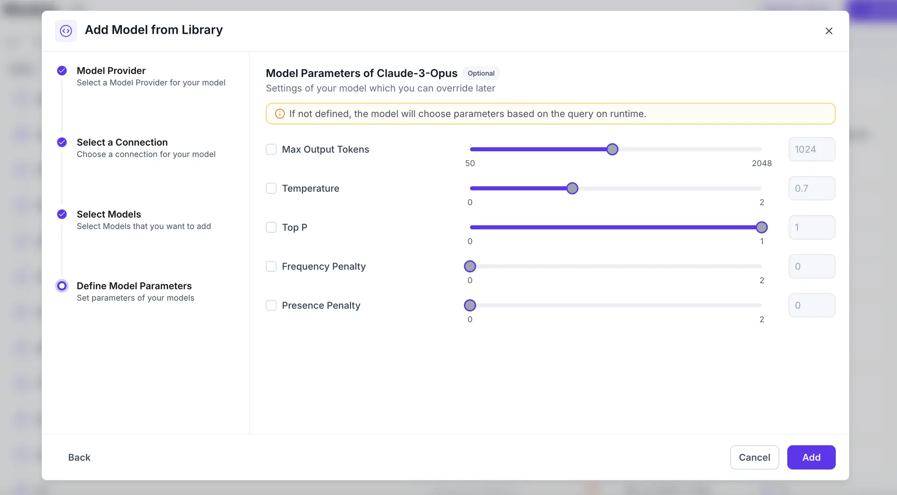

# Add a Model

Source: https://www.unifyapps.com/docs/unify-agentic-ai/add-a-model
Section: agentic-ai

---

## Overview

The UnifyApps Models provides a comprehensive collection of enterprise models, enabling organizations to easily access, implement, and customize AI capabilities within the UnifyApps platform. This article will guide you through the process of adding a new model to your UnifyApps environment.

## Accessing the Models

To begin, navigate to the `Setup` section within the UnifyApps platform. You should see a dashboard displaying a list of currently available models.

## Understanding the Models Interface

The Models interface is designed for easy navigation and management of your AI models:

- **Search Bar:** Allows you to search for specific models.
- **Filter and Sort Options:** You can filter models by various criteria and sort them to find what you need.
- **Model Categories/Providers:** Models are categorized by their providers, such as OpenAI, Gemini, Anthropic, Deepseek, AI Anthropic Via Bedrock, and Qwen. Each category displays the number of models available under that provider.

## Adding a New Model

To add a new model, follow these steps:

**Step 1: Choose Model Provider**

From the Models screen, click on the `+ Add Model` button. This will open the `Add Model from Library` wizard. Under the `Model Provider` section, select the desired provider for your model. Options include:

- OpenAI
- Gemini
- Anthropic
- Deepseek
- AI Anthropic Via Bedrock
- Qwen

**Step 2: Select a Connection**

After choosing a Model Provider, you will need to select a connection for your model. A connection links your UnifyApps environment to the external AI model service. You can choose an existing connection. If an appropriate connection doesn't exist, you might need to create a new one. For example, when setting up an `AI Anthropic` connection, you would provide a connection name, project, API Key, and set request timeout duration and rate limit policies. Connections often involve authentication types such as Access Token, JWT Auth, OAuth 2.0, Basic, or Custom.

**Step 3: Select Models**

Once a connection is established, proceed to the `Select Models` step. Here, you can choose the specific models from the selected provider that you wish to add to your library. The interface will display a list of available models with details such as input and output costs if applicable. For instance, if Anthropic is your chosen provider, you might see models like `us.anthropic.claude-3-opus-20240229-v1:0` or `us.anthropic.claude-3-5-haiku-20241022-v1:0.`

**Step 4: Define Model Parameters**

The final step is to `Define Model Parameters`. In this section, you can set various parameters for the models you are adding, configuring them to suit your specific application needs. If parameters are not explicitly defined, the model will choose them based on the query at runtime. Examples of common parameters you might adjust include:

- **Max Output Tokens:** Controls the maximum length of the model's response.
- **Temperature:** Influences the randomness of the output; higher values lead to more creative responses.
- **Top P:** A sampling parameter that controls the diversity of the output.
- **Frequency Penalty:** Reduces the likelihood of the model repeating common words or phrases.
- **Presence Penalty:** Controls the model's tendency to introduce new topics.

