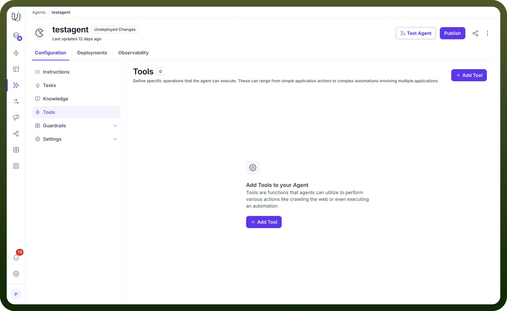
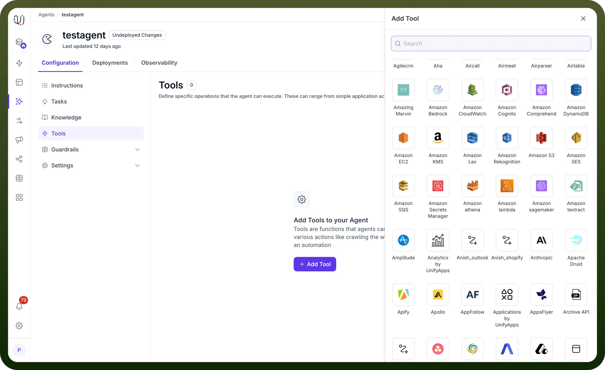

# Add new tool

Source: https://www.unifyapps.com/docs/unify-agentic-ai/add-new-tool
Section: agentic-ai

---

UnifyApps provides a streamlined interface for enhancing your AI Agent's capabilities by adding tools that can execute various actions, from web crawling to complex automation workflows. The platform's intuitive design ensures you can expand your agent's functionality with just a few clicks. Let's walk through the process of adding tools to empower your AI Agent.

## Understanding the Tools Interface

When you access your AI Agent's configuration, you'll find the Tools section prominently displayed. This area shows:

- A counter indicating the current number of tools (shown as "0" when empty)
- A clear description explaining that tools enable your AI agent to perform specific operations
- An easily accessible "+ Add Tool" button to begin the enhancement process

## Steps to Add a New Tool

1. **Access the Tools Section**: Navigate to your AI Agent's configuration page and locate the Tools area, which provides a dedicated space for managing your agent's executable capabilities.
2. **Initiate Tool Addition**: Click the prominent "+ Add Tool" button (displayed in purple) to open the tool selection interface.
3. **Explore Available Options**: The system presents you with a comprehensive library of tools and integrations. You'll notice the description mentions that "Tools are functions that agents can utilize to perform various actions like crawling the web or even executing an automation."
4. **Select Your Desired Tool**: Choose from the extensive catalog of pre-built integrations and tools based on your specific needs.

  

5. **Configure Tool Parameters**: Once selected, configure the tool's specific settings, including:
  - Input parameters and variables
  - Authentication credentials (if required)
  - Workflow triggers and conditions
  - Output handling and data mapping

## Types of Tools Available

UnifyApps supports a wide range of tool categories:

- **Web Operations**: Tools for crawling websites, extracting data, and monitoring online resources
- **Automation Workflows**: Complex multi-step processes that can include branching logic, loops, and conditional execution
- **API Integrations**: Direct connections to third-party services and platforms
- **Data Processing**: Tools for transforming, analyzing, and manipulating information
- **Communication Tools**: Integrations for sending notifications, emails, or messages
- **Custom Automations**: Workflows built using UnifyApps' no-code automation builder

## Best Practices for Tool Implementation

1. **Start with Essential Tools**: Begin by adding tools that address your most common use cases
2. **Test in Isolation**: Verify each tool works correctly before combining them in complex workflows
3. **Monitor Performance**: Keep track of tool execution times and success rates
4. **Document Tool Purpose**: Maintain clear descriptions of what each tool does for future reference
5. **Version Control**: Track changes to tool configurations for easy rollback if needed

## Maximizing Tool Effectiveness

- **Chain Tools Together**: Create powerful workflows by connecting multiple tools in sequence
- **Use Context Wisely**: Pass relevant conversation context to tools for more accurate results
- **Implement Fallbacks**: Ensure your AI Agent can still function if a tool fails
- **Regular Maintenance**: Update tool configurations as APIs and requirements change
- **User Feedback Integration**: Refine tools based on actual usage patterns and user needs

## Common Use Cases

1. **Customer Support**: Tools that create tickets, check order status, or update customer records
2. **Sales Automation**: Lead qualification, CRM updates, and proposal generation
3. **Research & Analysis**: Web scraping, data aggregation, and report generation
4. **Content Creation**: Tools that generate, format, or publish content across platforms
5. **Workflow Automation**: Complex business process automation spanning multiple systems

By strategically adding tools to your AI Agent, you transform it from a conversational interface into a powerful automation engine. The intuitive interface ensures that even complex integrations remain manageable, allowing you to focus on creating value rather than wrestling with technical implementation.
