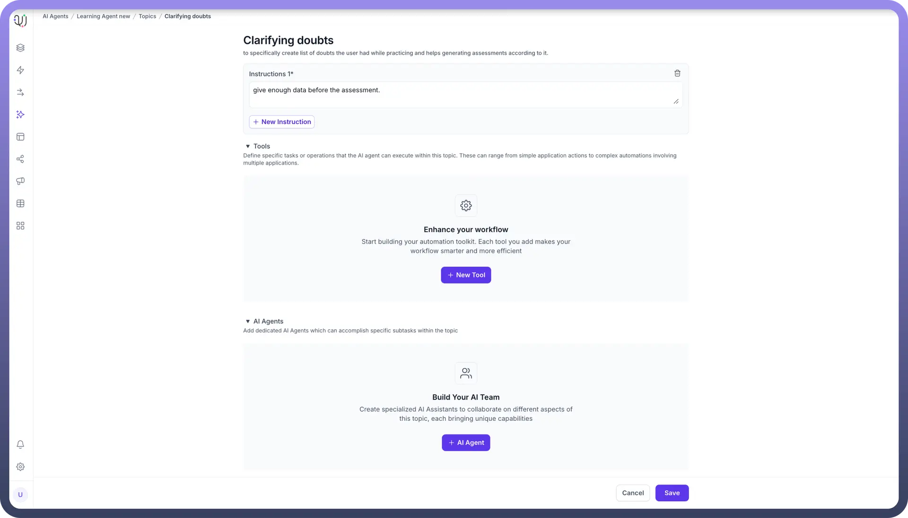
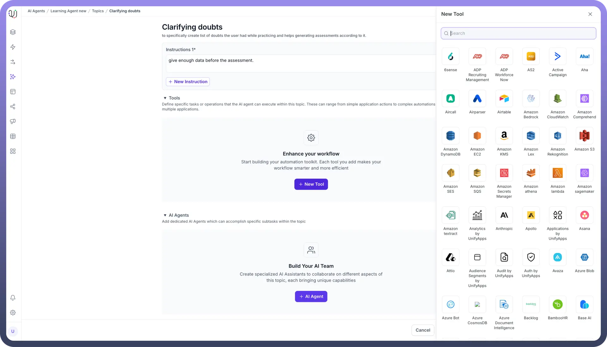

# Adding Tools to your Tasks

Source: https://www.unifyapps.com/docs/unify-agentic-ai/adding-tools-to-your-tasks
Section: agentic-ai

---

UnifyApps provides an intuitive interface for adding tools to enhance your AI Agent's capabilities with just a few clicks. Each task has a dedicated section for tools, where you can define specific operations to be executed by the agent within that task's context. Let's explore how to leverage this feature to maximize your AI Agent's potential.

## Steps to Add Tools

1. **Navigate to Your Task**: Access the desired task within your AI agent's configuration.
2. **Locate the Tools Section**: Scroll down to find the "`Tools`" area, where you'll define the agent's executable tasks.
3. **Initiate Tool Creation**: Click the "`+ New Tool`" button to begin adding a new capability to your task.

  

4. **Choose from a Wide Array of Integrations**: UnifyApps offers a diverse selection of pre-built integrations, ranging from popular services like ADP, Amazon Web Services, and Asana, to specialized tools like Aircall and Apollo.

  

5. **Configure Your Tool**: Once you've selected an integration, you'll be able to set up the specific parameters and workflows for that tool within your task. The platform supports complex multi-step agentic workflows built using our automation builder, which includes advanced logic capabilities such as branching, looping, conditional processing, and parallel execution. The system can handle distributed execution for asynchronous operations and in-memory execution for immediate responses. These multi-step agentic workflows can then be plugged in behind agentic apps that can be built using our no code application builder.

For Example, Automated Customer Support Ticket Creation In a "Customer Support" task, you could add a task to automatically create a support ticket when a customer reports an issue. Using the Zendesk integration, configure the "Create Ticket" tool with parameters like subject, description, priority, and tags. Set up input variables to capture necessary information from the user during the conversation. When implemented, this tool allows your AI agent to instantly log customer issues in Zendesk, streamlining the support process without immediate human intervention. This simple yet effective tool demonstrates how integrating specific tasks can significantly enhance your AI agent's functionality and improve customer service efficiency.

## Best Practices for Adding Tools

1. Align with Task Goals: Ensure each tool you add directly contributes to the task’s overall purpose.
2. Start Simple: Begin with basic tools and gradually increase complexity as you become more familiar with the system.
3. Consider User Needs: Add tools that streamline processes and enhance user satisfaction.
4. Test Thoroughly: After adding tools, rigorously test your AI agent to ensure proper functionality.
5. Regular Updates: Continuously refine and add new tools to keep your AI agent current and effective.

## Benefits of Well-Implemented tools

- Enhanced Functionality: Expand your AI agent's capabilities across various platforms and services.
- Improved Efficiency: Automate complex workflows, reducing the need for manual intervention.
- Greater Accuracy: Predefined tools ensure consistent and accurate task execution.
- Scalability: Easily manage and update your AI agent's capabilities as your business needs evolve.

By thoughtfully adding and managing tools within your tasks, you can create sophisticated AI agents capable of handling intricate tasks across multiple platforms. The UnifyApps interface makes this process accessible, allowing you to build powerful, custom-tailored AI solutions for your specific business needs.

Remember, the key to successful tool implementation lies in understanding your users' needs and aligning your AI agent's capabilities accordingly. With UnifyApps' extensive integration options, you're well-equipped to create an AI agent that can truly revolutionize your business processes.

Now, the next step is to add a prompt to the AI Agent. Read the next article to learn about it.
