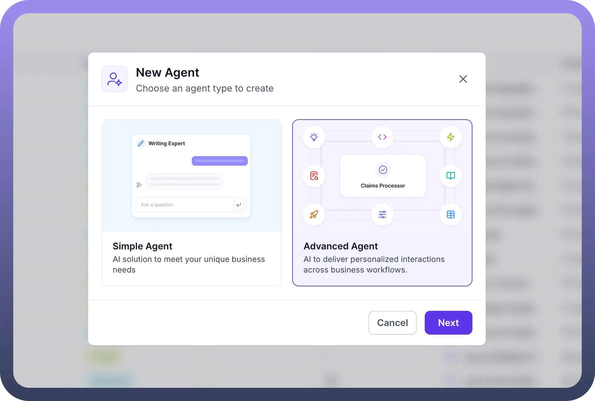
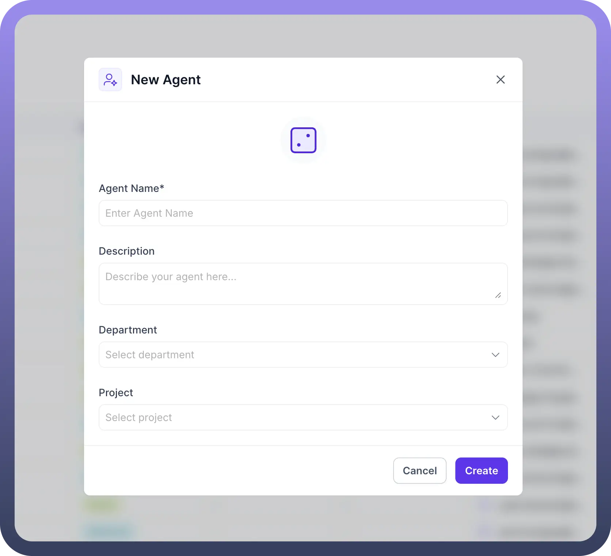
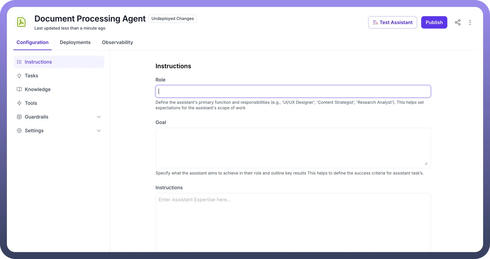
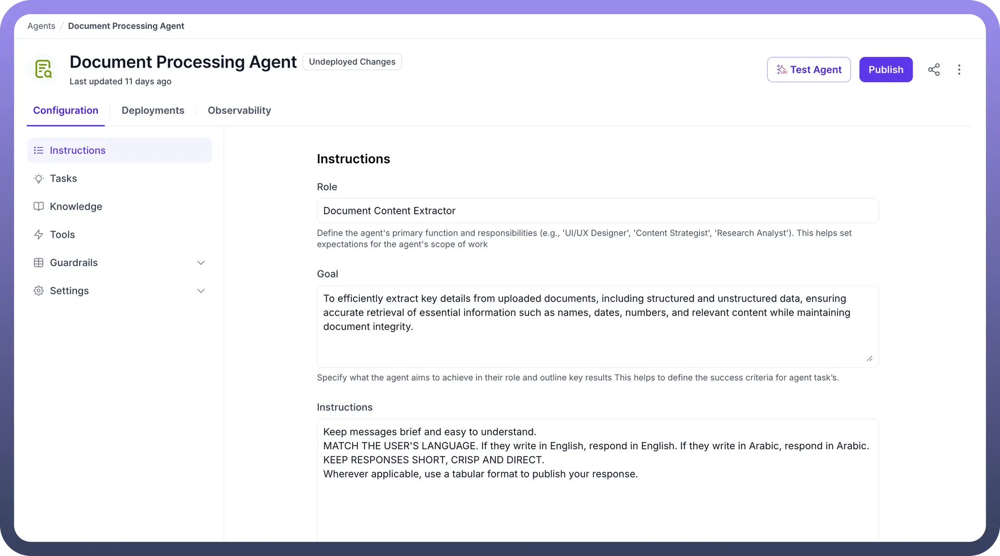
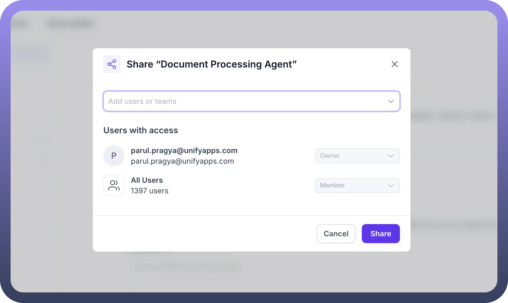
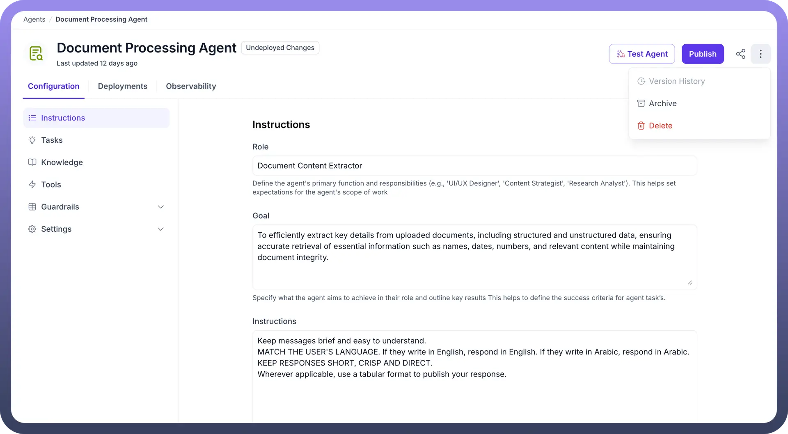

# Advanced Agent

Source: https://www.unifyapps.com/docs/unify-agentic-ai/advanced-agent
Section: agentic-ai

---

### Configure an Advanced Agent

Let’s create your first AI Agent by following these easy steps:

1. Click on the `Agents` option in the left sidebar of your UnifyApps dashboard in the Unify AI category.
2. On the Agent page, click on the `+ New Agent` button on the top right. This will prompt you to create a new AI Agent.

  

3. Give a name to your agent and assign it to a certain department if you have any and click on the `Create` button.

  

4. Here’s how your AI Agent's landing page will look like.

  

5. Configure `Role`**:** Define the agent's primary function and responsibilities (e.g., 'UI/UX Designer', 'Content Strategist', 'Research Analyst'). This helps set expectations for the agent's scope of work
6. Define `Goal`: Specify what the agent aims to achieve in their role and outline key results This helps to define the success criteria for agent task’s.
7. Set Up `Instructions`**:** Provide background context and instructions related to your agent's expertise.

  

8. Configure `Tasks`: Tasks define different journeys allowing you to structure different flows your agent can execute. **Note:** You can refer to [Setup Task](https://www.unifyapps.com/docs/unify-agentic-ai/setup-tasks) article to know more about it.
9. Set Up `Knowledge Base`: Navigate to **Knowledge** section and add your data sources (documents, databases, APIs) to your agent. **Note:** You can refer to the [Knowledge Base Configuration](https://www.unifyapps.com/docs/unify-agentic-ai/integrate-knowledge-base) article for detailed configuration.
10. Configure `Tools`: Go to **Tools** section and connect required external tools and APIs. **Note:** Refer to the [Tools](https://www.unifyapps.com/docs/unify-agentic-ai/configure-tools)article for detailed configuration steps.
11. Set Up `Guardrails`: Navigate to **Guardrails** section and configure safety controls and quality thresholds. **Note:** You can refer to the [Guardrails Configuration](https://www.unifyapps.com/docs/unify-agentic-ai/guardrails-overview) article for comprehensive setup guidance.
12. Click on `Settings` in the left sidebar and configure:
  - **Indexing**: Set up data indexing and search optimization.
  - **Pre Processing**: Configure input data cleaning and preparation.
  - **Response Generation**: Adjust output formatting and generation parameters.
  - **Prerequisite Actions**: Set up required actions before agent execution. **Note:** You can refer to [Advanced Settings](https://www.unifyapps.com/docs/unify-agentic-ai/settings-overview) documentation to know more about it.
13. You can also add multiple users as collaborators to the AI Agent by clicking on `Share Symbol` where you will get an option to provide Admin, Viewer or Editor access to the users.

  

14. You can publish the agent with your changes by clicking on the `Publish` .
15. You can control version using version history by clicking on the 3 dots on the top right and selecting your desired version from `Version history`.

  
