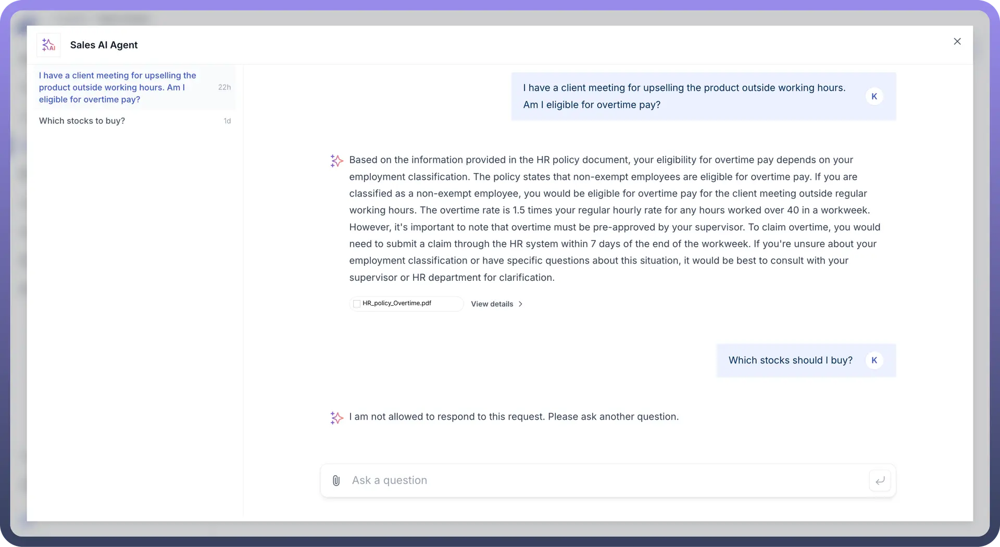
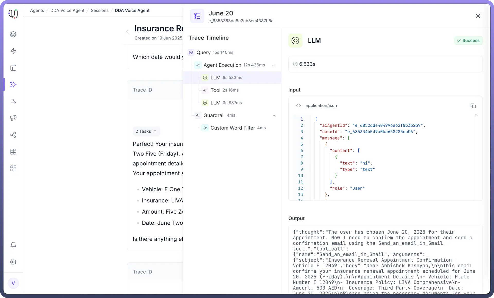
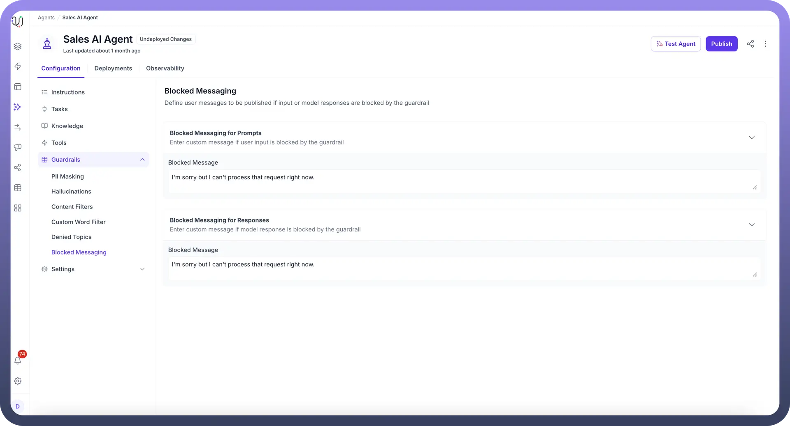

# Blocked Messaging

Source: https://www.unifyapps.com/docs/unify-agentic-ai/blocked-messaging
Section: agentic-ai

---

Blocked Messaging in AI Agents allows you to define custom messages when user input queries or AI responses are blocked by guardrails. This ensures smooth communication, even when certain content is restricted, by providing clear and predefined explanations to the user.

**Key Parameters**:

- `Blocked Messaging for Prompts` : Configured messages are displayed when a **user's input** is blocked by the guardrails, informing them why their request can't be processed.
- `Blocked Messaging for Responses` : Configured messages are displayed when an **agent’s response** is blocked due to violating guardrail rules, ensuring the user is aware of the limitation.

To illustrate, let's look at the example given below.

**Reference:** Added a denied topic named "Stocks and Investment Advice"
**User Input:** "Which stocks should I buy?" 
**Blocked Message:** "I am not allowed to respond to this request. Please ask another question."

## How to Configure Blocked Messaging in your AI Agent?

1. From the Guardrails section in your AI Agents Dashboard, click on “`Blocked Messaging`”.
2. In the Blocked Messaging for Prompts field, enter a custom message that will be displayed to users when their input is blocked. For example: “I’m sorry, but I can’t help with this particular request. Could you rephrase it?”
3. Similarly, under Blocked Messaging for Responses, write a message that the AI agent will show when its response is restricted. For example: “I’m sorry but I can't process that request right now”

  

4. Once your custom messages are defined, save the settings to ensure the AI agent uses them whenever inputs or responses are blocked.

By configuring Blocked Messaging, AI Agents can handle restricted interactions professionally, maintaining a seamless user experience even when certain content is filtered out by the system.

These guardrail components in AI Agent by UnifyApps help maintain safe, ethical, and compliant AI operations, ensuring that the AI Agents deliver controlled, accurate, and brand-aligned interactions.
