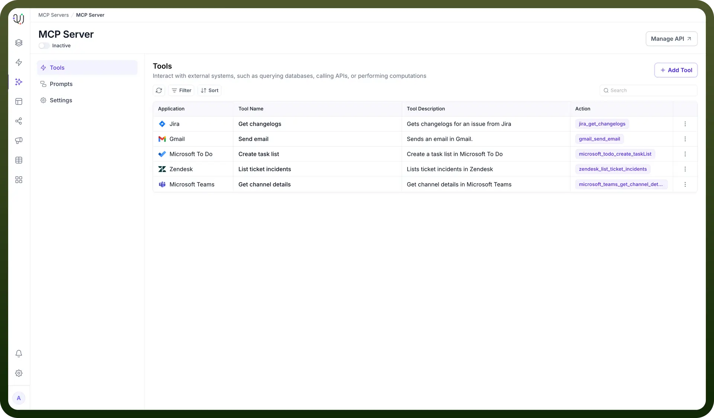
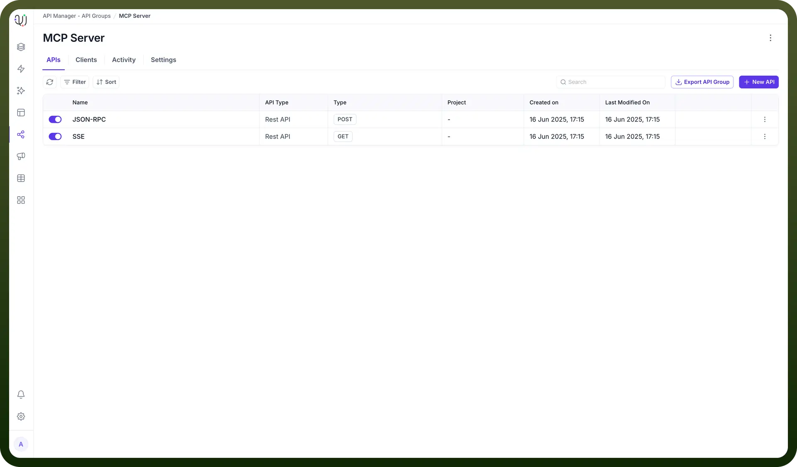

# Configure MCP Servers

Source: https://www.unifyapps.com/docs/unify-agentic-ai/configure-mcp-servers
Section: agentic-ai

---

## Overview

MCP establishes a model-agnostic universal interface for functionalities such as reading files, executing functions, and handling contextual prompts, thereby standardizing context exchange between AI assistants and software environments. Architecturally, MCP is built upon JSON-RPC 2.0 and re-uses message-flow concepts from the Language Server Protocol (LSP), which ensures a unified and consistent framework for interactions between AI applications and external resources. The protocol defines specifications for critical aspects including data ingestion and transformation, contextual metadata tagging, model interoperability across platforms, and the establishment of secure, two-way connections between data sources and AI-powered tools.

**UnifyApps' Core Positioning and Strategic Leverage of MCP**

UnifyApps, fundamentally powered by our Integration Platform as a Service (IPaaS) platform, is uniquely positioned to leverage the Model Context Protocol. This core IPaaS capability provides a robust, scalable, and secure environment essential for connecting AI models to diverse enterprise systems and data sources. By integrating MCP, UnifyApps transforms these existing integration capabilities into a standardized format for AI interaction.

## UnifyApps as a Comprehensive MCP Server and Tool Provider

**Detailed Functionality of UnifyApps as an MCP Server**

UnifyApps provides a dedicated section for the creation and management of Model Context Protocol (MCP) Servers within the Agentic AI Module. Leveraging its robust IPaaS capabilities, UnifyApps facilitates the creation of these MCP Servers using an extensive library of over 600 Out-of-the-Box (OOTB) Connectors, in addition to supporting custom in-house APIs that are connected to the UnifyApps Platform. This comprehensive connectivity ensures that virtually any enterprise system or data source already integrated with UnifyApps can be seamlessly exposed as an MCP-compliant resource or tool .

Furthermore, UnifyApps incorporates robust authentication mechanisms that can be directly applied to the MCP server instances created within the platform, enhancing security and ensuring that only authorized AI clients or systems can invoke the exposed MCP servers. The MCP servers configured within UnifyApps offer significant operational flexibility; they can be invoked externally by any MCP-compliant client outside the UnifyApps platform, or they can be consumed internally within other UnifyApps workflows or agentic systems, thereby fostering internal reusability and modularity.

**Exposing Workflows and Specific Nodes as MCP-Compliant Tools**

UnifyApps platform is engineered to facilitate the sharing of its powerful workflow capabilities as reusable AI tools. This is achieved by enabling the exposure of entire workflows, or even specific nodes contained within a workflow, as tools that are accessible via the MCP standard. This capability is critical for promoting modularity and reusability of AI components across disparate systems. By standardizing the exposure of these capabilities, UnifyApps empowers organizations to share specialized AI functions, integrations, or automations with partners or other internal and external systems in a universally understood format. This directly supports MCP's overarching goal of enabling developers to build secure, two-way connections between their data sources and AI-powered tools.

## Steps For Creating Custom MCP server

1. In the UnifyApps AI platform, head over to the MCP tab and create your own MCP server by clicking on `Add new MCP`. After that you can add the required tools you want to access using MCP protocol using the `Add Tool` button. You can also customize prompts and settings.

  

2. Then head over to Manage API to expose this MCP server as an API and manage it using UnifyApps API manager.

  

3. Now you can create new APIs or export API group for exposing this MCP server and to use it as an API. You can also manage Client, Activity and settings to fine-tune it according to your specific use case.

## Listing and Consuming Available Tools via "MCP by UnifyApps" Node

UnifyApps features a dedicated `MCP by UnifyApps` node, which functions as a centralized point within the UnifyApps environment for users to discover and access a comprehensive list of tools available for use within their agentic AI systems. This node directly leverages the capabilities of the MCP standard to provide this consolidated tool listing. Consequently, tools exposed by external MCP servers, as well as UnifyApps' own exposed workflows and nodes, can be cataloged and made available through this single point, streamlining their integration into AI agent workflows.

This multifaceted approach positions UnifyApps as a comprehensive MCP hub. The platform's ability to host MCP servers, expose its internal capabilities as MCP tools, and consume and discover tools from other MCP servers creates a complete solution for AI tool integration. This comprehensive capability makes UnifyApps an effective "MCP marketplace" or an ecosystem enabler for its clients. It simplifies the entire lifecycle of AI tool integration—from the creation and exposure of internal tools to the discovery and utilization of external ones—all within a single, secure platform. This significantly reduces the complexity and development overhead for enterprises aiming to build sophisticated agentic AI systems.

The "`MCP by UnifyApps`" node, in particular, serves as a gateway to agentic AI scalability. By centralizing tool discovery and management, it directly addresses a core challenge in scaling AI agents. While MCP itself standardizes tool integration, UnifyApps' dedicated node streamlines this process for developers constructing multi-tool agents and complex, agent-based workflows. The fact that UnifyApps can also expose its own automations as an MCP server means this node can evolve into a rich, internal catalog of enterprise-specific AI capabilities, further simplifying the underlying complexity of tool integration for AI developers.

## Secure Connectivity within the MCP Ecosystem

**Configurable URLs and Robust Authentication for Secure Tool Exposure**

UnifyApps offers a robust API Platform specifically engineered for the secure exposure of AI capabilities and workflows. This platform ensures that any AI-powered process or tool exposed through UnifyApps adheres to enterprise-grade security standards. Users are provided with extensive flexibility to expose workflows as APIs to external entities, complete with fully customizable URLs and RESTful endpoints. This capability facilitates seamless integration with diverse external systems while allowing for consistent branding and structured access.

The platform integrates comprehensive access control mechanisms, which include granular authentication controls, rate limiting to prevent abuse and manage system load, and quotas to enforce usage policies. These configurations are meticulously designed to ensure secure and controlled access to all exposed tools, aligning with MCP's inherent emphasis on establishing secure connections. Furthermore, UnifyApps' API Platform captures detailed analytics for each exposed endpoint. This provides invaluable monitoring of usage patterns, performance metrics, and other critical indicators essential for effective governance and optimization of AI services. The system also supports configurable alerts for critical and warning thresholds, enabling proactive management and operational oversight of exposed tools.

**Advanced Authentication for Connecting to External MCP Servers**

UnifyApps possesses the inherent capability to expose MCP servers through its advanced API Manager. This manager is designed to support a wide array of authentication types, ensuring compatibility with the diverse security requirements of external MCP servers and providing robust security for UnifyApps' own exposed MCP servers. The platform supports industry-standard authentication protocols, including JSON Web Token (JWT) for secure, compact, and URL-safe transmission of information; OAuth 2.0 for delegated authorization, enabling third-party applications to obtain limited access to HTTP services; Basic Auth, a simple and widely supported authentication scheme; and Custom Authentication, for scenarios requiring bespoke security mechanisms tailored to specific client or server needs.

**Leveraging Server-Sent Events (SSE) for Real-time Communication**

UnifyApps utilizes Server-Sent Events (SSE) for real-time, unidirectional communication, specifically leveraging the Model Context Protocol for this purpose. SSE is a lightweight protocol that enables a server to push data updates to a client over a single HTTP connection, making it highly efficient for streaming data. This architectural choice ensures low-latency updates by streaming data efficiently from backend services to the frontend. For dynamic AI interactions, where timely context and tool outputs are crucial for effective agent behavior, SSE provides a superior mechanism compared to traditional polling methods, minimizing latency and overhead.

The real-time communication capabilities facilitated by SSE are fundamental to supporting seamless interaction with multiple AI models and autonomous agents. This architectural decision is not merely a technical detail but a foundational element that enables the performance and responsiveness required for sophisticated, autonomous AI agents. It allows for dynamic context updates, immediate delivery of tool outputs, and highly responsive agent behavior, which are critical for complex agentic AI workflows and chain-of-thought reasoning over distributed resources. UnifyApps' adoption of SSE directly contributes to the ability of AI models to reason, act, and collaborate across diverse digital tools securely and efficiently. This capability is particularly advantageous for use cases demanding continuous data streams and rapid feedback loops, thereby pushing the boundaries of what agentic AI can achieve within an enterprise context.

> **Note:** For a comprehensive overview and in-depth understanding of the Model Context Protocol, please refer to the official documentation available at: [https://modelcontextprotocol.io/introduction](https://modelcontextprotocol.io/introduction).
