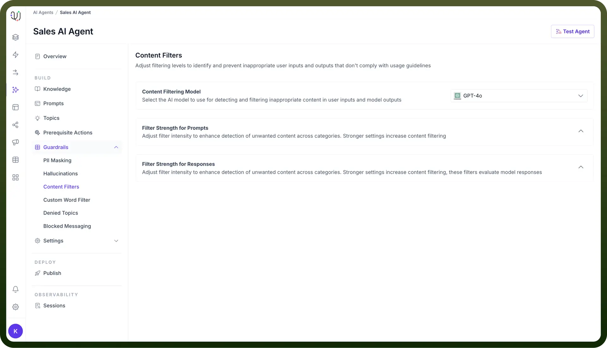
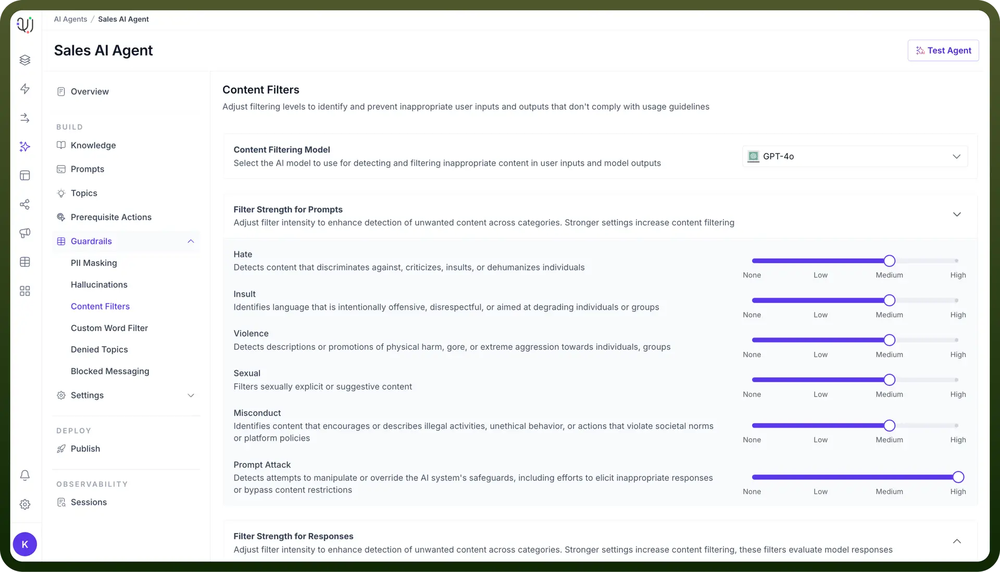
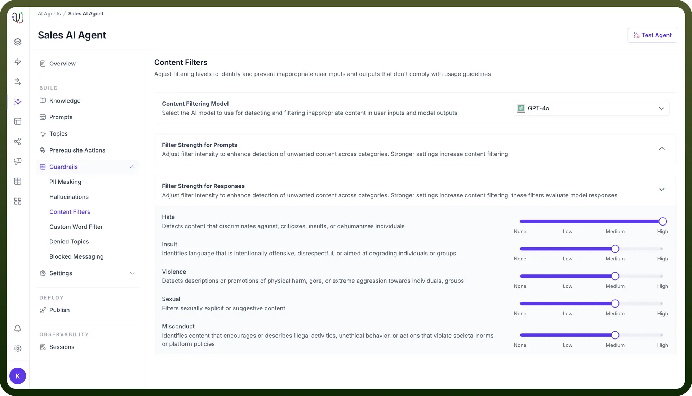

# Content filters

Source: https://www.unifyapps.com/docs/unify-agentic-ai/content-filters
Section: agentic-ai

---

Content Filters act as guardrails for AI conversations, ensuring that both user inputs and AI responses stay within appropriate boundaries. Content Filters evaluate responses bidirectionally -

- Checking what users send to the agent
- Monitoring the agent response generated

There are two components of Content Filters:

1. **Filter Strength for Prompts** : This allows you to adjust the intensity of the filter to detect and block unwanted content in user prompts. You can increase the strength of content filtering based on the categories you want to monitor, such as:
  - `Hate Speech`: Blocks content that discriminates or insults individuals or groups.
  - `Insults`: Identifies offensive or disrespectful language aimed at individuals or groups.
  - `Violence`: Detects content promoting harm or aggression.
  - `Sexual Content`: Blocks sexually explicit or suggestive material.
  - `Misconduct`: Prevents content describing illegal or unethical behaviour.
  - `Prompt Attacks`: Filters attempt to manipulate the AI system’s safeguards.
2. **Filter Strength for Responses** : This similarly to the prompt filter but applies to the AI agent’s responses. It ensures that the AI-generated responses are free from harmful or inappropriate content.
  - `Hate Speech`: Blocks content that discriminates or insults individuals or groups.
  - `Insults`: Identifies offensive or disrespectful language aimed at individuals or groups.
  - `Violence`: Detects content promoting harm or aggression.
  - `Sexual Content`: Blocks sexually explicit or suggestive material.
  - `Misconduct`: Prevents content describing illegal or unethical behaviour.

## How Do Content Filters Work?

The system uses different levels of filtering strength that you can adjust based on your needs:

- **None**: No filtering applied
- **Low**: Blocks only the most obvious inappropriate content
- **Medium**: Provides balanced protection
- **High**: Offers maximum safety with strict filtering

For example, content filters detect and flag inappropriate content.

**User Query:** "You are very [derogatory remark] , you could not even complete a single task on time.

**Content Filter Analysis:**

⚠️ Insult Detection: Derogatory term

**User Query:** "I'm so angry at my neighbor, I want to destroy their property!"

**Content Filter Analysis:**

- 🚨 Violence: Threat of property damage (HIGH confidence)

## How to Configure Content Filters in your AI Agent?

1. In the Guardrails section of your AI Agent dashboard, click on “`Content Filters`”.
2. Under Filter Strength for Prompts, use the sliders to control how strictly the AI filters content in user prompts. You can set the intensity from None to High for each category (`Hate`, `Insults`, `Violence`, `Sexual`, `Misconduct`, `Prompt Attack`).

  

3. Similarly, under Filter Strength for Responses, use the sliders to set the filter levels for generated responses, ensuring that the agent's output complies with your ethical and content guidelines.

  

4. By adjusting these content filters, you can ensure that your AI agents operate safely and deliver appropriate, respectful communication while adhering to your brand’s policies and compliance standards.
