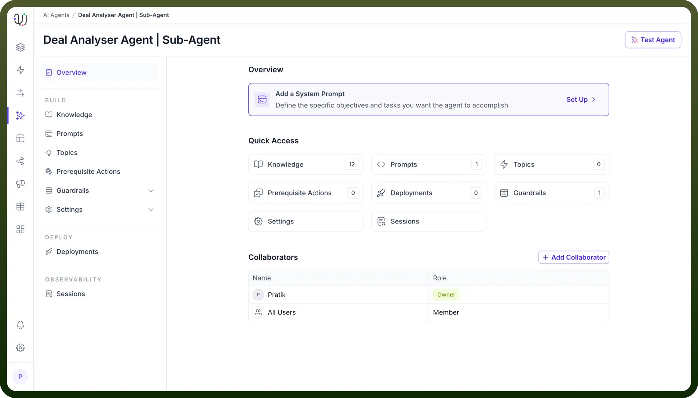
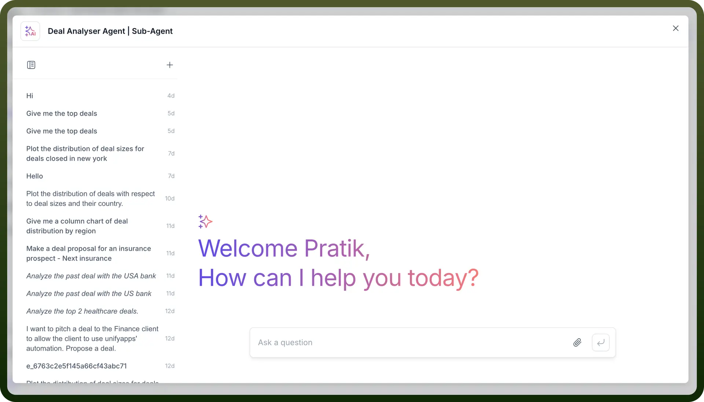
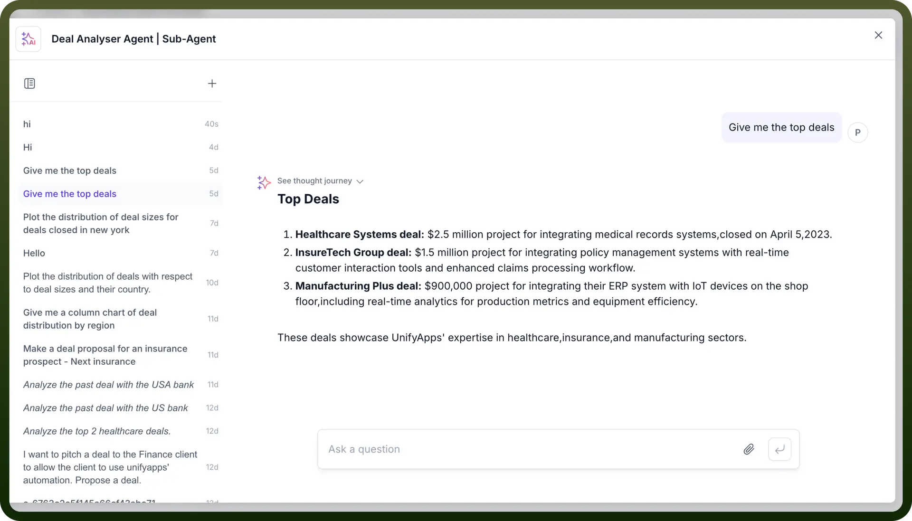

# Conversational Testing

Source: https://www.unifyapps.com/docs/unify-agentic-ai/conversational-testing
Section: agentic-ai

---

The Test Agent feature provides a simple, direct way to validate your AI agent's performance through an intuitive copilot chat interface. This built-in testing capability allows you to interact with your agent to map out its end-to-end journey and verify its behavior before actual deployment.

For Example: Consider an HR Assistant designed to be your employees' 24/7 HR helpdesk - it can instantly answer questions about leave balances, walk employees through benefit enrollment, explain company policies, and help with common HR documentation.

To test the AI Agents, follow these easy steps:

1. Once the agent is published, you can test it by clicking on the “`Test Agent`” button on the top-right.

  

2. A test window will open, simulating a chat interface where you can enter a prompt to interact with the Agent.

  

  

3. After testing the Agent, review its responses. If adjustments are necessary, you can go back to the respective configuration settings (guardrails, indexing, preprocessing, or response generation) to fine-tune the agent's behavior.
4. Once adjustments are made, republish the agent to apply the changes.

By following these steps, you complete the end-to-end process of setting up, publishing, and testing your AI Agent, ensuring it is ready for deployment to assist users effectively.
