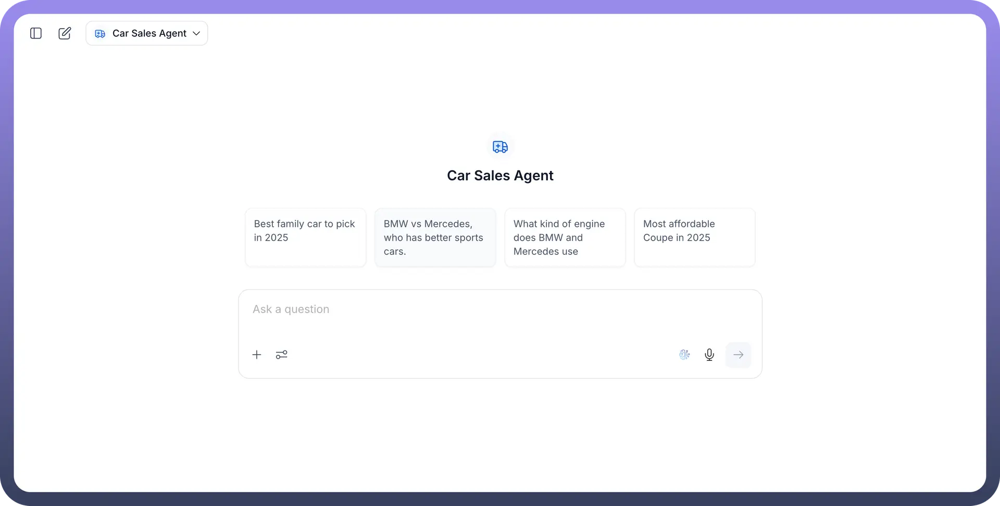
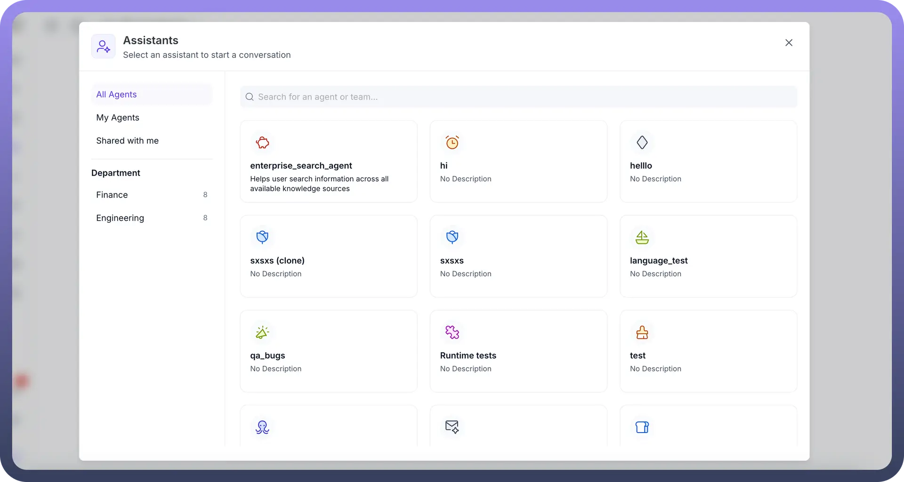
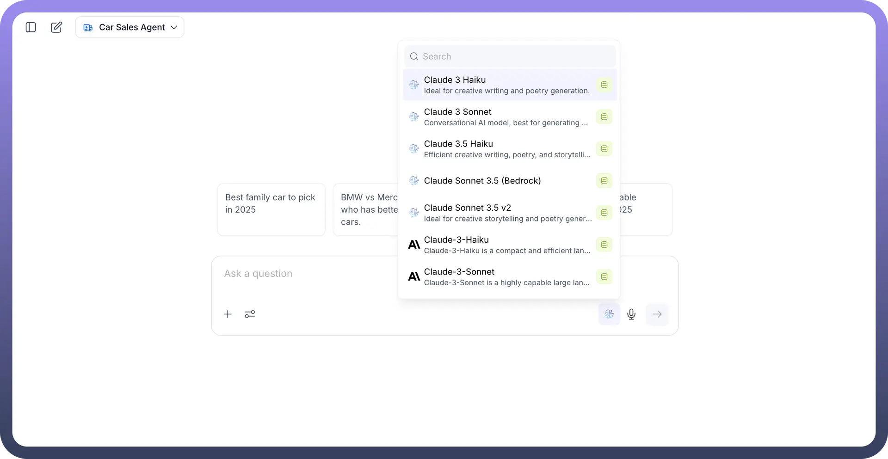
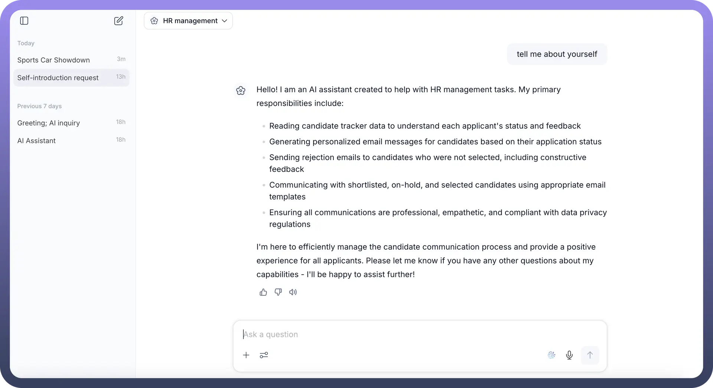
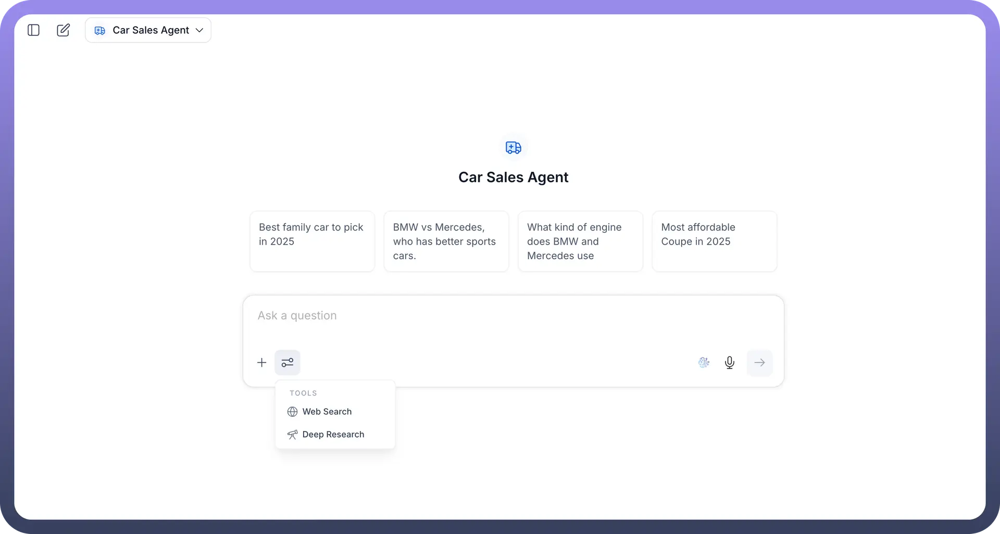

# Overview

Source: https://www.unifyapps.com/docs/unify-agentic-ai/copilot-overview
Section: agentic-ai

---

## Overview

Copilot in UnifyApps acts as a centralized interface, allowing users to access and manage all their agents in a single place. This streamlines workflows by providing a unified environment for interacting with various AI agents, eliminating the need to switch between different interfaces.

## Key Capabilities of Copilot

Copilot offers several key functionalities to enhance your interaction with AI agents:

- **Accessing Multiple Agents & Team of Agents in One Place:** Copilot consolidates all your agents and team of agents, making them easily accessible from a single dashboard. This eliminates the need to navigate to individual agent pages for interaction.

- **Switching Between Agents:** Within Copilot, you can effortlessly switch between different agents. This is particularly useful when you need to consult various specialized agents for different tasks or inquiries.
- **Changing the LLM Model:** Copilot provides the flexibility to change the underlying Large Language Model (LLM) used by an agent. This allows you to experiment with different models to optimize agent performance or explore diverse generative capabilities.

- **Managing Conversations:**
- **New Chat:** You can initiate a new chat session with any selected agent.
- **Chat History:** Copilot maintains a history of your conversations with agents, allowing you to review past interactions and track progress.

- **Uploading Attachments:** Users can upload attachments directly within the Copilot interface, enabling agents to process and respond to queries that require external file context.
- **Using Tools:** Copilot integrates various tools that agents can leverage to perform their tasks. Examples include `Web Search` and `Deep Research` capabilities. Users can customize these tools as needed.

- **Voice Input**: By clicking on the voice icon, you can speak your prompt which will be translated into text for the agent to process.

## Deploying Agents to Copilot

To make an agent available within Copilot, you need to deploy it from the agent's configuration settings. When you create an agent, you'll find an option to publish it, which includes deploying it to Copilot. During the deployment process, you can `Tag this version` of the agent and provide `Version notes` to describe changes. Crucially, there will be a checkbox option, `Deploy this agent on Copilot`, which you must select.

After deployment, agents can be shared with specific users or teams. You can add users or teams to grant them access, and their access level (e.g., `Member`) can be managed.

## Testing Agents

UnifyApps offers two primary ways to test your agents:

- **Testing Individual Agents (Pre-Deployment):** Before deploying an agent to Copilot, you can test it individually. This is done by clicking on 'test the agent' within the agent's configuration interface. This allows you to verify its functionality in isolation.
- **Testing Multiple Agents in Copilot:** Copilot simplifies the testing of multiple agents simultaneously. Instead of selecting and testing each agent individually, Copilot provides a unified interface where you can easily switch between and interact with various deployed agents to observe their collective performance and interactions.
