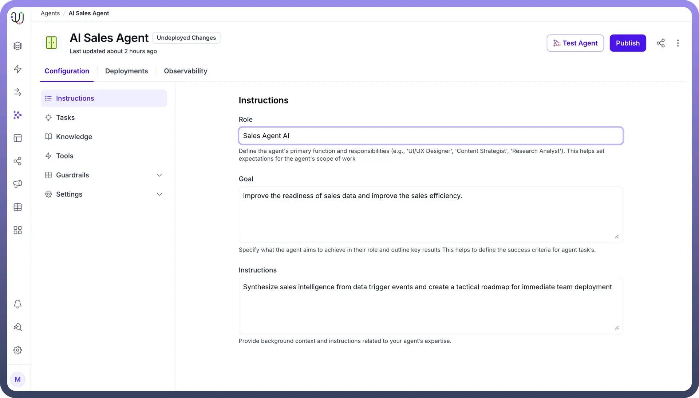
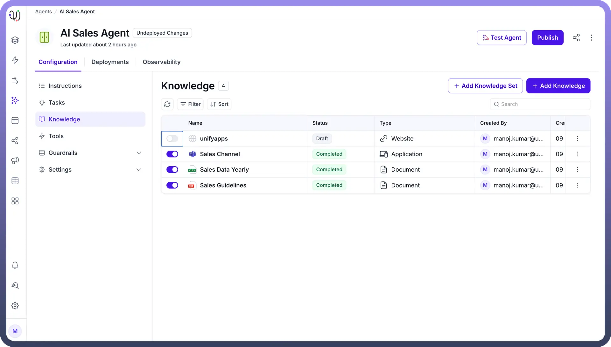
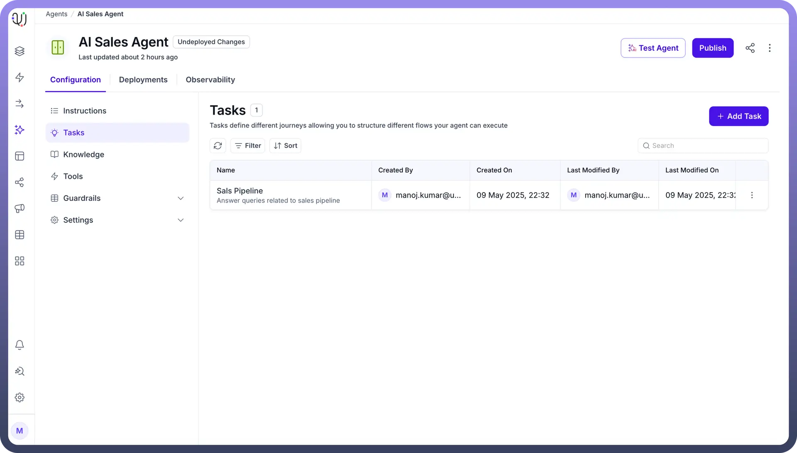
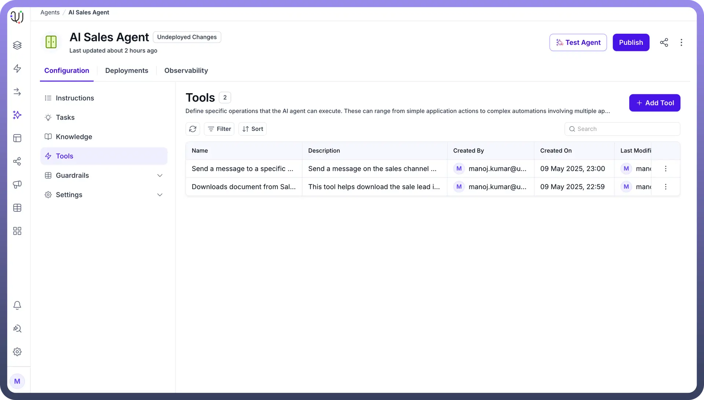
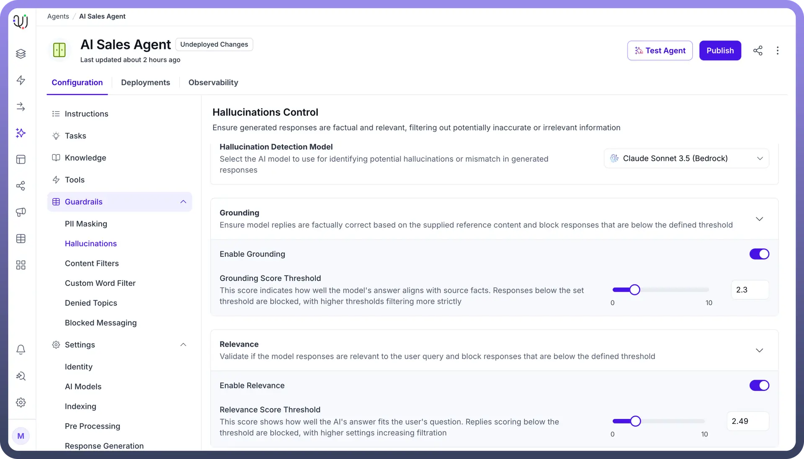
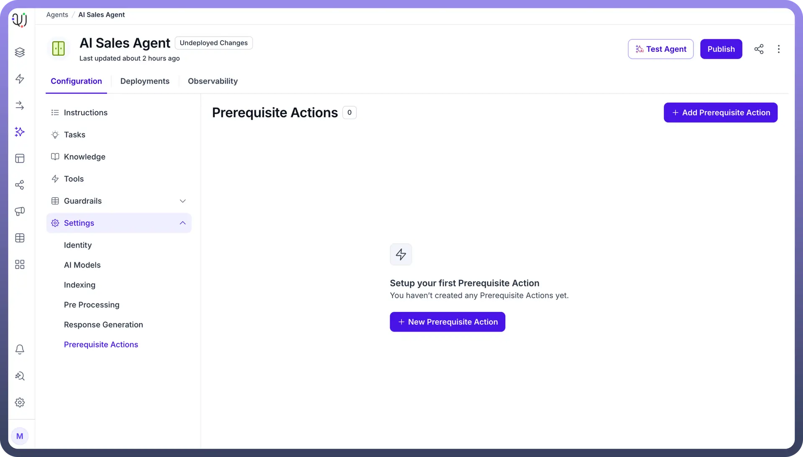

# Create Your First Agent

Source: https://www.unifyapps.com/docs/unify-agentic-ai/create-your-first-agent
Section: agentic-ai

---

At UnifyApps, we've built our AI Agents to work smartly by breaking down complex problems into simple, manageable steps. By following a logical sequence of reasoning, the agents can provide transparent and explainable solutions. To function effectively, agents require access to knowledge, use prompts to format responses, topics to execute actions and guardrails to ensure safe and accurate actions.

To effectively understand AI Agents by UnifyApps, let's go over the basic building blocks.

## Instructions

Our AI agent operates through precise instructions that transform business needs into actionable intelligence. By establishing clear objectives and assigning contextually relevant roles, you provide the agent with its operational identity and purpose. This role-based approach ensures the agent understands both what to accomplish and how to approach tasks with the appropriate expertise. The instruction framework allows for customization of the agent's focus, tone, and methods to align with your specific workflows. Through this strategic direction, your AI assistant becomes a specialized extension of your team, tailored to navigate business challenges with capabilities you define.

## Knowledge

Think of Knowledge in an AI Agent like a skilled employee's training and experience. Just as an employee needs the right information to help customers, an AI Agent needs proper knowledge to give accurate answers and solve problems. Within UnifyApps, this knowledge can be pre-loaded or dynamically gathered in real time from sources such as applications, documents or websites. This may include an organization’s internal knowledge articles, external applications like Sharepoint, Jira, Gitlab, etc. For example, Insurance AI Agent can be fed with policy details, premiums, and coverage options, enabling it to provide quick, accurate answers and improve customer support. 

UnifyApps honors source application's **Role-Based Access Control (RBAC)**. For example, if a Google Doc is added as a knowledge source for an agent, then only the users who have access to that particular document will be receiving answers based on the contents of the document.

## Tasks

Tasks are like specialized skills that allow the AI Agent to perform specific actions. If knowledge is what the agent knows, tasks are what it can do. Each task is a set of steps the agent follows to complete a journey using the tools assigned to it.

For example, an IT support agent manages password reset requests through a simple sequence: verify user identity, generate a temporary password, send a secure reset email, and log the activity. This ensures secure and efficient password management.

## Tools

Our suite of AI operation tools serves as the backbone for executing tasks across your digital ecosystem with precision and efficiency. These tools function as specialized connectors between our AI agent and your business applications, each designed to perform specific actions ranging from basic data retrieval to complex cross-platform workflows. 

Fundamentally, they act as digital bridges that translate AI intelligence into concrete application functions, allowing the agent to interact with your existing systems just as a human would, but with greater consistency and scalability. Each tool is meticulously defined with clear inputs, execution parameters, and expected outputs, enabling them to be combined into sophisticated process chains while maintaining security protocols and governance standards. These tools transform abstract AI capabilities into tangible business value by providing the structured pathways through which intelligence becomes action.

## Guardrails

Guardrails ensure your AI Agent operates within safe, ethical and business-aligned standards through predefined rules and boundaries. These guardrails are important for maintaining the reliability and integrity of AI Agents by preventing unintended actions, blocking inappropriate content and ensuring compliance with company policies and regulations.

**Why are Guardrails Important?**
Guardrails are essential for ensuring that AI Agents:

- Provide accurate and reliable responses.
- Avoid harmful or inappropriate actions.
- Respect privacy and data security regulations.
- Stay aligned with company policies and ethical standards.

## Prerequisite Actions

Prerequisite actions for AI Agents are a set of predefined steps that will be executed mandatorily before the agent starts conversing with the end user. These tasks can include collecting necessary information, like user data or access permissions, to ensure the agent is ready to work. Prerequisite actions are executed at start of each new session and it's essential that these get completed before the agent can proceed further.

For example,  a customer support agent can have a prerequisite action defined to publish a contact details form to capture the user information before actually triggering a topic or a journey based on the issue type.

## Create an Agent

UnifyApps enables you to create and manage multiple AI Agents, each designed for specific business needs and user personas. Whether you're building a customer support agent, an IT helpdesk assistant or a sales support tool, our platform makes the creation process simple and straightforward.

UnifyApps offers two types of AI Agents to suit different user needs and levels of complexity:

- **Simple Agent** – Designed for business users, this agent is quick to set up with a user-friendly interface. Ideal for tasks like answering FAQs, document-based queries or handling basic support interactions.
- **Advanced Agent** – Tailored for more complex use cases, this agent allows tool integrations, custom workflows, and dynamic decision-making. It's best suited for personalized interactions and automation across business processes.
