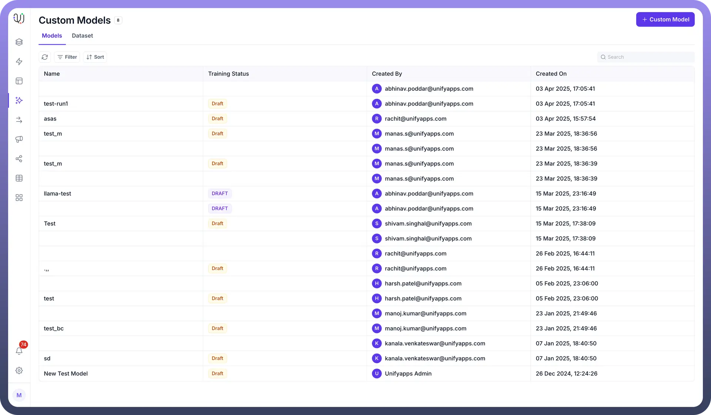
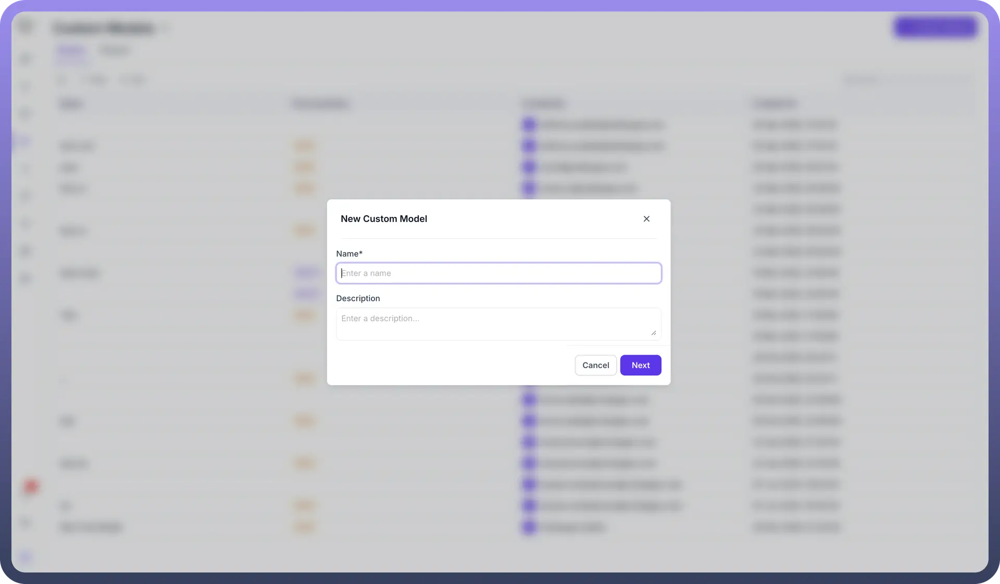
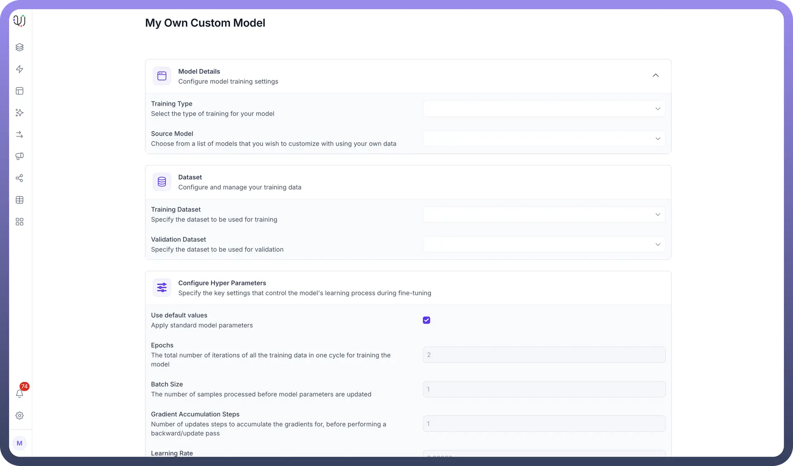
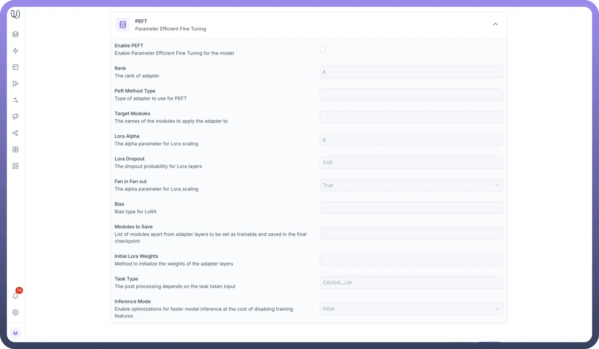

# Custom Models

Source: https://www.unifyapps.com/docs/unify-agentic-ai/custom-models
Section: agentic-ai

---

## How to leverage Custom Models in UnifyApps?

Users can leverage the power of LLM Models using our UnifyApps Platform to build efficient agents and workflows. You'll learn two primary methods for incorporating tailored models: fine-tuning an existing base model and integrating your entirely custom-built model as an API.

### Fine-tuning Your Own Base Model

Fine-tuning is the process of taking a pre-trained base model and training it further on a smaller, specific dataset to adapt its capabilities to a particular task or domain. This allows the model to generate more relevant and accurate outputs for your unique use case without building a model from scratch.

**Prerequisites**

- **A Base Model:** UnifyApps supports various popular base LLMs that can be fine-tuned.
- **A Labeled Dataset:** A high-quality dataset relevant to your specific task. The more aligned and cleaner your data, the better the fine-tuning results.
- **UnifyApps Account:** Access to the UnifyApps platform with appropriate permissions.

### Steps for Fine-tuning

1. In the UnifyApps AI platform choose Custom Models and click on Add Custom Model

  

2. Enter your Custom Model’s Name and Description according to your use case and requirements.

  

3. Now, Add and Configure Base Model details, dataset, configure Hyper Parameters like epoch, batch size, learning rate, and much more to fine-tune your model to fit your specific use case and data.

  

4. Customise Parameter Efficient Fine Tuning parameters like bias, LoRa dropout, etc

  
