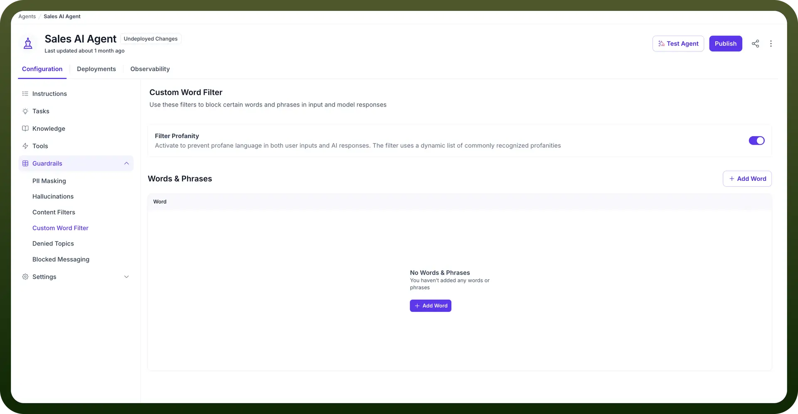
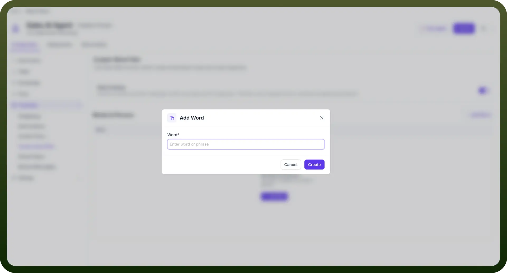
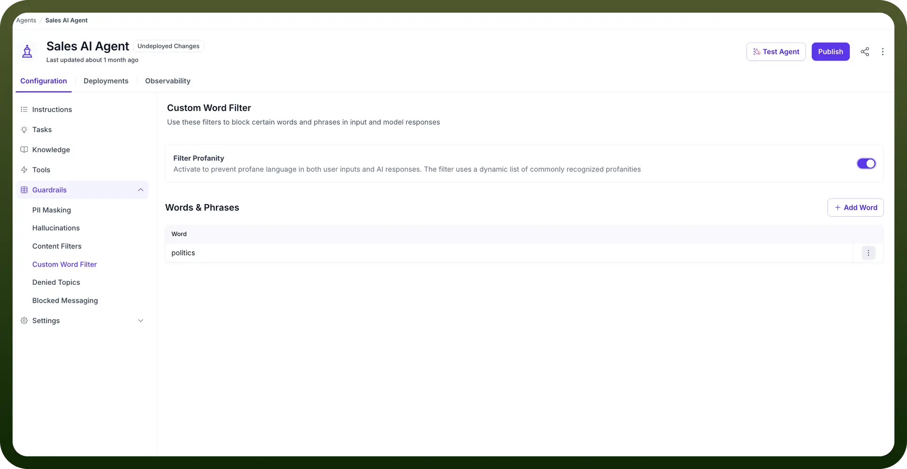

# Custom Word Filter

Source: https://www.unifyapps.com/docs/unify-agentic-ai/custom-word-filter
Section: agentic-ai

---

## Overview

The Custom Word Filter guardrail  allows you to block specific words or phrases from appearing in both user inputs and AI-generated responses. This ensures that the AI agent communicates within the boundaries set by your organization’s policies and brand guidelines.

## Key Components

- `Filter Profanity` : It is a built-in toggle that blocks profane or offensive language in both inputs and responses. This feature uses a dynamic list of commonly recognized profanities to prevent inappropriate content. To illustrate this better, let’s look at the below example.**User Input**: "This product is [profanity] expensive!" **Agent Response** : "Your message contains inappropriate language. Please rephrase your feedback professionally." **User Input:** "This service is [profanity] terrible!" **Agent Response:** "I understand you may be frustrated. Please rephrase your feedback professionally so I can better assist you."
- `Custom Words & Phrases` : You can manually add specific words or phrases to block in both user inputs and AI responses, ensuring the AI agent avoids sensitive or off-brand language. For example, you can block mentions of competitors or sensitive business terms. To illustrate this better, let’s look at the below example. **Blocked Terms**: Balance sheet, Profit Margins, Cash reserve **User:** Can you tell me about the company's cash reserves and current profit margins? **Agent Response:** I am not allowed to answer this query. Could you please ask something else?

## How to Configure Custom Word Filter in your AI Agent?

1. From the Guardrails section in your AI Agents Dashboard, click on “`Custom Word Filter`”.
2. Toggle the “`Filter Profanity`” option to automatically block common offensive language.

  

3. Click the “`+ Add Word`” button to manually input specific words or phrases that you want to block from both user input and AI responses. It might include competitors’ names or specific business terms.

  

4. View the list of blocked words under Words & Phrases. You can edit or remove entries as needed by clicking on the three-dot menu beside each word or phrase. By configuring the Custom Word Filter, you ensure that your AI agent maintains a professional tone, avoids sensitive topics, and adheres to the specific language guidelines of your organization.

  
