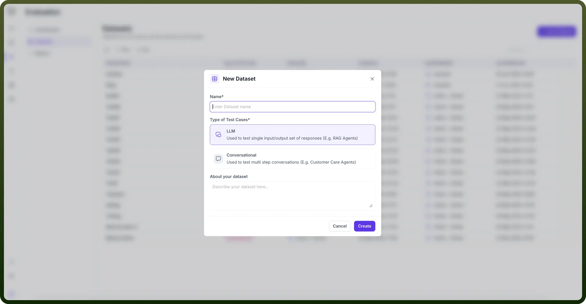
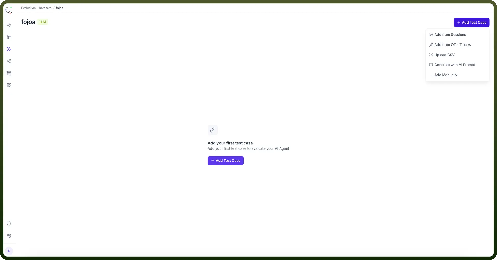
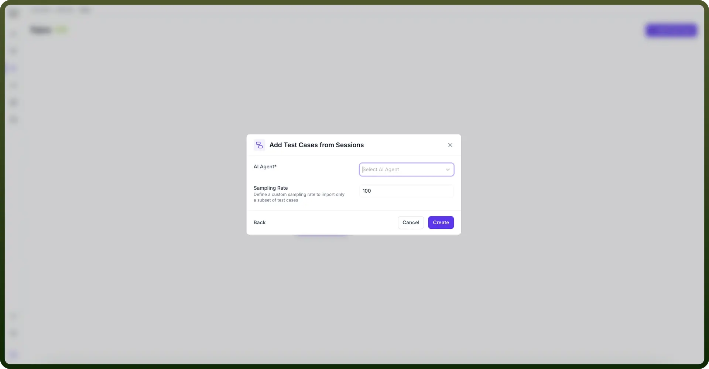
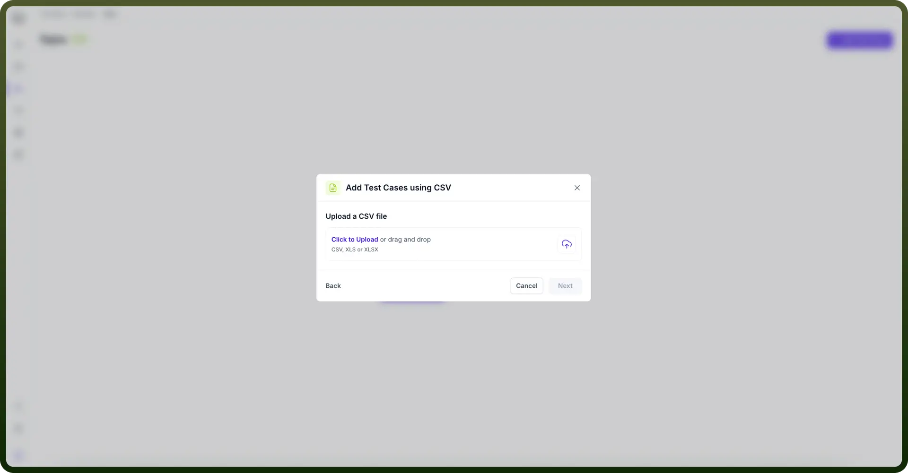
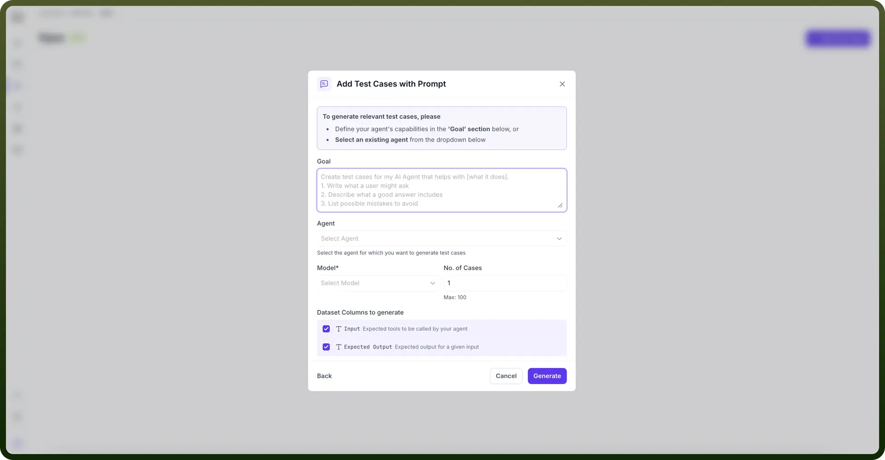
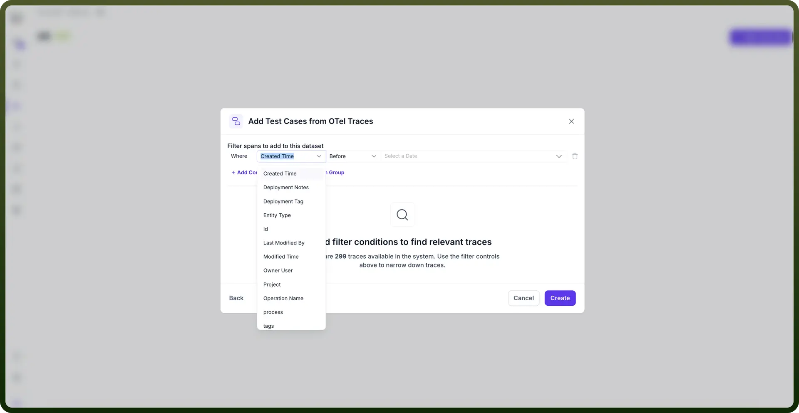
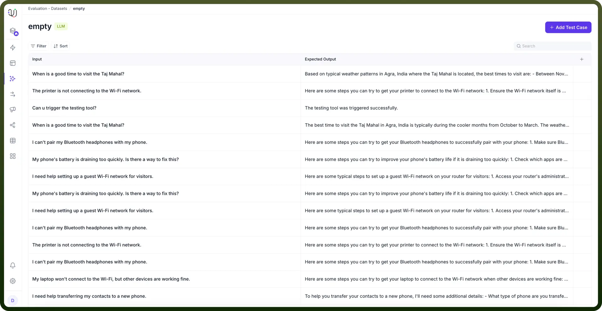
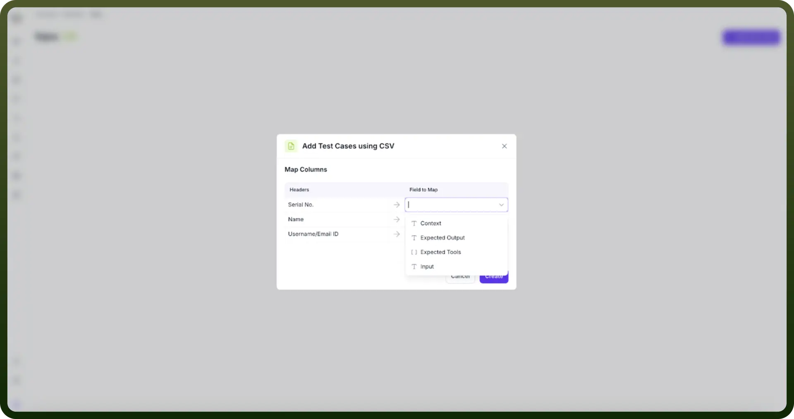

# Datasets

Source: https://www.unifyapps.com/docs/unify-agentic-ai/datasets
Section: agentic-ai

---

Datasets form the foundation of AI agent testing by providing structured collections of test cases. These test cases enable systematic evaluation of agent responses across various scenarios, from simple question-answer pairs to complex conversational flows.

## Dataset Types

The platform accommodates two primary test case categories:

- **LLM Test Cases**: Designed for single input-output validation, particularly useful for RAG (Retrieval-Augmented Generation) use cases
- **Conversational Test Cases**: Built to test multi-turn dialogues and complete user journeys

  

## Creating Datasets

**Step 1: Name Your Dataset**

Begin by providing a descriptive name that reflects the dataset's purpose and scope.

**Step 2: Choose Creation Method for test cases**

The platform offers five flexible options for dataset creation:

- **From Sessions**: Import test cases directly from existing agent sessions
  1. Select the specific agent whose sessions you want to import
  2. Define a sampling rate to control the volume of imported cases
  3. Review and potentially filter the imported data for relevance

    

- **Upload CSV**: Bulk import test cases via CSV files

  

- **Generate with Prompts**: Auto-generate test cases by defining dataset goals
  1. Define clear, specific goals for your dataset
  2. Select agent for which you want to prepare test cases
  3. Choose desired AI modal and no. of test cases you want that model to generate
  4. Select columns to generate

- **Add manually**: Manually input questions and expected answers
- **Create OTel Cases**: Transform OpenTelemetry trace data from sessions on different platform into test cases
  1. Select “`add from otel traces`” after clicking on “`Add test case`” button
  2. You will see no. of traces available in system
  3. Add condition or condition group depending upon your usecase and requirements.

    

  4. Click on “`create`” button. You will see that the dataset has been created.

    

**Step 3: Define Test Case Fields**

Each test case can include up to seven fields:

- **Input** (mandatory): The user query or prompt
- **Expected Output** (mandatory): The desired agent response
- **Expected Tool**: Specific tools the agent should utilise
- **Context**: Additional background information
- You can add custom fields according to your requirement

  

This flexible approach ensures datasets can be tailored to specific testing requirements while maintaining consistency across different evaluation scenarios.
