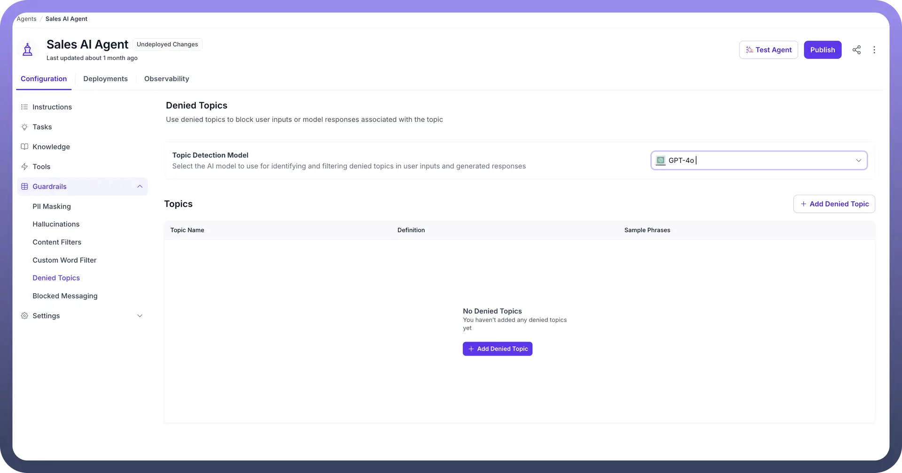
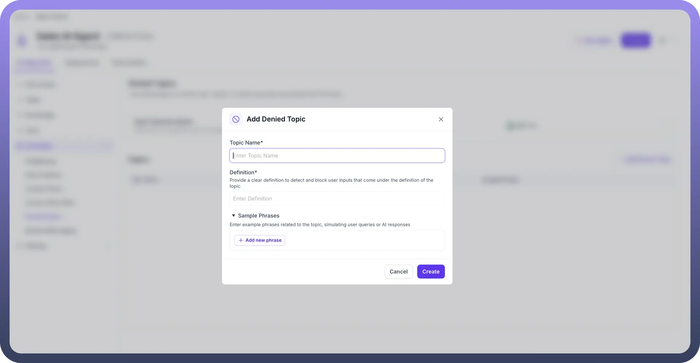
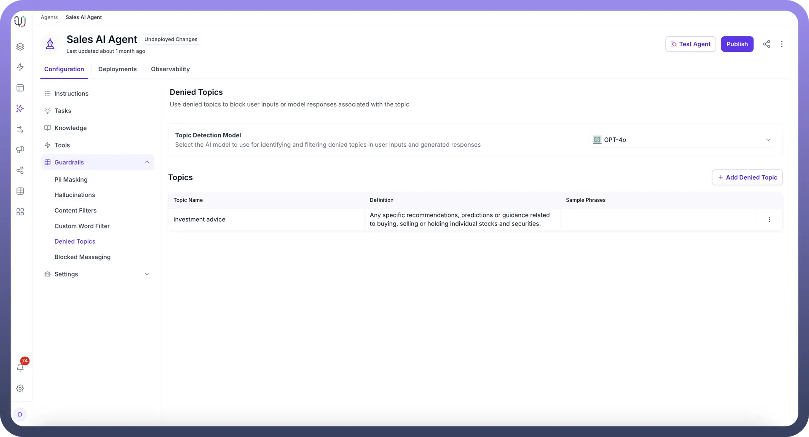

# Denied Topics

Source: https://www.unifyapps.com/docs/unify-agentic-ai/denied-topics
Section: agentic-ai

---

## Overview

Denied Topics are specific subjects and conversations that an AI Agent is set up to avoid. These act as boundaries that keep interactions safe, professional, and within appropriate limits. They are custom guardrails that you can define to keep your AI Agent within designated safe zones of conversation.

## How Denied Topics Work?

Just as human employees need to understand workplace boundaries and sensitive topics, AI Agents require clear guidelines about subjects they should not engage with. This enables AI Agents to operate effectively while maintaining appropriate limits.

Denied Topics serve multiple critical functions in AI Agent deployment:

- Maintain regulatory compliance
- Ensure professional communication standards

To better understand, consider these examples for a customer support agent.

1. **Healthcare Advice** **User:** "I have severe neck pain, what medication should I take?" **AI Agent Response:** "I am not allowed to answer this query. Could you please ask something else? ”
2. **Financial Advice** **User:** "Should I invest in tech stocks or cryptocurrency right now?" **AI Agent Response:** "I am not allowed to answer this query. Could you please ask something else?"

## How to Configure Denied Topics in your AI Agent?

1. From the Guardrails section in your AI Agents Dashboard, click on “`Denied Topics`”.
2. Select the AI model that will be used to detect and filter denied topics in both user inputs and AI responses, ensuring the agent stays on track with approved subjects. (eg- Mistral, GPT- 4o, etc.)

  

3. Click the “`+ Add Denied Topic`” button to create a new restricted topic. You can define the topic, provide a description, and include sample phrases to help the agent understand what to block.

  

4. You can view and manage your existing denied topics under the Topics section. Edit or remove them as necessary by using the three-dot menu.

  

5. By configuring Denied Topics, the AI Agent ensures compliance and prevents unwanted or risky conversations, keeping interactions focused, secure, and aligned with business objectives.
