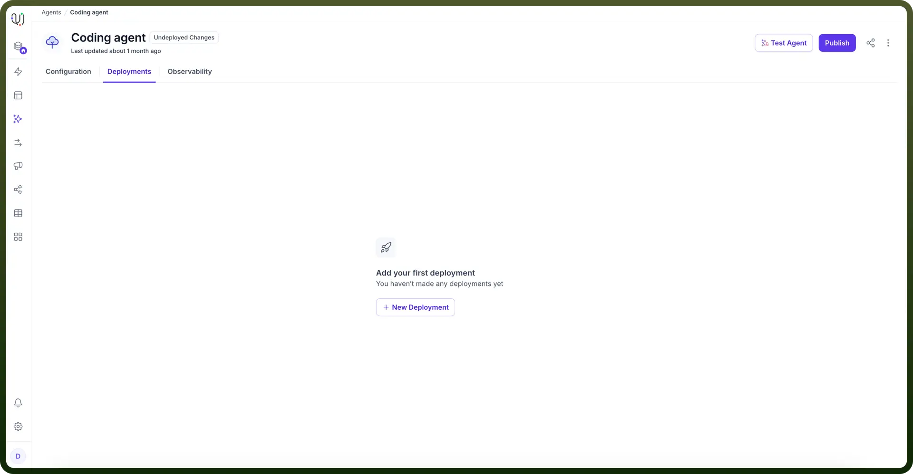
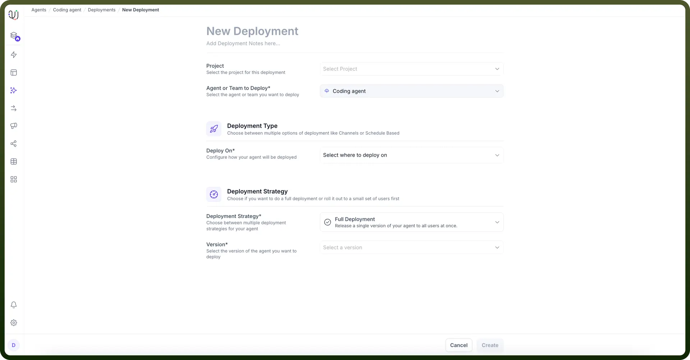
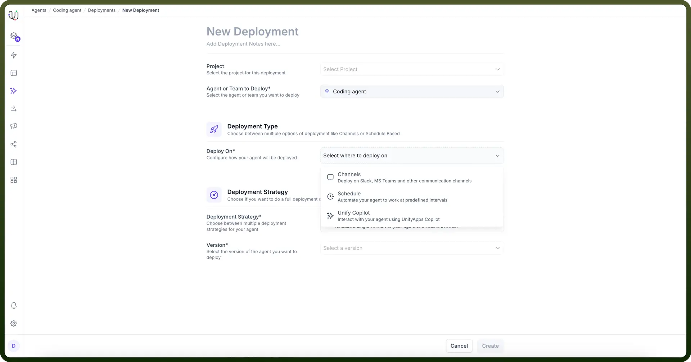

# Deployments

Source: https://www.unifyapps.com/docs/unify-agentic-ai/deployments
Section: agentic-ai

---

The Deployment section streamlines the process of launching your agent through an intuitive interface. Follow these steps to deploy your agent:

### Steps to Deploy

1. **Create New Deployment:** Click "`New Deployment`" to begin the setup process.

  

2. **Name Your Deployment:** Enter a descriptive name for easy identification.
3. **Select Project:** Choose which project this deployment belongs to from your available options.

  

4. **Configure Deployment Method:** Select how to deploy your agent
  - Deploy to specific messaging channels
  - Schedule for regular intervals
  - Enable interaction through UnifyApps Copilot

    

5. **Set Deployment Strategy:** In the Deployment Strategy section, configure
  - `Rollout Method`: Deploy to all users simultaneously or in controlled batches
  - `Version Selection`: Choose the specific version to deploy

This streamlined approach ensures your agents are deployed efficiently while maintaining control over the rollout process.
