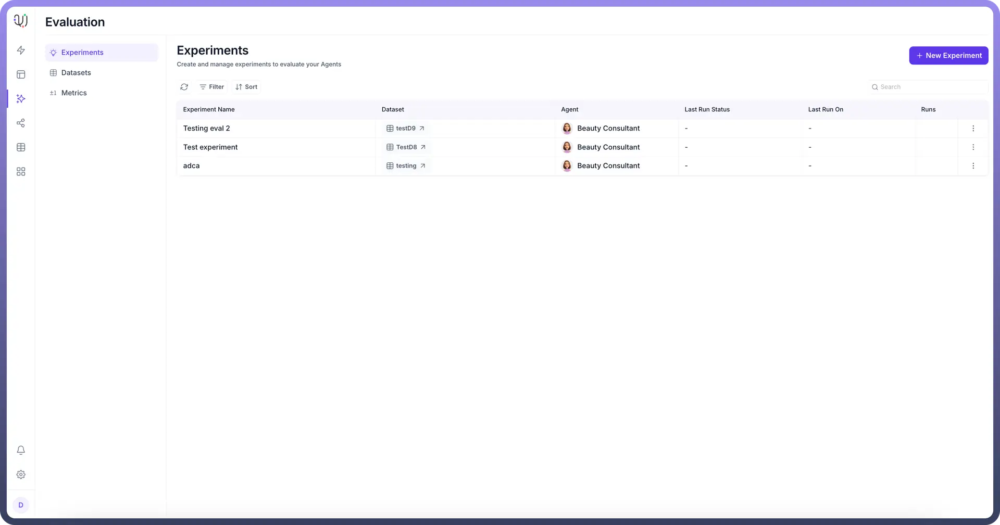
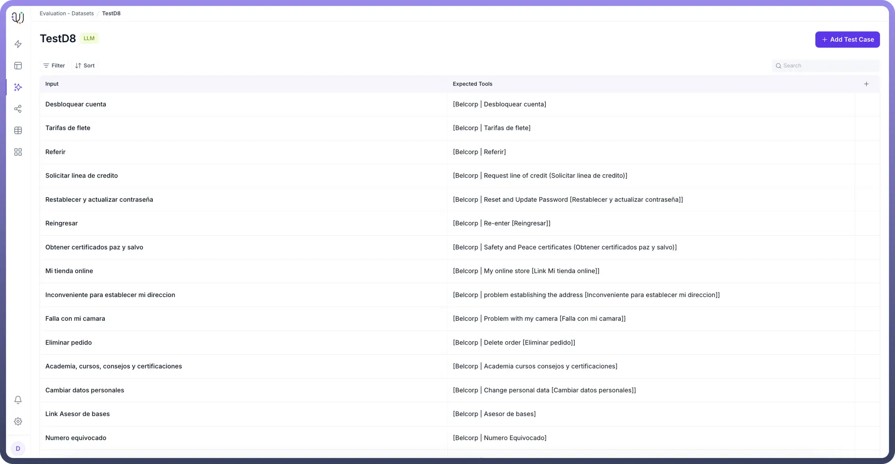
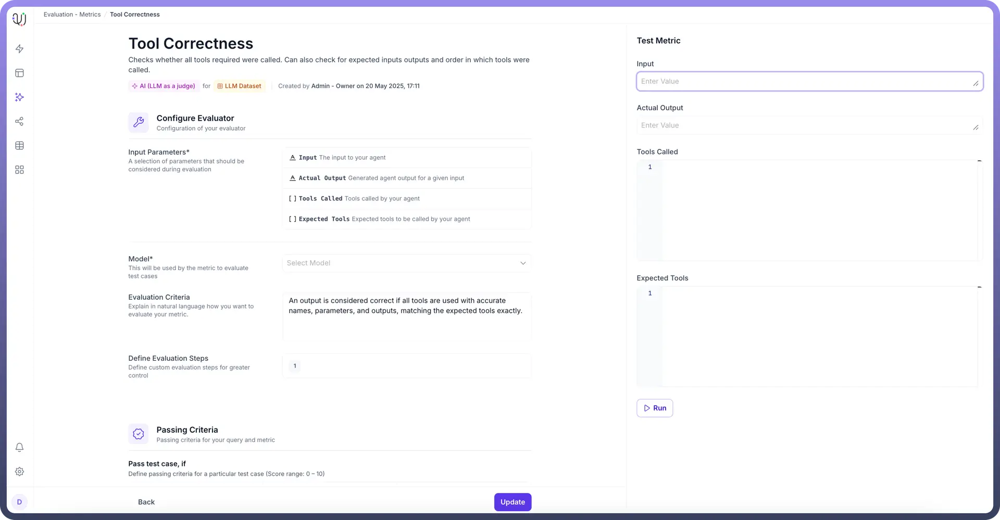
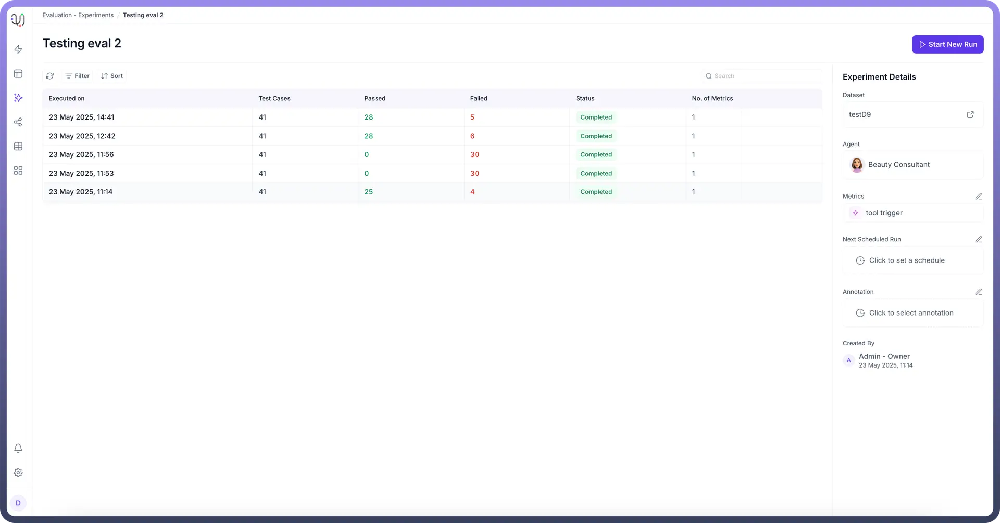

# Overview

Source: https://www.unifyapps.com/docs/unify-agentic-ai/evaluation-overview
Section: agentic-ai

---

The Eval Module is a comprehensive platform designed to test and evaluate AI agents using predefined test cases and customizable metrics. This testing framework ensures agents perform as expected across various scenarios and use cases.

## Core Components

The platform is built on three fundamental pillars that work together to provide thorough agent evaluation:

### 1. Datasets

Datasets are collections of test cases used to run agents and analyze their outputs. These predefined test cases serve as benchmarks for agent performance. The platform supports two distinct types of test cases:

- **LLM Test Cases**: Single input, single output scenarios ideal for straightforward response validation
- **Conversational Test Cases**: Multi-turn interactions that test complete user journeys and complex workflows

  

### 2. Metrics

Metrics define the evaluation criteria used to assess agent performance. The platform offers flexible evaluation methods:

- **LLM-based evaluation**: Using AI models as judges to assess response quality
- **Automated evaluation**: Systematic testing using predefined rules and criteria
- **Manual evaluation**: Human review for nuanced assessment

  

### 3. Experiments

Experiments bring datasets and metrics together to perform comprehensive evaluations. Users can:

- Select specific agents for testing
- Choose appropriate metrics for evaluation
- Apply relevant datasets to test various scenarios

  

This integrated approach ensures thorough testing across different dimensions of agent performance, providing valuable insights for optimization and improvement.
