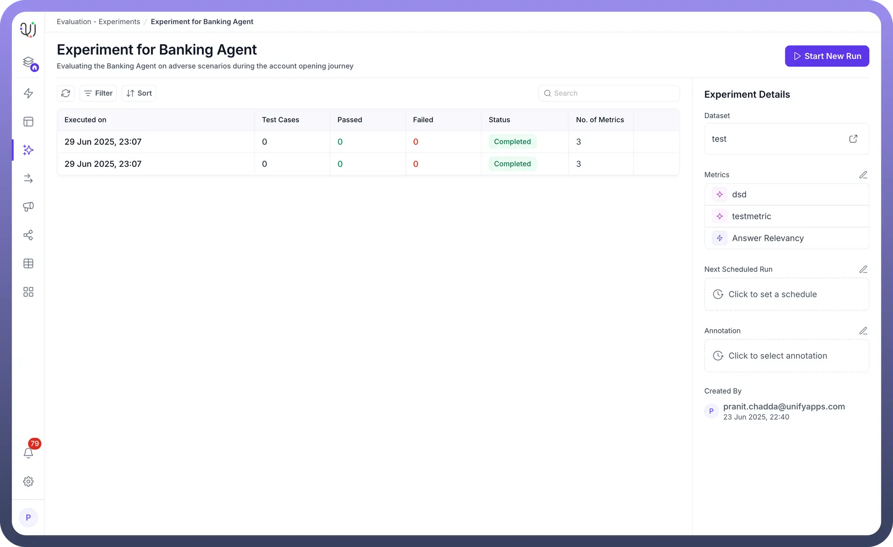
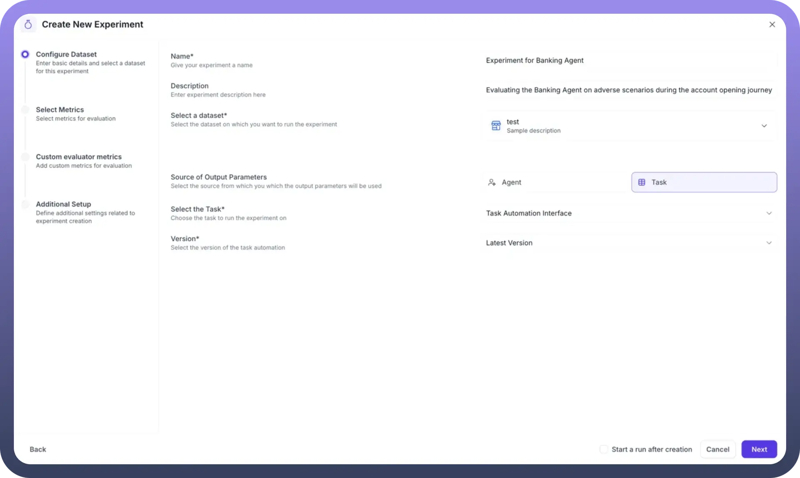
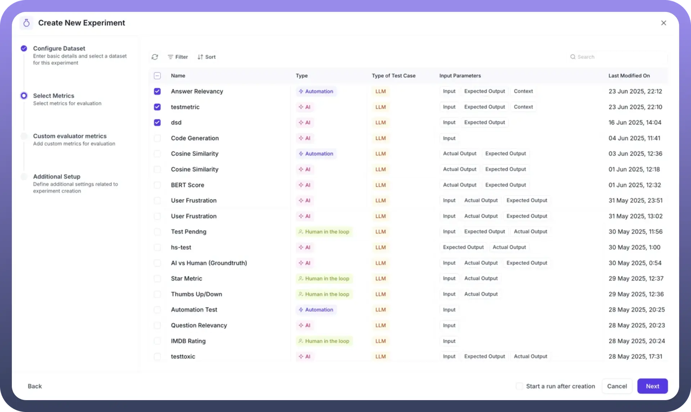
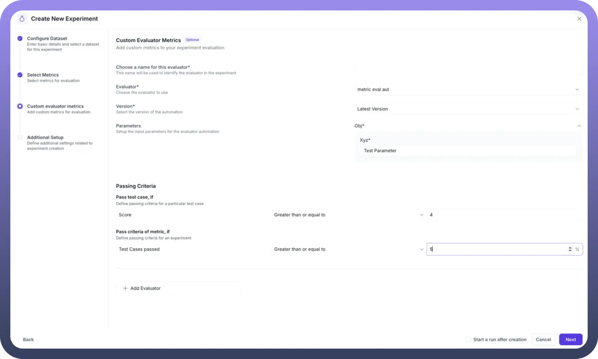
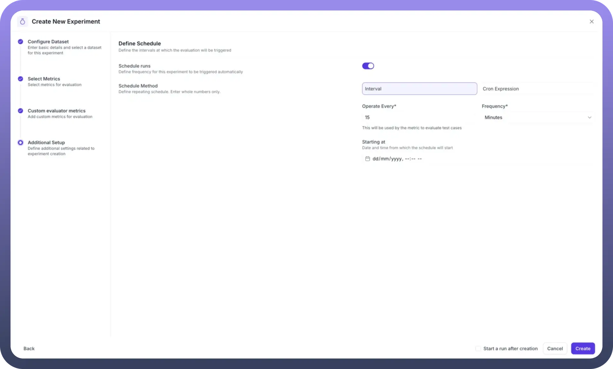

# Experiments

Source: https://www.unifyapps.com/docs/unify-agentic-ai/experiments
Section: agentic-ai

---

UnifyApps provides a comprehensive experiment framework that enables you to systematically evaluate your AI Agent's performance using predefined datasets and metrics. Experiments allow you to test your agent against multiple scenarios, track performance over time, and identify areas for improvement through both automated metrics and human annotation. Let's explore how to create and manage experiments for thorough agent evaluation.

### Understanding Experiments

Experiments are structured evaluation sessions that:

- Test your AI Agent against curated datasets
- Apply multiple metrics to assess performance
- Generate comprehensive reports on agent capabilities
- Support both one-time and scheduled recurring evaluations
- Enable human review and annotation of results

## Create a New Experiment

Creating an experiment brings together your datasets, metrics, and evaluation targets into a cohesive testing framework. Here's how to set up comprehensive agent evaluations.

**Step 1: Configure Basic Details**

Navigate to the Experiments section and click "`Create New Experiment`" to begin:

- `Name`: Provide a descriptive identifier (e.g., "Experiment for Banking Agent")
- `Description`: Document the experiment's purpose and scope (e.g., "Evaluating the Banking Agent on adverse scenarios during the account opening journey")

**Step 2: Select Dataset and Output Source**

**Choose Your Dataset**:

- Select from your created datasets using the dropdown
- The dataset provides the input test cases for evaluation

**Define Output Source**: Choose where the system should obtain outputs for evaluation:

1. `Agent`: The standard method for evaluating a specific AI Agent
  - Inputs from your dataset are sent to the selected agent
  - The agent's responses become the outputs for metric evaluation
  - Best for testing live agent performance
2. `Task`: Use an automation workflow as the evaluation target
  - Select from your task automation interfaces
  - Choose the specific version to test
  - Useful for testing workflow-based implementations

**Step 3: Select Evaluation Metrics**

The metrics selection screen displays all available metrics with detailed information:

- `Metric Name`: Identifies each evaluation criterion
- `Type`: Shows if it's AI-based or Automation-based
- `Test Case Type`: Indicates LLM or Conversational evaluation
- `Input Parameters`: Lists required data points for each metric

Select relevant metrics by checking the boxes next to:

- Answer Relevancy
- testmetric
- Code Generation
- Cosine Similarity
- User Frustration
- And any other configured metrics

You can filter metrics using:

- Search functionality
- Type filters (AI, Automation, Human in the loop)
- Sort options for easier navigation

**Step 4: Configure Custom Evaluator Metrics**

This section allows you to add specialized evaluation logic:

**Custom Evaluator Configuration**:

- `Name`: Identify the custom evaluator
- `Evaluator Selection`: Choose from available automation evaluators (e.g., "metric eval aut")
- `Version`: Select the specific version to use
- `Parameters`: Map input parameters to evaluator requirements

**Passing Criteria Definition**:

- `Test Case Level`: Set score thresholds (e.g., Score ≥ 4)
- `Experiment Level`: Define overall success criteria (e.g., 75% test cases must pass)

**Step 5: Scheduling**

Configure automated experiment runs for continuous monitoring:

**Schedule Configuration**:

- `Toggle Schedule Runs`: Enable/disable automated execution
- `Schedule Method`: Choose between Interval or Cron Expression
- `Frequency Settings`:
  - `Operate Every`: Set interval value (e.g. 15)
  - `Frequency`: Select time unit (Minutes, Hours, Days, etc.)
- `Starting Time`: Define when the schedule begins

For advanced scheduling, use Cron expressions for precise control over execution timing.

**Step 6: Create and Launch**

Review your configuration and click `Create` to initialize the experiment. You'll be directed to the experiment dashboard where you can:

- View experiment details
- See selected dataset and metrics
- Monitor scheduling status
- Start your first evaluation run

**Running Your Experiment**

Once created, initiate your experiment evaluation:

1. **Start New Run**: Click the "`Start Run`" button to begin evaluation
2. **Monitor Progress**: Track the evaluation status as it processes test cases
3. **View Results**: Access detailed results once the run completes

### Working with Task-Based Evaluations

When using Task automations instead of Agents:

1. **Create Evaluation Automation**: Build an automation using the "`Eval by UnifyApps`" trigger
2. **Configure Task Execution**:
  - Map input parameters (input, expected output, context)
  - Define output generation logic
  - Return required fields (actual output, retrieved context, tools called)
3. **Select in Experiment**: Choose your task automation when configuring output source
4. **Version Control**: Select the appropriate automation version for testing

## Human Annotation in Experiments

While automated metrics provide objective measurements, human annotation adds crucial qualitative assessment to your evaluation process. The platform seamlessly integrates human review capabilities within the experiment framework.

**Understanding Human-in-the-Loop Metrics**

Human annotation metrics appear with special indicators in the metrics list:

- Marked with `Human in the loop` tags
- Require manual review of outputs
- Provide subjective quality assessment
- Complement automated evaluations

**Accessing Experiment Results for Review**

After an experiment run completes:

1. **Navigate to Results**: Access the detailed experiment results page
2. **View Test Cases**: Each test case displays:
  - Input query
  - Expected output
  - Actual agent response
  - Metric scores and pass/fail status

**Reviewing Individual Test Cases**

For each test case requiring human review:

**Visible Information**:

- User input and expected output comparison
- Automated metric scores (e.g. `Correctness of Output: Score 3`)
- LLM judge reasoning and evaluation

**Understanding Evaluation Results**

The results interface provides comprehensive insights:

**Metric Performance**:

- Individual scores for each metric
- Pass/fail status based on defined thresholds
- Detailed reasoning for each evaluation

**Human Annotation Process**

When reviewing results:

1. **Examine Context**: Review all available information including hidden fields
2. **Assess Quality**: Evaluate aspects automated metrics might miss
3. **Document Findings**: Note patterns or issues for improvement
4. **Export Reports**: Generate comprehensive evaluation reports

## Best Practices for Experiments

**Experiment Design**:

1. Start with focused datasets testing specific capabilities
2. Combine complementary metrics for comprehensive evaluation
3. Include both automated and human review metrics
4. Schedule regular experiments to track performance trends

**Output Source Selection**:

- Use Agent evaluation for production testing
- Leverage Task evaluation for workflow validation
- Consider version control when testing automations

**Metric Selection Strategy**:

- Balance efficiency and thoroughness
- Include metrics covering different aspects (accuracy, relevance, tool usage)
- Add human review for nuanced assessment

**Scheduling Considerations**:

- Run experiments during low-traffic periods
- Set appropriate intervals based on change frequency
- Monitor scheduled run results regularly

## Troubleshooting Common Issues

**System Limitations**:

- Check API access and authentication
- Verify callback URLs are accessible
- Ensure sufficient rate limits

**Failed Metrics**:

- Review metric configuration
- Validate input parameter mapping
- Check automation logic for custom evaluators

**Performance Optimization**:

- Limit concurrent test cases for resource-intensive evaluations
- Use appropriate metric combinations
- Consider batch processing for large datasets

By leveraging UnifyApps' experiment framework, you create a robust evaluation system that combines automated metrics with human insight. This comprehensive approach ensures your AI Agents meet quality standards while continuously improving based on systematic testing and feedback.
