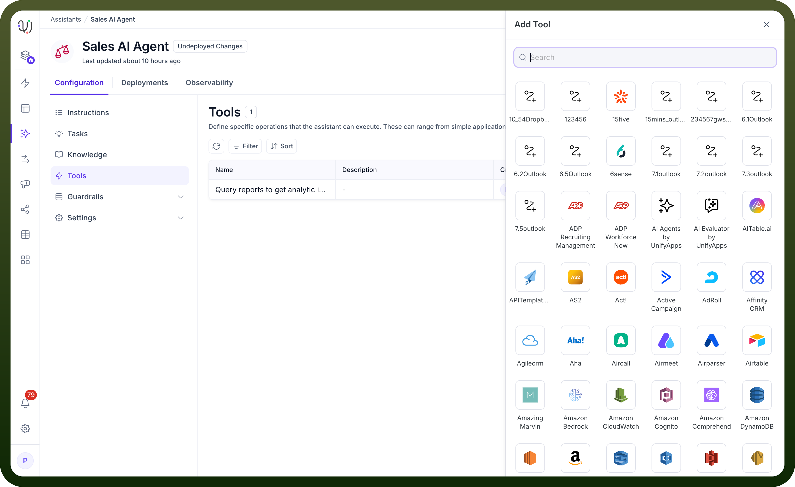
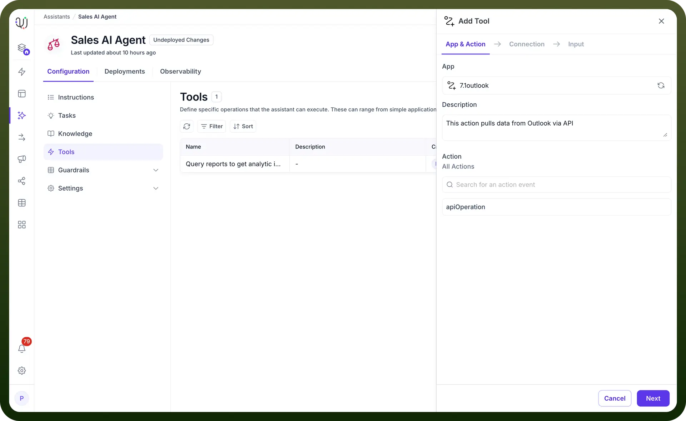
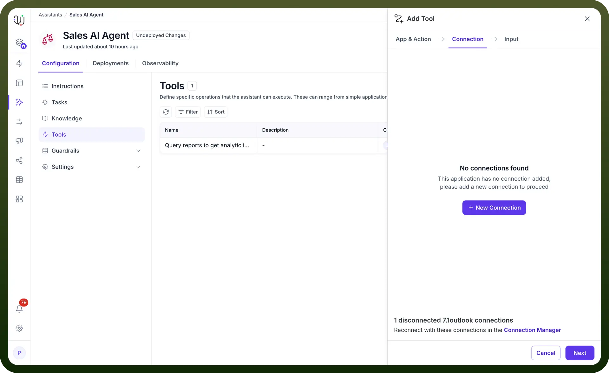
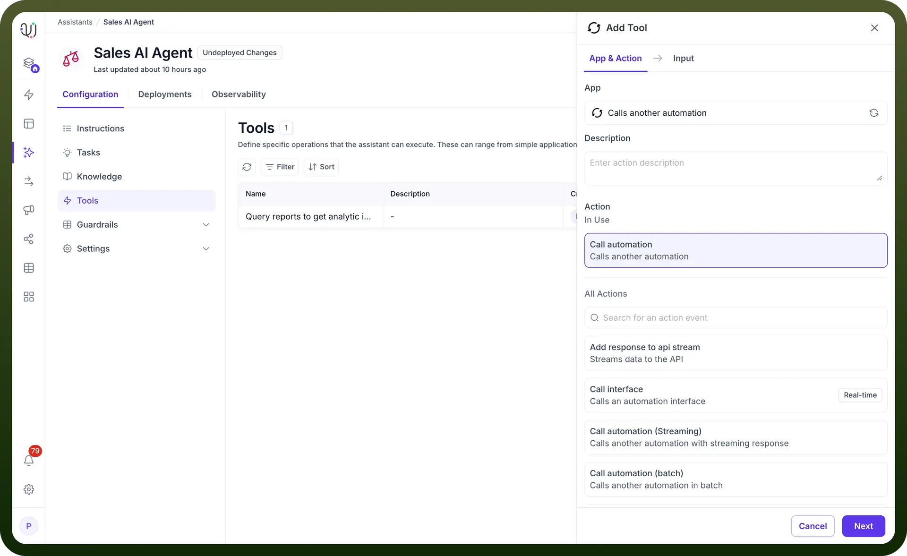
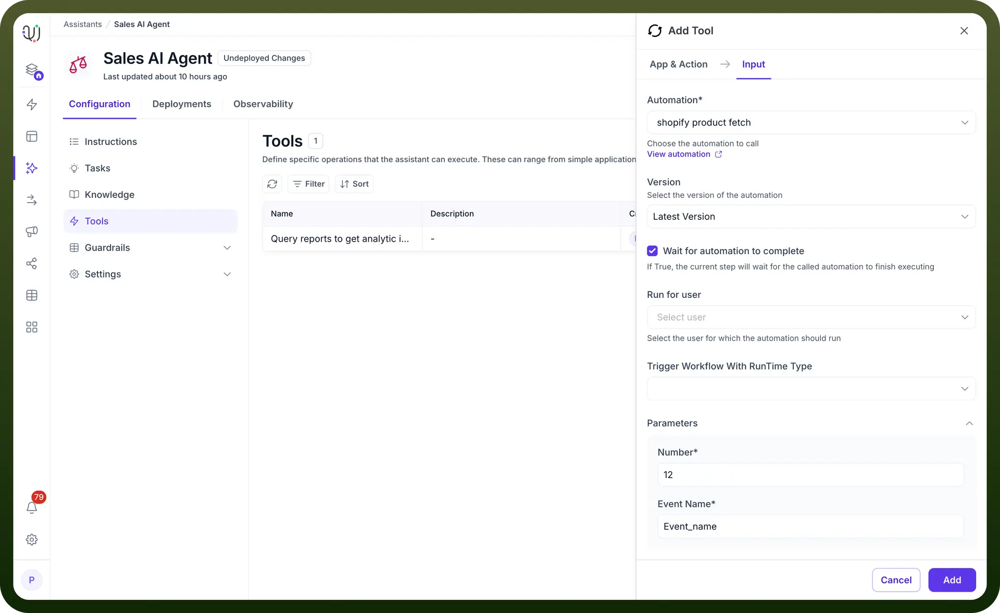
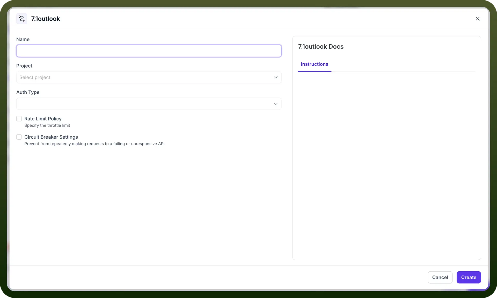

# Expose Workflows as Tools

Source: https://www.unifyapps.com/docs/unify-agentic-ai/expose-workflows-as-tools
Section: agentic-ai

---

UnifyApps enables you to transform your custom automation workflows into reusable tools that your AI Agents can execute on demand. This powerful feature bridges the gap between your automation capabilities and conversational AI, allowing agents to trigger complex multi-step processes through simple conversations. Let's explore how to expose your workflows as tools and maximize their potential within your AI Agent ecosystem.

## Understanding Workflow Integration

When you expose a workflow as a tool, you're essentially creating a bridge between your AI Agent's conversational interface and your automated business processes. This integration allows your AI Agent to:

- Execute complex automation sequences based on user requests
- Pass conversation context and parameters to workflows
- Return workflow results back to the conversation
- Handle multi-step processes without user intervention

## Steps to Expose a Workflow as a Tool

1. **Initiate Tool Addition**: Click the `+ Add Tool` button in your AI Agent's Tools section to open the tool configuration panel.

  

2. **Navigate Through Configuration Tabs**: The interface presents three configuration stages:
  - **App & Action**: Select your workflow application
  - **Connection**: Configure authentication and access
  - **Input**: Define parameters based on your workflow schema

    

3. **Select Your Workflow Application**: In the App section, you'll see your available workflow applications (like `7.1outlook` in the example). Select the workflow you want to expose as a tool.
4. **Add Description**: Provide a clear description of what this tool does. This helps both you and other team members understand the tool's purpose and functionality.
5. **Choose the Specific Action**: Search for and select the exact automation action from your workflow that the AI Agent should trigger. The system displays `All Actions` with a search bar to help you find specific operations like `apiOperation` or any custom actions you've defined.

## Configuring Custom Automations

When selecting `Calls another automation` from the App section, you'll enter a specialized configuration flow for your custom workflows:

1. **Automation Selection**: Choose from your available automations using the dropdown (like `shopify product fetch` in the example). The system displays all automations you've created, allowing you to repurpose existing workflows as AI Agent tools.
2. **Version Management**: Select which version of your automation to use - typically `Latest Version` ensures your tool always uses the most current workflow logic.
3. **Execution Settings**: Configure key operational parameters:
  - **Wait for completion**: Toggle whether the AI Agent should wait for the automation to finish before responding
  - **Run for user**: Specify which user context the automation should execute under
  - **Runtime type**: Define how the workflow should be triggered and executed
4. **Parameter Configuration**: The system automatically detects your automation's input schema and presents the required parameters (like `Number` and `Event Name` fields shown). Map these parameters to conversation context or set default values to ensure smooth execution.

This approach transforms your existing automations into conversational tools, enabling users to trigger complex workflows through natural language interactions with your AI Agent.

## Managing Connections

The Connection tab is crucial for ensuring your workflow can execute properly:

**When No Connection Exists**:

- You'll see a `No connections found` message
- The system prompts: "This application has no connection added, please add a new connection to proceed"
- Click the `+ New Connection` button to establish authentication

**When Connections Are Available**:

- Select from existing connections
  - If the system shows disconnected connections (e.g., `1 disconnected 7.1outlook connections`), reconnect through the Connection Manager link if needed

## Creating New Connections

When setting up a new connection, you'll need to provide:

- `Name`: A descriptive identifier for the connection
- `Project`: Select the associated project from the dropdown
- `Auth Type`: Choose the authentication method required by your workflow
- `Rate Limit Policy`: Configure throttle limits to prevent API overload
- `Circuit Breaker Settings`: Set up failsafe mechanisms to handle unresponsive APIs

**Defining Input Parameters**

The Input tab is where the magic happens - this is where you map your workflow's schema to the AI Agent's conversational context:

1. **Schema-Based Configuration**: The input fields dynamically adjust based on your workflow's predefined schema
2. **Parameter Mapping**: Connect conversation variables to workflow inputs
3. **Data Type Validation**: Ensure inputs match the expected data types
4. **Optional vs Required Fields**: Clearly identify which inputs are mandatory

**Advanced Configuration Options**

**Dynamic Input Handling**:

- Map user inputs from the conversation directly to workflow parameters
- Use context variables to pass relevant information
- Set default values for optional parameters

**Error Handling**:

- Configure how the AI Agent should respond if the workflow fails
- Set up retry logic for transient failures
- Define fallback responses for better user experience

**Output Processing**:

- Determine how workflow results should be presented to users
- Format complex data structures into readable responses
- Handle both synchronous and asynchronous workflow executions

## Best Practices for Workflow Tools

1. **Clear Naming Conventions**: Use descriptive names that clearly indicate what the workflow does
2. **Comprehensive Documentation**: Include detailed descriptions for both the tool and its parameters
3. **Input Validation**: Implement proper validation to ensure workflows receive correct data
4. **Performance Optimization**: Consider workflow execution time when designing conversational flows
5. **Security Considerations**: Ensure sensitive operations have appropriate access controls

## Common Use Cases

**Customer Order Processing**: Expose an order management workflow that can:

- Validate order details from conversation
- Check inventory availability
- Process payment authorization
- Generate order confirmation
- Update customer records

**HR Request Automation**: Create tools for common HR workflows like:

- Leave request submission
- Employee onboarding processes
- Benefits enrollment
- Training registration

**IT Service Management**: Automate IT support through exposed workflows:

- Password reset procedures
- Software access requests
- Incident ticket creation
- System health checks

By exposing your workflows as tools, you create a powerful synergy between conversational AI and process automation. This integration enables your AI Agents to not just answer questions, but actively execute business processes, making them true digital assistants capable of handling complex operational tasks.
