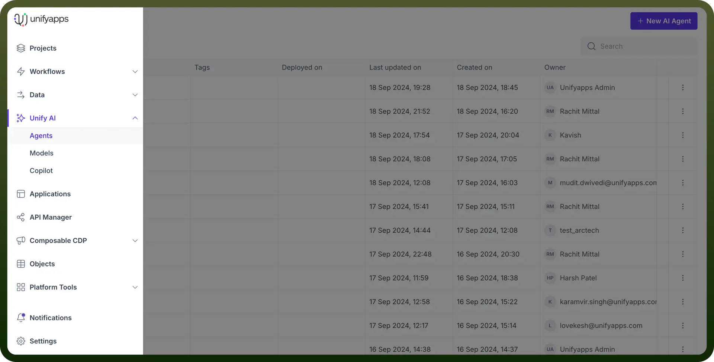
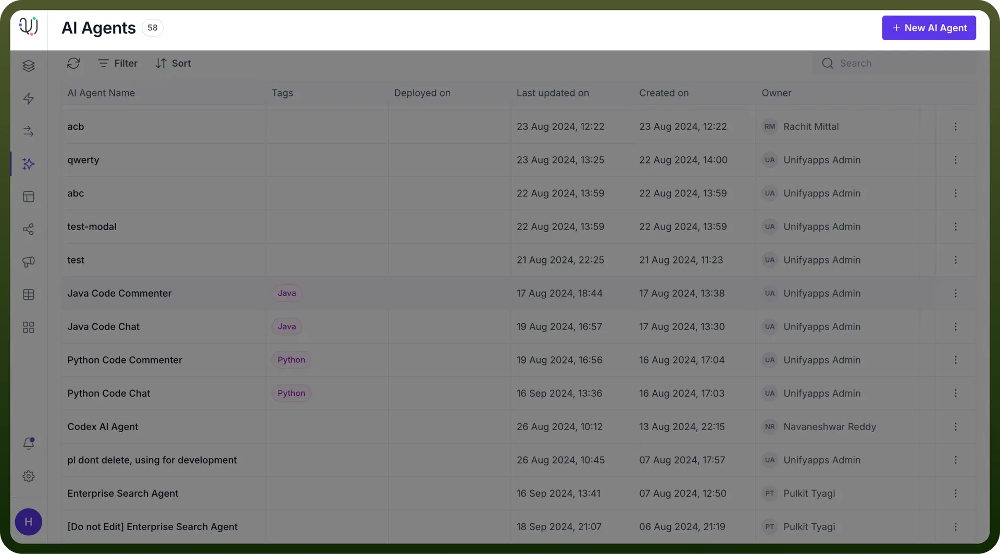
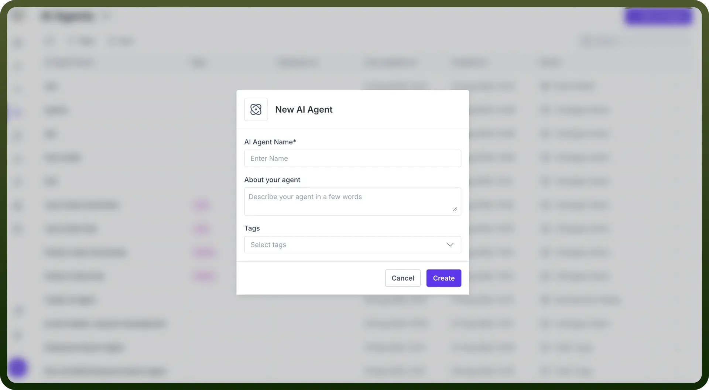
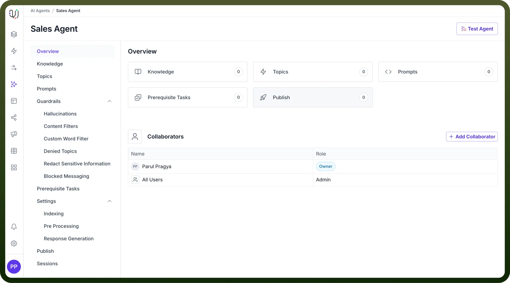
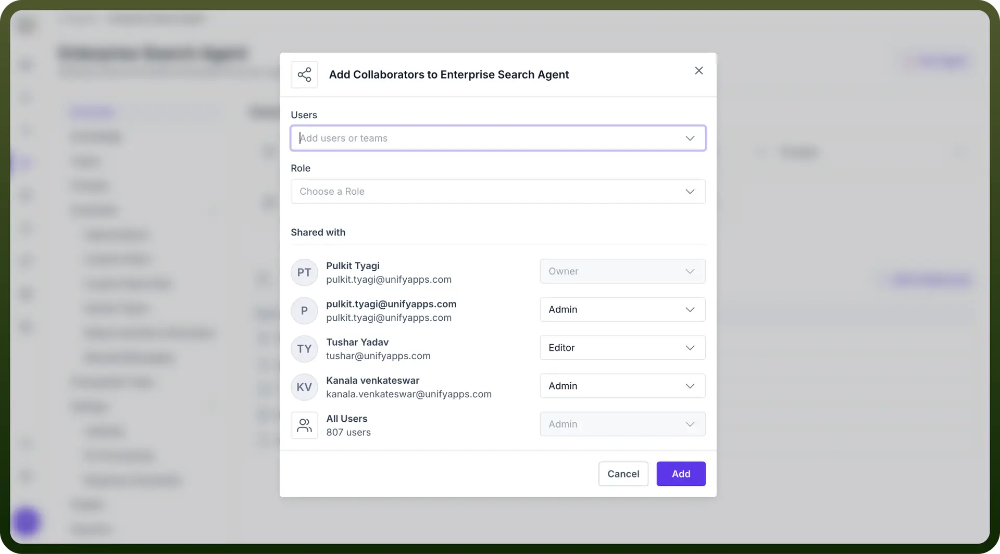

# Getting Started

Source: https://www.unifyapps.com/docs/unify-agentic-ai/getting-started
Section: agentic-ai

---

## Introduction to AI Agents

With UnifyApps, you can create specialized **domain-specific** AI agents and **multi-agent** teams that operate according to your organization's unique processes and integrate seamlessly with your existing tools and apps, just like a skilled employee.

You can assign entire roles or specific tasks to these **autonomous agents**, allowing you to scale their impact without limits.

"AI agent helps to manage large amounts of information, letting businesses focus on **quick solutions** and **smooth task handling**. It transforms business knowledge into smart automations, making processes **faster** and more **efficient**."

This article outlines the main features of UnifyApps’ AI agents, and how they can be set up and configured easily through the platform — with **no code** or manual setup required.

## Features of AI Agent

Unlike standalone large language models (LLMs) or rule-based software/hardware systems, AI agents by UnifyApps are powered with the following features:

- `Knowledge-Driven`**:** Uses your organization’s knowledge base to provide **accurate** and **relevant** solutions.
- `Action Planning` & `Execution`**:** It can map and execute **logical** steps to reach a specific goal.
- `Chain of Thought Process`**:** It uses a step-by-step **reasoning** process to break down complex tasks, ensuring better decision-making and problem-solving.
- `Contextual Awareness`**:** Understands and responds based on the **surrounding context**, making interactions more accurate and relevant.
- `Adaptive Learning`**:** Continuously **improves** performance by learning from interactions and adapting to new data.

## Why an AI Agent?

Workplaces face challenges like repetitive tasks, slow responses, and high inquiry volumes, leading to delays and reduced productivity.

UnifyApps' AI Agents solve this by **automating tasks**, providing **instant responses**, and **optimizing** processes, allowing employees to focus on strategic work while enhancing customer support and overall efficiency.

1. These agents handle multiple interactions simultaneously, speeding up response times and increasing `service efficiency`.
2. They are `available 24/7` round the clock, ensuring customers get assistance anytime, which boosts customer satisfaction and loyalty.
3. AI agents gather data on customer behavior and preferences, offering valuable `data-driven insights` to help businesses improve services.
4. They deliver `consistent`**,** error-free responses, ensuring customers receive `reliable` and trustworthy information.
5. AI agents can `easily scale` to meet growing demand, maintaining high service quality even with increasing interaction volumes.

## Use Cases of AI Agents

UnifyApps AI agents are widely applicable across various businesses. Here are some applications where these agents are driving significant improvements:

- **Customer Service and Support** Customer Service AI agent provides **instant responses** to common inquiries, offers 24/7 support, and improves **customer satisfaction**, allowing human agents to handle more complex issues. **Banking AI Agent** is designed to help customers with banking-related inquiries. It is equipped with knowledge about the bank’s products, services, and FAQs which gives you relevant & updated information accurately and faster.
- **Sales and Marketing** Sales AI agent manages the sales process by identifying potential leads, automating outreach, and tracking customer interactions. By automating routine tasks like **follow-ups** and **lead qualification**, the AI agent boosts productivity and helps sales teams focus on closing deals timely.
- **Coding Agent for Developers** AI-powered Coding agents assist developers by automating coding tasks, generating code snippets, creating test cases, and debugging. They can quickly suggest code based on requirements, **reducing development time** which can boost the productivity of the engineering team and help them deliver in less time.
- **Human Resources and Recruitment** HR AI agents help in the recruitment process by automating tasks like resume screening, interview scheduling, and conducting initial interviews. It can efficiently scan large volumes of resumes, identify top candidates, and schedule interviews, **speeding up hiring** and ensuring the selection of qualified talent.

## Create an Agent

Let’s create your first AI Agent by following these easy steps:

1. Click on the "`Agents`" option in the left sidebar of your UnifyApps dashboard in Unify AI category.

  

2. On the Agent page, click on the ”`+ New AI Agent`” button on the top right. This will prompt you to create a new AI Agent.

  

3. Write the name of your Agent & describe it’s role. Then, Click on the “`Create`” button. Here’s how your AI agent's landing page will look like.

  

  

4. You can also add multiple users as Collaborators to the AI Agent by clicking on "`+ Add Collaborator`" where you will get an option to provide Admin, Viewer or Editor access to the users.

  

Let's learn about the key concepts to build an AI agent in the next article.
