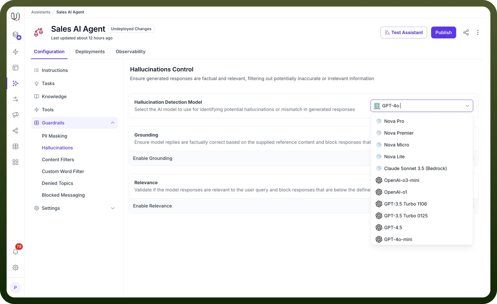
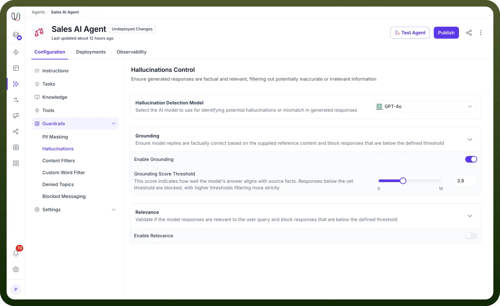
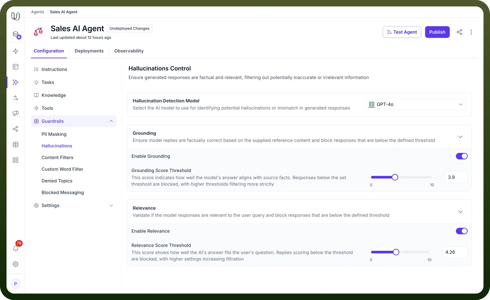

# Hallucination Control

Source: https://www.unifyapps.com/docs/unify-agentic-ai/hallucination-control
Section: agentic-ai

---

## What are Hallucinations?

Hallucinations occur when AI models generate responses that are factually incorrect or irrelevant despite appearing confident and coherent. These can range from subtle inaccuracies to irrelevant information, potentially impacting business operations and decision making processes.

Our platform allows you to select your preferred AI model for hallucination detection. You maintain control over how potential hallucinations or mismatches in generated responses are identified by selecting the model of your choice.

## Controlling Hallucinations

1. `Grounding` ensure that the AI Agent’s responses are factually aligned with reference content. It blocks any answers that do not meet the predefined grounding threshold. When enabled, the grounding system:
  - Validates responses against supplied reference content.
  - Implements threshold-based filtering.
  - Blocks responses that fall below defined confidence level.
  - Cross-references generated content with authenticated knowledge bases
  - Ensures responses are backed by verifiable information To illustrate this better let’s look at the below example. **Reference Content:** Company’s return policy - 30-day return window - Items must be unused with original tags - Shipping costs are non-refundable - Store credit issued for items without receipt**User Query:** "What's the return policy for items without a receipt?"✅ **Grounded Response** (Passes threshold): "For items returned without a receipt, you will receive store credit as per our policy."❌ **Ungrounded Response** (Blocked): "You can get a full cash refund or exchange the item within 60 days, even without a receipt."**Why:** The ungrounded response contradicts the reference content by stating incorrect return window and refund type.
2. `Relevance` validate whether the AI Agent's responses are relevant to the user’s query. It blocks irrelevant responses below the set threshold to ensure the agent delivers precise answers. When activated, it:
  - Evaluates if responses directly address user queries
  - Measures contextual alignment
  - Filters out off-topic or tangential information
  - Blocks responses falling below the relevance threshold
  - Maintains conversation focus and efficiency To illustrate this better let’s look at the below example- **User Query:** "How do I reset my password?"✅ **Relevant Response** (Passes threshold): "To reset your password, click the 'Forgot Password' link on the login page and follow the email instructions."❌ **Irrelevant Response** (Blocked): "We offer various account security features including two-factor authentication, biometric login, and regular security audits. Our platform uses AES-256 encryption for all data transmission..."**Why:** While security-related, the response diverges from the specific password reset request.

## How to Configure Hallucination Control in Your AI Agent?

1. From the Guardrails section in the left-hand menu on your AI Agent dashboard, select “`Hallucinations`”.
2. Choose your AI model (e.g., GPT-4o, Meta Llama3.3 70B Instruct, Deepseek R1, Mistral etc) from the Hallucination Detection Model dropdown.

3. Toggle the “`Enable Grounding`” option to activate grounding for the AI model. When enabled, it will ensure responses are based on supplied reference data.
4. Adjust the Grounding Score Threshold slider to set how strictly the AI Agent's responses need to align with facts.

Higher score ensures more stringent filtering, blocking any response that falls below the set threshold.

5. Toggle the “`Enable Relevance`” option to activate relevance validation for the LLM model.
6. Adjust the Relevance Score Threshold slider to define the relevance threshold. This slider controls how closely the AI Agent's response must match the user's query.

Higher thresholds block responses that are less aligned with the user's question, ensuring more relevant replies.

7. By customizing these settings, our platform allows you to control the accuracy and relevance, ensuring that generated responses are reliable, fact-based, and highly relevant to user queries.
