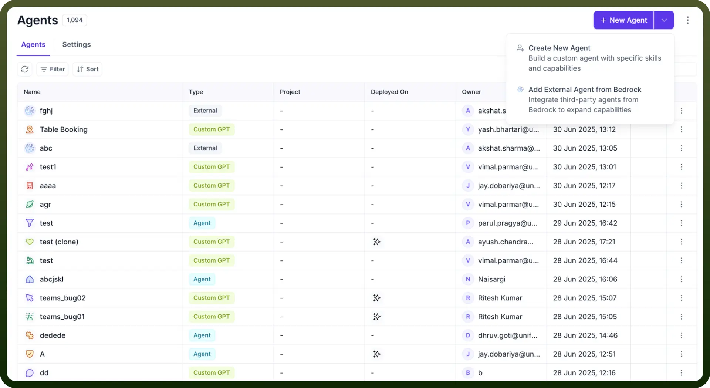
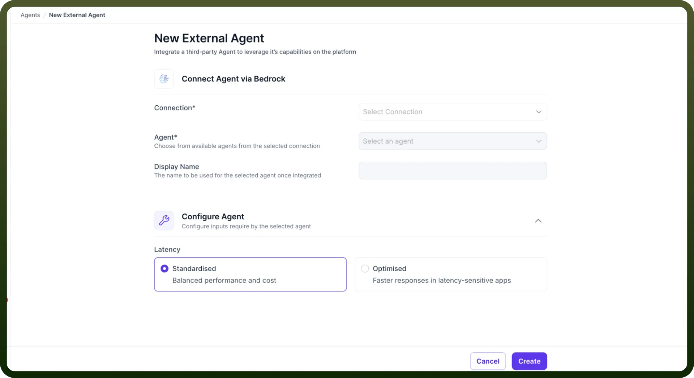
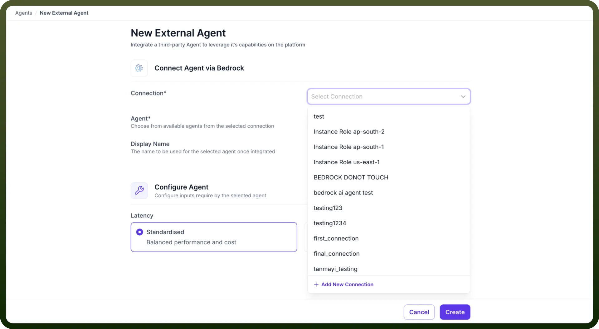
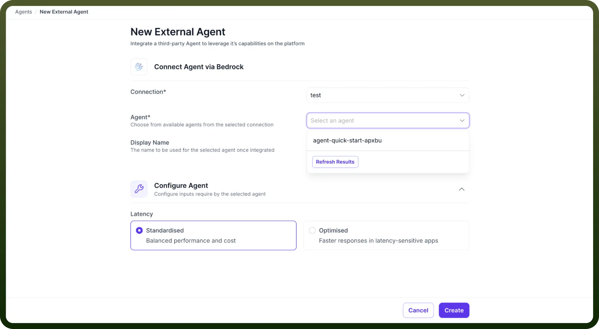
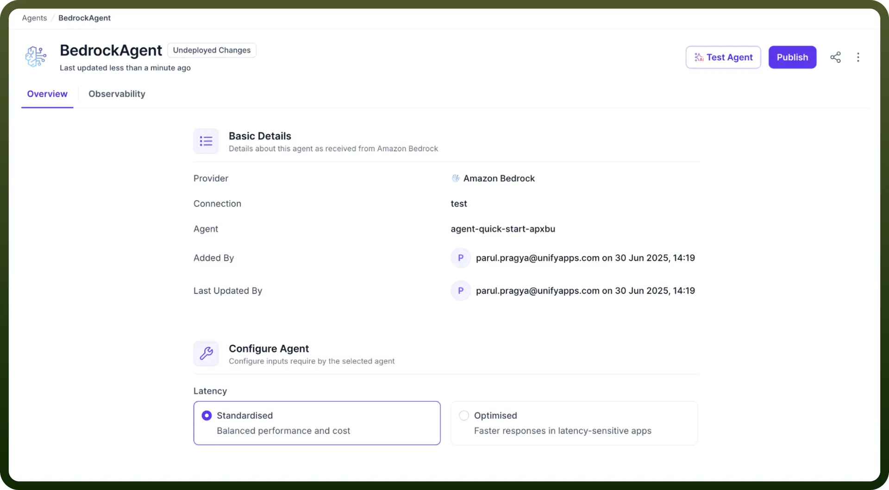

# Import External Agents via Bedrock

Source: https://www.unifyapps.com/docs/unify-agentic-ai/import-external-agents-via-bedrock
Section: agentic-ai

---

## Overview

This guide walks you through the process of integrating third-party agents from Amazon Bedrock into UnifyApps platform. This allows you to integrate and access agents created outside the platform within your setup.

## Step-by-Step Process

1. **Access the New Agent Creation**
  - Navigate to the **Agents** dashboard
  - Click on the dropdown button beside the + New Agent button in the top-right corner.
  - From the dropdown menu, select `Add External Agent from Bedrock`**.**

    

2. **Configure Connection Settings** On the "New External Agent" page, you'll need to configure the following:

  

  - **Connection**: Click the dropdown to select an existing connection
    - Choose from available connections
    - If no suitable connection exists, click **+ Add New Connection** to create a new one

      

  - **Agent**: After selecting a connection, choose the specific agent
    - The dropdown will populate with available agents from the selected connection
    - Use the **Refresh Results** button if you need to update the agent list

      

  - **Display Name**: Enter a name for the agent as it will appear in your platform
    - This name will be used to identify the agent once integrated
    - Choose a descriptive name that reflects the agent's purpose
3. **Configure Agent Settings** Choose between two latency configurations:
  - `Standardised` (Recommended)
    - Balanced performance and cost
    - Suitable for most use cases
  - `Optimised`
    - Faster responses in latency-sensitive applications
    - Higher cost but improved performance
4. **Complete the Integration**
  - Review all configuration settings
  - Click `Create` to integrate the external agent
  - The system will process the integration and create the new agent
5. **Verify Integration** After successful creation, you'll be redirected to the agent overview page where you can:
  - View **Basic Details** including:
    - Provider: Amazon Bedrock
    - Connection name
    - Agent identifier
    - Creation timestamp and user
  - Access **Configuration Options** for further customization
  - Use **Test Agent** to verify functionality
  - **Publish** the agent to make it available.

