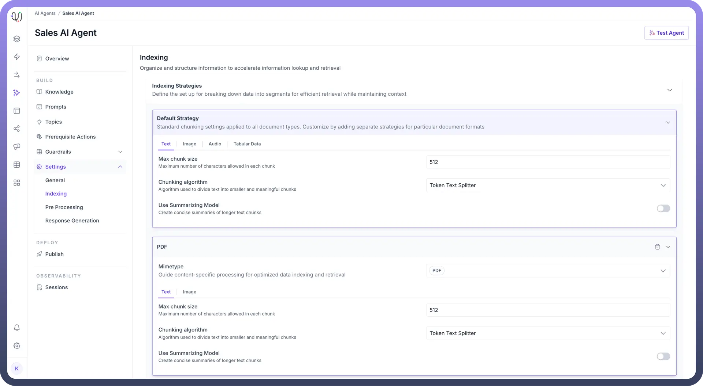
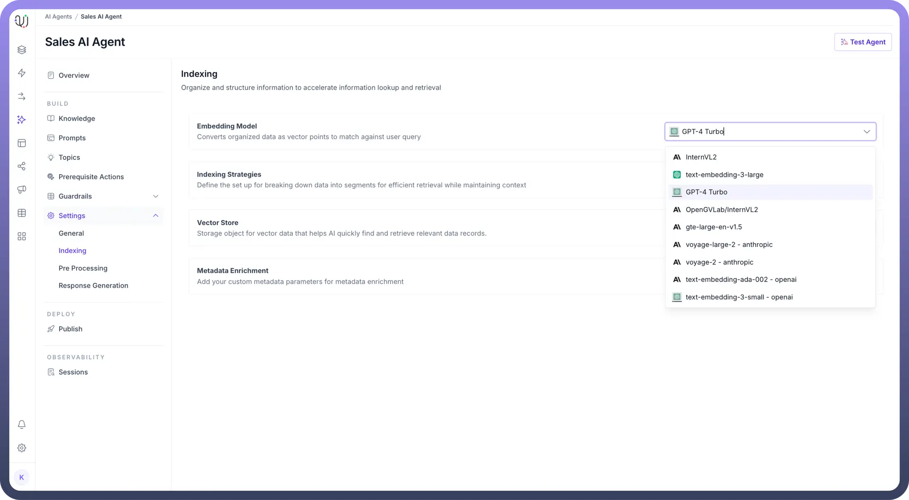
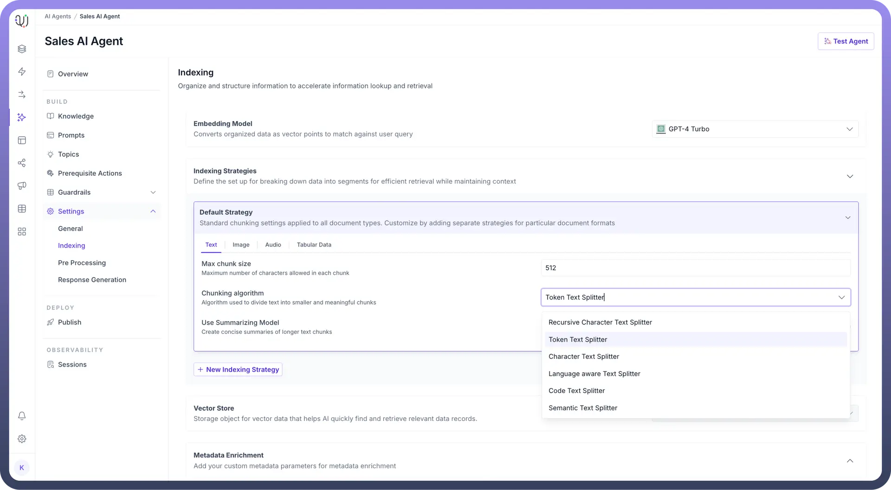
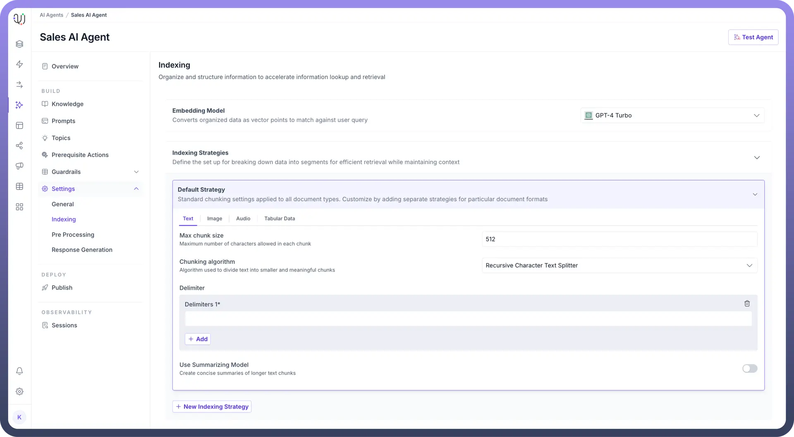
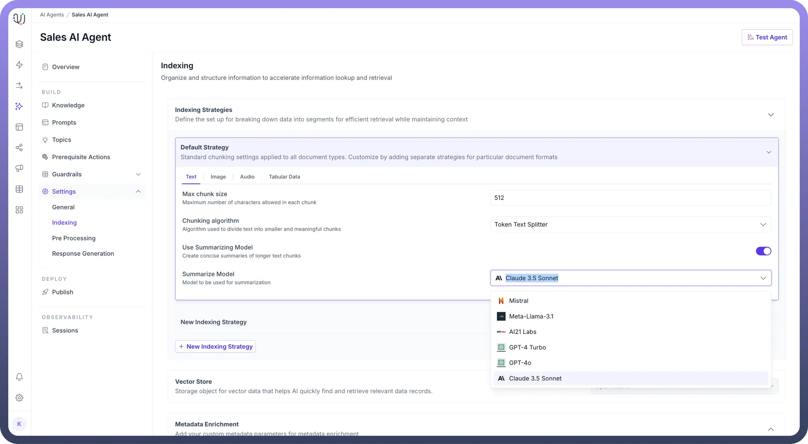
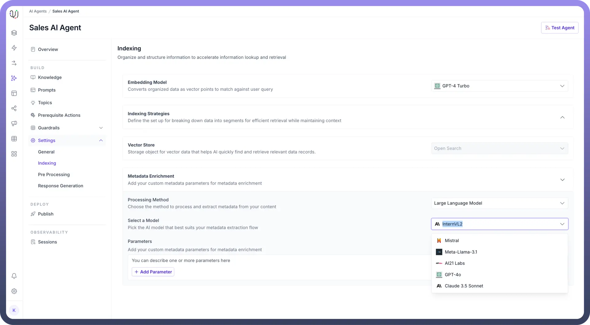
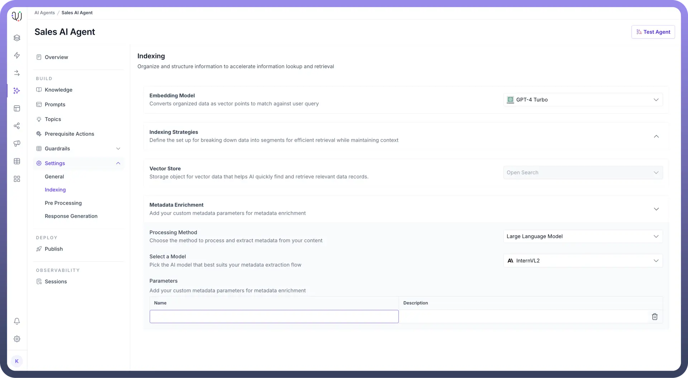
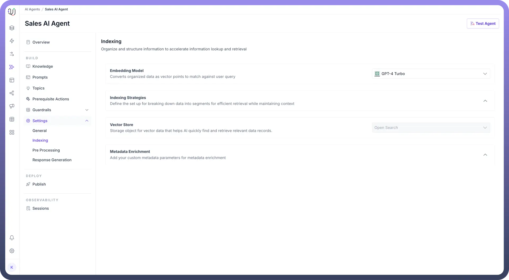

# Indexing

Source: https://www.unifyapps.com/docs/unify-agentic-ai/indexing
Section: agentic-ai

---

## Overview

The complete knowledge management process for an AI Agent consists of 3 layers:

AI Agent Response Generation Workflow :

1. **Knowledge Indexing**
  - Document processing
  - Embedding generation
  - Vector storage
2. **Query Processing & Retrieval - Query Rephrasing**
  - Chunk Retrieval
  - Ranking/Reordering
3. **Response Generation**
  - Answer formation
  - Response delivery

The Indexing process represents the first layer of the knowledge management process, positioned before query processing and final response generation.

## Why is Indexing required?

Indexing is the foundational step when connecting any knowledge source with your  AI Agent. When you add a knowledge source - whether it's documents or multimedia content - the indexing process is used to transform this raw information into a format your agent can effectively understand and use to generate responses.Content from knowledge source is segmented into optimized chunks and transformed into (embeddings) that are stored into a vector database on the platform. All these steps ensure a better and cohesive response from your AI Agent.

**Do the users need to do it manually?**

No. Unify’s AI Agent setup provides an out of the box and best in class indexing setup which automatically processes any new knowledge source which is added. However, users have the option of defining their own custom indexing settings as per the process defined below.

## How Indexing Works?

Let's walk through what happens when you add a document to your AI Agent's knowledge base, for example, a company policy document about employee leave procedures.

**Step 1: Document Upload and Initial Processing**

When a document is added to your AI agent's knowledge base, the system first identifies its format (PDF, Word, text, etc.). This initial processing stage prepares your document for the subsequent chunking phase by analyzing its structure and organizing the content into processable segments.

For example, you upload a PDF document as your agent's knowledge source that contains the below two sections: 

**Section 1: Annual Leave Policy** Employees are entitled to 20 days of annual leave per calendar year. Leave must be approved by immediate supervisors at least two weeks in advance.

**Section 2: Sick Leave Guidelines** Employees should notify their manager within 2 hours of their shift start time.

**Step 2: Breaking Down the Content (Chunking)**

The system breaks down your document into smaller, manageable pieces.
Each Agent comes with a Default Strategy that applies standard chunking settings across all document types, but you can create custom strategies for different content types by clicking the "`New Indexing Strategy`" button. This flexibility is important because different types of content require different handling:

Text, Image, Audio, and Tabular Data (as shown in the tabs) each have unique characteristics:

1. Text documents might need specific chunk sizes and splitting algorithms
2. Images require a text extraction model.
3. Audio modality needs transcription settings.
4. Tabular Data can be indexed through tables to sql or by generating simple embeddings.

  

For Example, let’s assume in this scenario **Default Strategy** applies with:

- Chunk size of 512 characters
- Token Text Splitter algorithm

This might create chunks like:

- Chunk 1: "Section 1: Annual Leave Policy - Employees are entitled to 20 days..."
- Chunk 2: "Section 2: Sick Leave Guidelines - Employees should notify..."

Each chunk maintains enough context to be meaningful while being small enough for efficient processing.

**Step 3: Converting to Vector Format (Embedding)**

Each chunk is converted into a numerical format (vectors) using your selected embedding model (e.g., text-embedding-3-small):

- Text is transformed into a series of numbers
- These numbers represent the meaning and context of the text
- Similar content gets similar number patterns

For example, "Annual leave policy" → [0.123, 0.456, 0.789,]

You can choose your own embedding model by selecting from the list of available models under embedding model settings.

**Step 4: Storage and Organization**

All the vector embeddings and  processed information is stored in the vector store object within the UnifyApps platform.However we can also customize external vector databases to generate responses depending on organizational requirements.

## How It Works in Practice?

When someone asks: "What's the process for requesting annual leave?"

1. **Query Processing**
  - Question is converted to the same vector format
  - System searches for similar vectors in the stored data
2. **Retrieval**
  - Matches are found in the relevant chunks
  - System pulls the appropriate section about annual leave
3. **Response Generation**
  - AI uses the retrieved chunks to formulate an accurate response
  - Returns the specific policy details about requesting leave

Refined and well structured indexing settings can help in ensuring

- Faster response times
- More accurate answers
- Better understanding of context

> **Note:** The goal is to help your AI Agent quickly find and accurately use the right information when answering questions. The indexing settings you choose directly impact how well it can do this.

## Configuring Indexing Settings

To configure the Indexing process in UnifyApps AI Agents, follow these easy steps:

1. Select an `Embedding Model` to convert organized data into vector points for fast retrieval. This will enable efficient matching against user queries.

  

2. For `Indexing Strategies`,
  - Set the maximum number of characters allowed in each chunk of text to optimize retrieval in the “`Max Chunk Size`” field.
  - Then, Choose the “`Chunking Algorithm`” for how the content will be split into chunks.

    

  - You can also choose different algorithms for different MIME types and can customize indexing settings based on the MIME type.

    

  - Optionally, you can add a delimiter to define where splits in the data should occur.

    

  - You can toggle the “`Use Summarizing Model`” option to create concise summaries of longer text chunks.

    

3. For `Metadata Enrichment`,
  - Choose the “`Processing Method`” to process and extract metadata from your content.
  - Then, “`Select a Model`” that will assist in metadata extraction.

    

  - Optionally, you can add custom metadata Parameters to enrich the indexing process by clicking on the “`Add Parameter`” button.

    

  - Define a “`Vector Store`” for storing the data that will be indexed. This storage helps quickly find and retrieve relevant data points.

    

These steps allow you to organize and structure data efficiently for faster lookup and retrieval in UnifyApps AI Agents.

The next step is preparing and optimizing user queries through rephrasing, chunk retrieval, and augmentation for effective processing, which are set up through pre processing settings.
