# Integrate Knowledge Base

Source: https://www.unifyapps.com/docs/unify-agentic-ai/integrate-knowledge-base
Section: agentic-ai

---

## Overview

Think of AI agent knowledge as the central repository of your intelligent assistant that powers every interaction and decision. While Large Language Models (LLMs) offer impressive general capabilities, they often lack the specific, accurate, and up-to-date knowledge needed for specialized business contexts. Adding knowledge sources to your AI agent is equivalent to providing it with specialized training and expertise, ensuring it can deliver accurate, contextual, and valuable responses beyond the limitations of generic LLM training data.

## Types of Knowledge Sources

There are four ways to add Knowledge to your AI Agent.

1. `Upload Documents` **:** Consider a digital library that lets you feed your AI Agent with various file formats like CSVs, PDFs, DOCs, XLS, and PPTs. Perfect for adding company documentation, handbooks, and internal resources that stay relatively static. For Example, Let's say you are building a HR Support agent then you could upload Employee handbook (PDF) and Training presentations (PowerPoint)
2. `Import a Website` **:** Enables your AI Agent to automatically crawl and index specified website content. Creates a dynamic knowledge base that stays current with your website updates, ensuring the agent always has the latest information.For Example, an e-commerce sales agent synchronizes weekly blog posts about new arrivals, keeps track of monthly promotional offers, and updates yearly policy changes.
3. `Applications` **:** Connects your AI agent directly to business applications and tools for real-time data access. Allows seamless integration with your existing software ecosystem like Slack, Teams etc. for up-to-the-minute information retrieval.For Example, Building a Project manager which has access to Slack/Teams thread for tracking all the delivery updates.
4. `Data Catalog` : Connect data catalogs with your agent to provide comprehensive knowledge of your data sources and their relationships. This enables your AI agent to understand the structure, lineage, and metadata of your enterprise data ecosystem. For Example, A financial advisory agent accessing a banking data catalog can navigate through account, customer, and transaction relationships to provide holistic financial insights while understanding the connections between different data entities.

## Role Based Access Control

UnifyApps supports Role-Based Access Control (RBAC) filters within its knowledge structure, providing a robust system for managing information access. This ensures that different users or roles within an organization can access only the knowledge or data that they are authorized to see.

For example, imagine a large company where:

- HR staff can access all employee records
- Department managers only see their team's information
- Regular employees can only view general company policies

When someone asks the AI agent about salary information:

- HR gets complete salary band information
- Managers see only their department's ranges
- Employees receive general policy information

## Step-by-Step Guide to Add Knowledge

1. In the AI Agents dashboard, select the "`Knowledge`" option from the left-hand sidebar.

  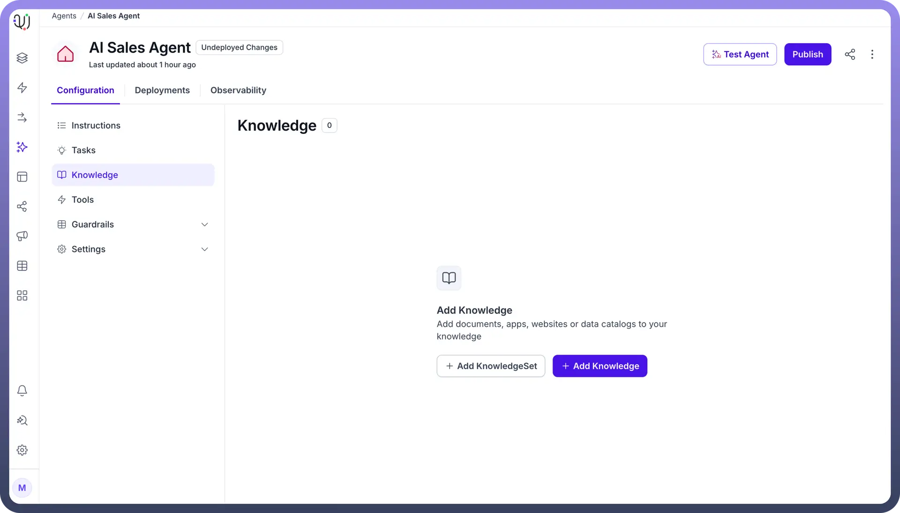

2. On the Knowledge page, click the “`+ Add Knowledge`” button. This action will prompt you to begin adding a new Knowledge base.
3. We provide four options to upload the Knowledge base for your agent:

  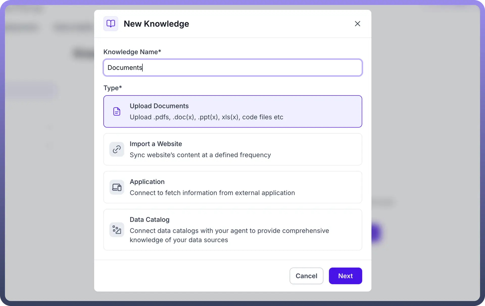

  - `Upload Documents` Upload files directly from your system, including PDFs, Word, Excel, PowerPoint etc, allowing the AI Agent to access and use the content for its tasks.

    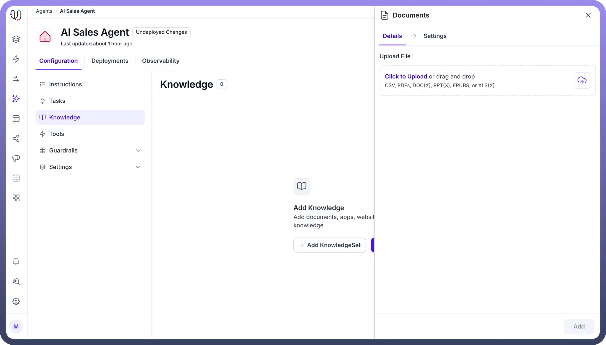

  - `Import a Website` Sync content from a website at regular intervals, enabling the AI agent have access to the latest data for more accurate and up-to-date responses. There are multiple options for refreshing frequency. It can be done on a Daily, Weekly, Monthly or yearly basis.

    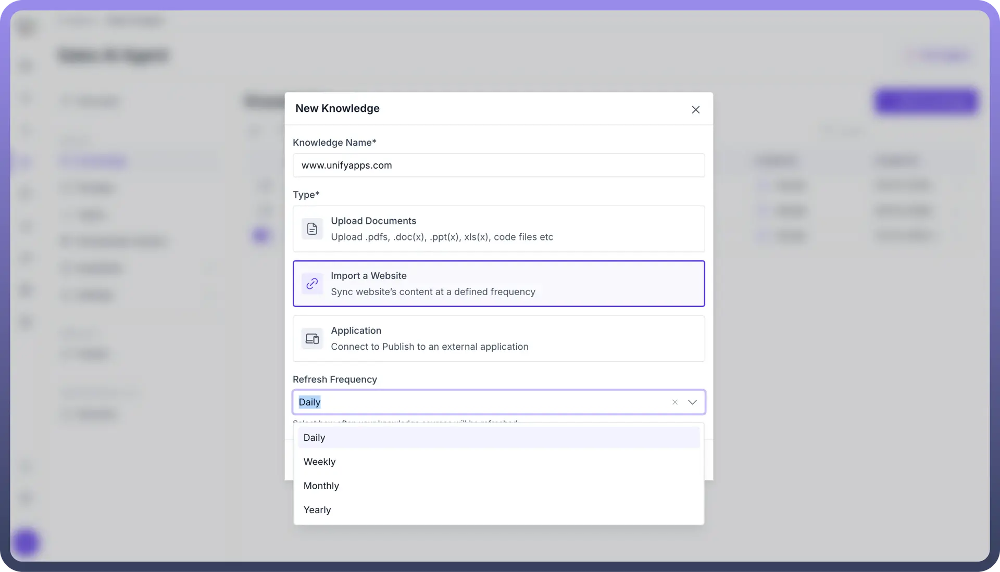

  - You can either import all the pages from the provided URL or select specific web pages to import.

    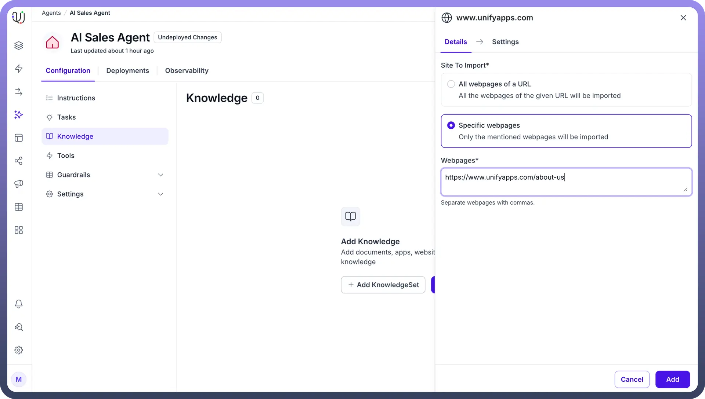

  - `Applications`: Connect the AI Agent to external applications like CRMs or databases, allowing it to pull real-time data and improve its performance and relevance in completing tasks. **Note:** If your use case involves performing analysis on an entire document (e.g., summarization, extraction, or deep insight generation), using **Knowledge** is not ideal. Instead, directly attach the document in the **Copilot chat** while interacting with the agent. This ensures the full content is available for context-aware, accurate analysis.

    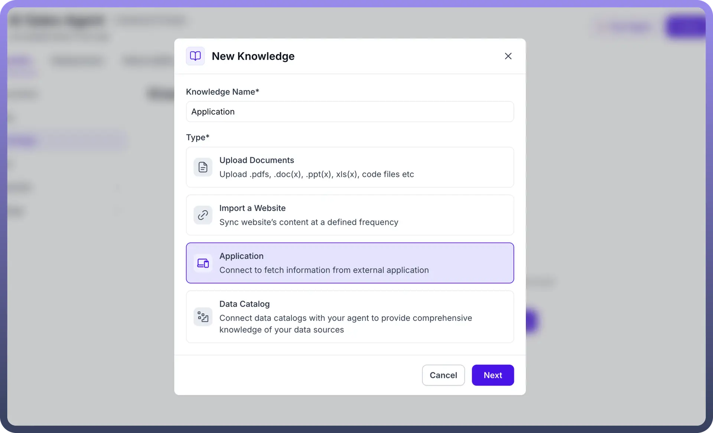

    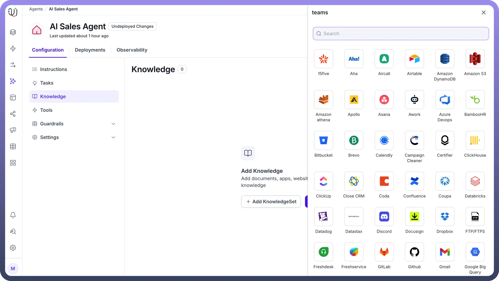

## Managing Knowledge Sources

Managing your AI agent's knowledge base is like controlling a smart digital library. The agent will only fetch answers from enabled knowledge sources, allowing you to control what information is accessible. 

For example, when you disable last year's holiday promotion guidelines and enable the current campaign information, the agent will exclusively reference the active content. By deleting outdated content like discontinued product details or old policy documents, you ensure the agent always provides accurate and current information from the enabled sources.

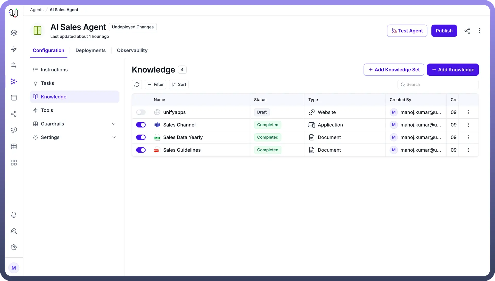

## Knowledge Set

We have an option to use a knowledge set which would not be specific to the agent and you can use this knowledge set to any agent you use . To create a Knowledge set Select the Knowledge option from Unify AI menu and select `+New Knowledge Set`

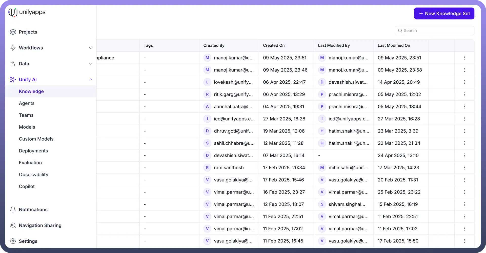

Give the Knowledge set a name that would resemble the data you are planning on indexing.

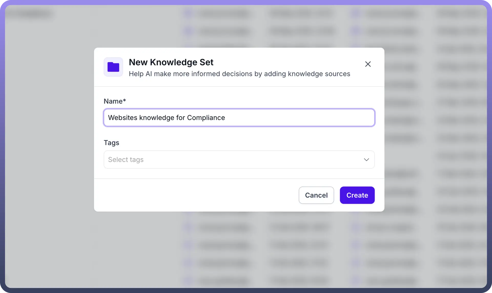

Select the new knowledge option and start indexing knowledge

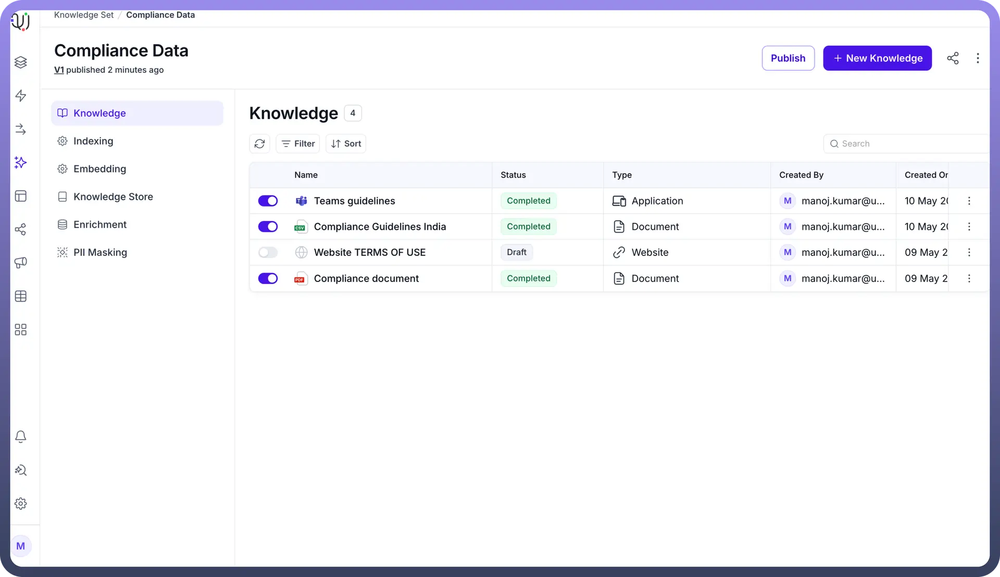

You can now use this knowledge set as knowledge for any agent .
