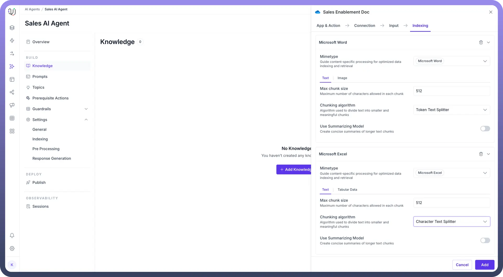

# Knowledge Ingestion

Source: https://www.unifyapps.com/docs/unify-agentic-ai/knowledge-ingestion
Section: agentic-ai

---

## Overview

Our knowledge ingestion setup allows you to process different modalities and MIME types, handling both structured and unstructured information across various file formats (.doc, .docx, .pdf, .xlsx, .csv, etc.). The content can exist in multiple modalities including text, images, tables, and audio.

## Core Ingestion Process

1. The core ingestion process begins by segregating **document modalities(Text,Images,Audio,Tabular Data)** into a semi-structured form.
  - ***Pre-processing*****:** Document is processed to extract the different modalities into semi-structured form so as to separate text, tables, figures, audio
  - ***Tables to text conversio*****n**:
    1. Use of *Vision language models (VLM)* to generate contextual textual descriptions of the tables. The choice of VLM is fully configurable.
    2. The contextual text is treated as a chunk which is to be indexed.
  - **Image to text conversion**:
    1. Use of *Vision language models (VLM)* to generate contextual textual descriptions of the images. The choice of VLM is fully configurable.
    2. The contextual text is treated as a chunk which is to be indexed.
  - ***Audio to text conversion****:* We convert it into text format using transcription models, and then contextualize the chunk using audio level summary and captions.
2. ***Audio Modalities*** are converted into text format using transcription models, and then we contextualize the chunk using audio level summary and caption and index it into a vector store.
3. *For* ***structured data*** *such as .xls, .csv*, the user can choose to interact with it via SQL or via the RAG chain.
  - SQL -Transforms natural language queries into SQL format:
- Questions are automatically converted to SQL queries
- User queries are executed on the knowledge database
- RAG(Text using Embeddings) : If a user chooses to ingest it via RAG, every row in the xls, csv is contextualized and indexed into the vector store.

Ultimately all content is converted to text modality and chunked based on user-selected strategies such as Recursive Text Splitter or Semantic Splitter etc. These chunks are then indexed into a vector store along with essential metadata like author information, creation date, and access levels which can potentially be used in the post retrieval stage for filtering the context and final agent response.

## Supported Mime Types

| **File Format** | **Supported Content Types** |
|---|---|
| `Microsoft Word` | Text, Image, Tabular Data |
| `OpenDocument Text` | Text, Image, Tabular Data |
| `Rich Text` | Text, Image |
| `PDF` | Text, Image, Tabular Data |
| `Plain Text` | Text |
| `Web Page` | Text, Image, Audio, Tabular Data |
| `EPUB` | Text, Image |
| `Microsoft Excel` | Text,Tabular Data |
| `OpenDocument Spreadsheet` | Text,Tabular Data |
| `CSV` | Text,Tabular Data |
| `TSV` | Text,Tabular Data |
| `Microsoft PPT` | Text, Image, Audio, Tabular  Data |

## Knowledge Indexing Pipeline

1. **Fetch Knowledge from the Source** The first step is to fetch knowledge from different sources. These sources can have knowledge in multiple formats like text (PDF, XLS, TXT), images (JPG, PNG), audio (MP3). Each file may come with Role-Based Access Control (RBAC) metadata that governs who can access the information. Once you add the connection in the knowledge source in the agent, an automation is scheduled in the background automatically to start the knowledge indexing process.
2. **Process the Knowledge Based on MIME Type** Once the data is fetched, it is processed according to its MIME type. The process of knowledge indexing can be customized at each MIME type level for each knowledge source.Indexing settings for different MIME types can be configured at both universal agent level and at individual knowledge level as well.

  

3. **Convert Knowledge of Different Modalities into Basic Units** Knowledge from different formats is converted into contextualized text. This might mean extracting text from PDFs, transcribing audio, or performing OCR on images. These basic units will later be indexed and embedded for efficient search retrieval. Settings available for each basic unit are explained below.
4. **Split the Knowledge into Chunks** Once the knowledge is processed, it is split into smaller chunks of information. This helps the system manage and retrieve knowledge more efficiently during search queries. Chunking of each MIME type can be configured. Chunking also needs to be contextual like a group of teams messages including thread, data of one table in a pdf.
5. **Generate Embeddings for Chunks** Each chunk is converted into embeddings (vector representations) using an embedding model. These embeddings represent the semantic meaning of chunks mathematically, allowing the system to correlate the user query with semantically similar embedded chunks. This approach enables the system to understand and match content based on meaning rather than just keywords, improving the accuracy and relevance of search results.
6. **Store Embeddings and RBAC Details** Finally, the embeddings are stored along with the RBAC metadata. Wherever possible, the RBAC details from the source are normalized to identifiable values, such as email addresses. If normalization is not feasible, the original RBAC details are stored as-is. During retrieval, if a normalized value (like an email) is available, it is used to filter the chunks for the requesting user. Otherwise, the user's permissions are dynamically fetched from the source to ensure proper access control for the relevant content. For example in Sharepoint we check the email address of the User and if the user has access to that particular folder then only the agent will answer the query based on the source.
