# Knowledge Settings

Source: https://www.unifyapps.com/docs/unify-agentic-ai/knowledge-settings
Section: agentic-ai

---

## Overview

This documentation covers the comprehensive knowledge management system for AI agents, including indexing strategies, PII masking, and enrichment capabilities. The system uses a four-stage pipeline to process and optimize knowledge for retrieval.

## Knowledge Indexing Pipeline

When you add a knowledge document to your AI agent, it goes through a four-step pipeline:

1. `Parsing` **– Making Sense of Your Document** The **parsing** phase transforms diverse document types (e.g., PDFs, DOCX, PPTX) into machine-readable formats. **Supported Extracted Elements:**
  - **Text**: Raw readable content
  - **Images**: Visual data (charts, infographics)
  - **Tables**: Structured row-column formats
  - **Layout & Formatting**: Hierarchy, headings, bullets, etc. **Note:** Good formatting (like proper headings and lists) significantly boosts parsing accuracy.
2. `Chunking` **– Breaking Documents Into Bite-Sized Pieces** After parsing, the next step is chunking—which simply means splitting a big document into smaller parts. **Why is this important?**
  - **Faster Responses**: Instead of scanning the whole document, the AI can quickly look through just the pieces (chunks) that matter.
  - **Less Strain on Memory**: Smaller pieces are easier for the system to process, which makes everything run more smoothly.
  - **Better Accuracy**: By focusing only on the most relevant chunks, the AI is more likely to give precise and accurate answers.
3. `Embedding` **– Turning Text into Meaningful Math** Once your document is broken into chunks, the next step is to turn each chunk into a number-based format called an embedding. Here’s what that means:
  - **Each chunk becomes a vector**: A vector is just a set of numbers that represents the meaning of the text.
  - **Similar meanings = closer vectors** For example, "great" and "awesome" might be far apart in a sentence, but their vectors will be close together because they mean similar things.
  - **Queries become vectors too**: When you ask a question, the system turns your query into a vector and looks for document chunks with similar vectors.
  - **It finds the closest matches**: This is how the AI figures out which parts of the document best answer your question. In short, embedding lets the AI find meaning and relevance using math—even if the exact words don’t match.
4. `Indexing` **– Organizing for Fast Search** After the document chunks are turned into vectors, the next step is to store them in a smart, searchable way. That’s what indexing does. Here’s how it works:
  - **All vectors go into a special database**: This database is built to quickly find and compare these number-based vector representations.
  - **Fast lookups**: When you ask a question, the system can quickly scan the database to find the most relevant chunks.
  - **Optimized for performance**: Indexing ensures that even with thousands of documents, the AI can find answers in seconds, not minutes. In short, indexing organizes all the embedded knowledge so your AI can search and respond lightning-fast.

## Knowledge Settings Interface

Once a document is added, you can configure several **settings** to control how it's parsed, indexed, and used.

> **Note:** Indexing settings will use the global agent configuration by default. You can customize settings here to override global defaults for specific MIME formats. Any changes made here will only apply to this knowledge source.

## Indexing Strategies

Each knowledge source allows customization of parsing, indexing, and enrichment parameters. These can override global agent configurations for greater control.

**Creating New Indexing Strategies**

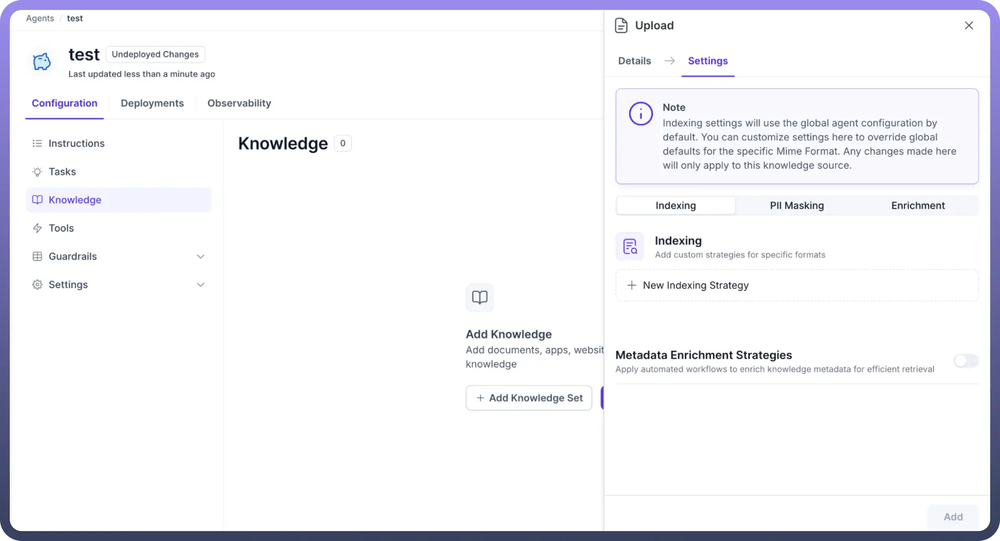

### MIME Type Selection

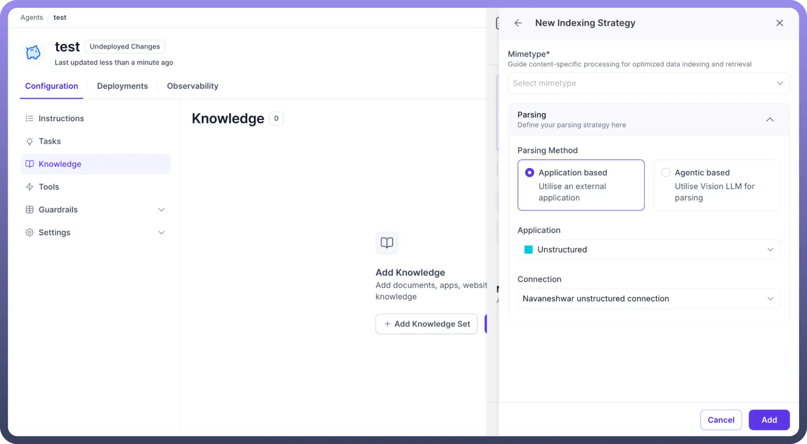

Select the correct format to optimize parsing strategy:

| **MIME Type** | **Use Case** |
|---|---|
| `Excel` | Tabular datasets, KPIs |
| `Word` | Reports, SOPs, policies |
| `PowerPoint` | Visual decks, product slides |
| `PDF` | Contracts, scanned docs |
| `Markdown` | Developer documentation |
| `JSON` | Structured config/data |
| `Images` | Scanned docs, charts |
| `ZIP` | Batch uploads |
| `Text` | Simple logs, notes |

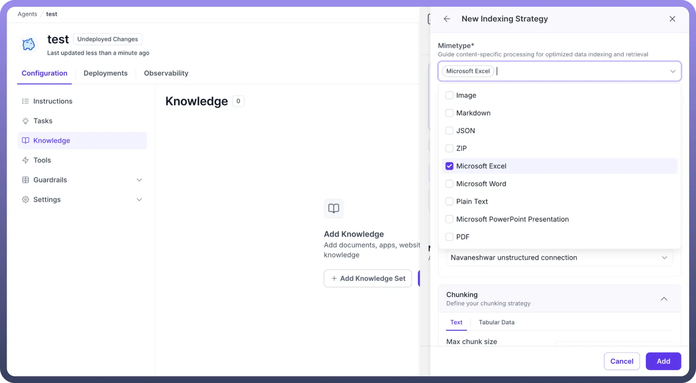

### Parsing Methods

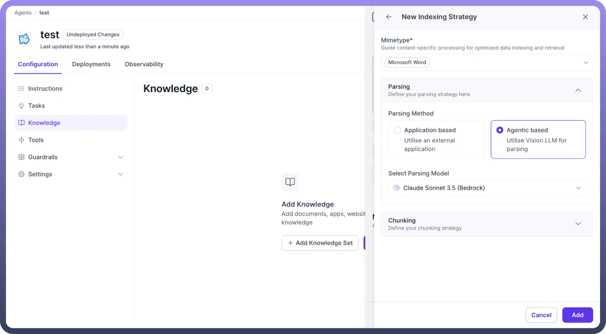

- `Application-Based Parsing`
  - **Description**: Utilizes external applications for parsing
  - **Speed**: Faster processing
  - **Accuracy**: Standard accuracy
  - **Best for**: Simple documents with minimal visual complexity
  - **Connection**: Requires configured external connections (e.g., "Unstructured connection")
- `Agentic-Based Parsing`
  - **Description**: Utilizes Vision LLM for parsing
  - **Speed**: Slower processing
  - **Accuracy**: Higher accuracy with visual elements
  - **Best for**: Complex documents with charts, graphs, images, and visual data
  - **Model Selection**: Choose from available models (e.g., Claude Sonnet 3.5 Bedrock)
  - **Recommendation**: Use for heavy OCR tasks and vision-related processing

### Chunking Strategies

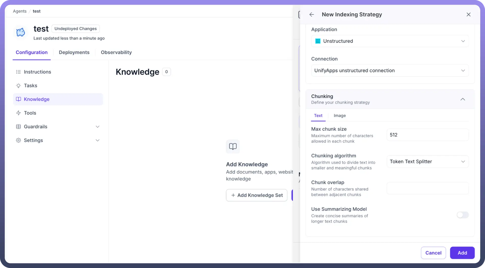

- **Text Chunking**
  - **Max Chunk Size**: Configure maximum characters per chunk (default: 512)
  - **Chunking Algorithm**: Algorithm used to divide text into smaller and meaningful chunks
  - **Chunk Overlap**: Number of characters shared between adjacent chunks
  - **Use Summarizing Model**: Creates concise summaries of longer text chunks
- **Image Chunking**
  - **Processing Method**: Technique to analyze and extract structured data from images
    - **Image to Text**: Converts visual content to text format
  - **Text Extraction Model**: Select appropriate model for OCR processing

    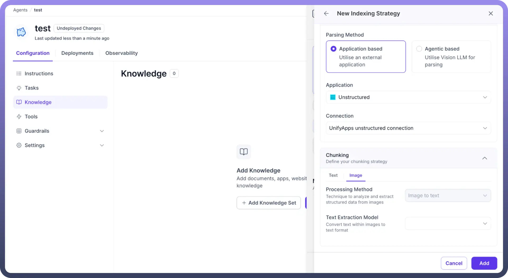

- **Tabular Data Processing**

  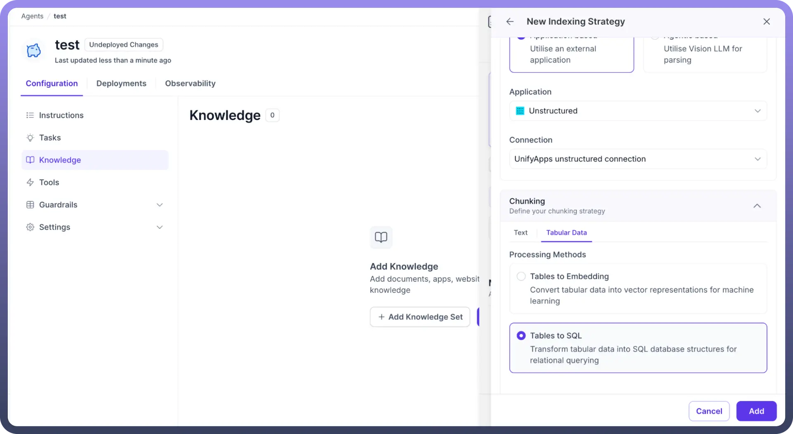

  - `Tables to Embeddings`
    - **Purpose**: Convert tabular data into vector representations for machine learning
    - **Use Case**: Semantic search across table data
    - **Best for**: Exploratory queries and information retrieval.
  - `Tables to SQL`
    - **Purpose**: Transform tabular data into SQL database structures for relational querying
    - **Use Case**: Precise data lookups and structured queries
    - **Best for**: Exact data retrieval and analytical queries
    - **Requirement**: First row must contain column headers

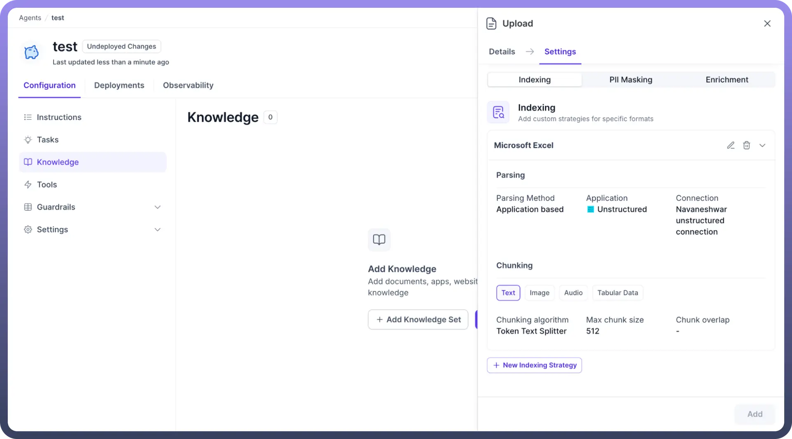

## PII Masking

Filter out sensitive information using multiple detection and protection methods to ensure data privacy and compliance.

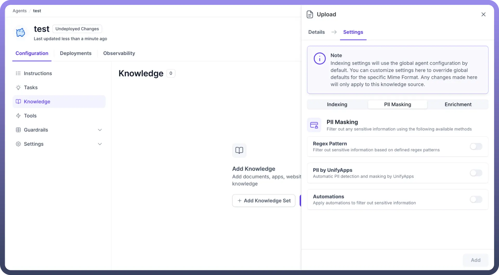

**Available Methods**

1. **Regex Pattern:** Filter out sensitive information based on defined regex patterns **Use Cases**: **Configuration**:

  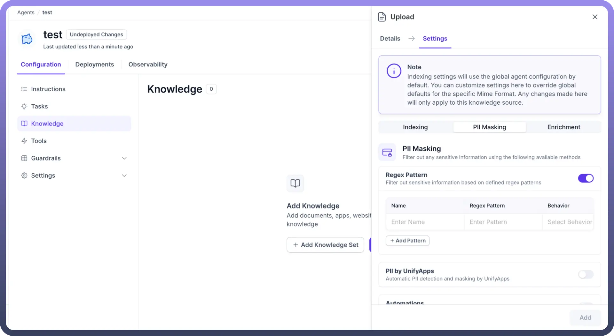

  - Custom sensitive data formats
  - Organization-specific identifiers
  - Industry-specific sensitive patterns
  - **Name**: Descriptive name for the pattern
  - **Regex Pattern**: Define the pattern to match sensitive data
  - **Behavior**: Choose action when pattern is detected
    - **Mask**: Hide matching content from the agent
    - **Block**: Stop processing entirely if pattern is found
2. **PII by UnifyApps :** Automatic PII detection and masking by UnifyApps **Features**:
  - Automatically detects common PII types:
    - Credit card numbers
    - Social security numbers
    - Phone numbers
    - Email addresses
    - Personal identifiers
  - No manual configuration required
  - Built-in intelligence for common sensitive data patterns
3. **Automations:** Apply custom automations to filter out sensitive information **Capabilities**:
  - Create complex PII detection workflows
  - Integrate with external systems
  - Implement organization-specific masking rules
  - Multi-step processing logic

## Enrichment Strategies

Enrich indexed knowledge with metadata for improved retrieval results and enhanced contextual understanding.

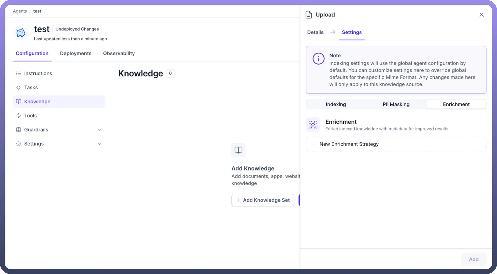

**Creating New Enrichment Strategies**

- **Processing Method:** Choose the method to process and extract metadata from your content

  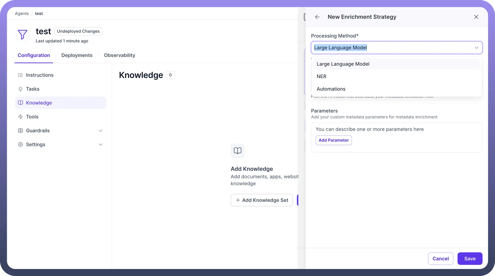

  1. **Automations**: Select from existing automations or create new ones

    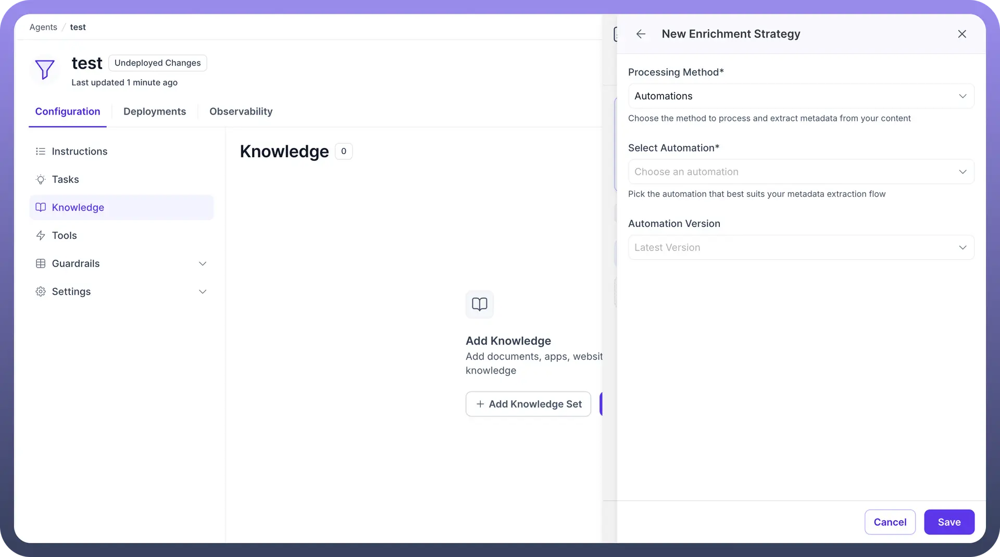

  2. **Large Language Model**

    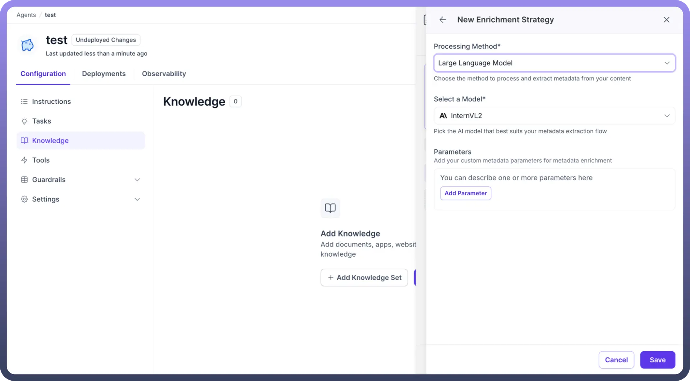

    - **Model Selection**: Select model that best suits your metadata extraction needs
    - **Parameters Configuration**:
      - **Custom Metadata Parameters**: Define specific metadata fields to extract
      - **Multiple Parameters**: Add multiple parameters for comprehensive enrichment

## Knowledge Sets

Knowledge sets provide a **single source of truth** for multiple agents sharing the same knowledge base, eliminating the need to manage knowledge across individual agents.

**Problem Solved**

**Without Knowledge Sets**:

- Must add knowledge to each agent individually
- Updates require modifying every agent separately
- Maintenance complexity increases with agent count
- Inconsistency risks across agents

**With Knowledge Sets**:

- Create centralized knowledge repository
- Multiple agents reference the same knowledge set
- Single update propagates to all connected agents
- Consistent knowledge across all agents

### Implementation Process

1. Navigate to Knowledge section
2. Click "`Add Knowledge Set`"

  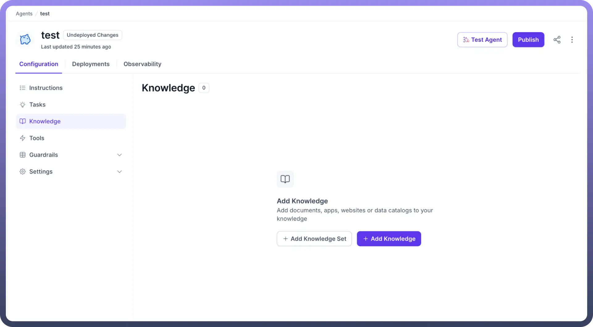

3. Create new knowledge set with descriptive name
4. Add knowledge documents using same configuration options
5. Reference knowledge set in multiple agents
6. Manage updates centrally through the knowledge set

## Best Practices

**Parsing Strategy Selection**

- **Use Application-based** for:
  - Simple text documents
  - Standard formatted files
  - High-volume processing needs
  - Performance-critical applications
- **Use Agentic-based** for:
  - Documents with complex visual elements
  - Charts, graphs, and diagrams
  - Scanned documents requiring OCR
  - High-accuracy requirements

**Chunking Optimization**

- **Adjust chunk size** based on content type:
  - Smaller chunks (256-512) for precise retrieval
  - Larger chunks (1024+) for context preservation
- **Configure overlap** to maintain context between chunks
- **Enable summarization** for lengthy content sections

**PII Protection Strategy**

- **Layer multiple methods**:
  - Start with automatic PII detection
  - Add regex patterns for specific organizational data
  - Use automations for complex scenarios
- **Test thoroughly** before production deployment
- **Regular audits** of PII detection effectiveness

**Enrichment Implementation**

- **Start simple** with basic metadata extraction
- **Gradually add complexity** based on retrieval performance
- **Monitor enrichment impact** on query results
- **Balance processing cost** with retrieval improvement

**Knowledge Set Management**

- **Use descriptive names** for knowledge sets
- **Group related knowledge** logically
- **Monitor agent dependencies** before making changes
- **Implement change management** processes for updates

## Troubleshooting

**Common Issues**

**Parsing Failures**:

- Check file format compatibility
- Verify connection configurations
- Review document structure and quality
- Consider switching parsing methods

**Chunking Problems**:

- Adjust chunk size for content type
- Modify overlap settings
- Review chunking algorithm selection
- Check for content formatting issues

**PII Detection Issues**:

- Test regex patterns independently
- Verify auto-detection coverage
- Review automation logic
- Check for false positives/negatives

**Enrichment Failures**:

- Validate model selection
- Review parameter definitions
- Check automation workflows
- Monitor processing performance

The knowledge settings system provides comprehensive control over how AI agents process, understand, and retrieve information. By carefully configuring indexing strategies, implementing appropriate PII protection, and leveraging enrichment capabilities, you can create highly effective and secure knowledge management systems. Knowledge sets enable scalable deployment across multiple agents while maintaining centralized control and consistency.

Success depends on understanding your specific use cases, testing configurations thoroughly, and iteratively optimizing based on performance metrics and user feedback.
