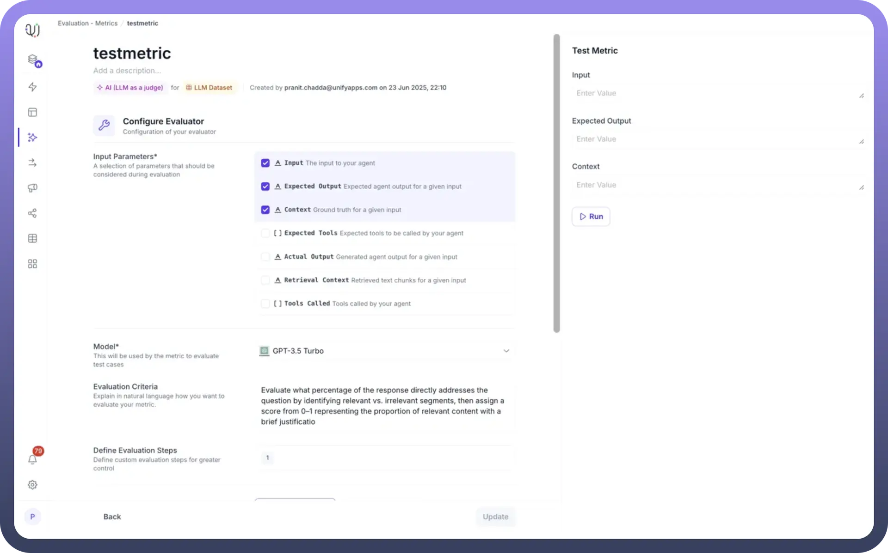
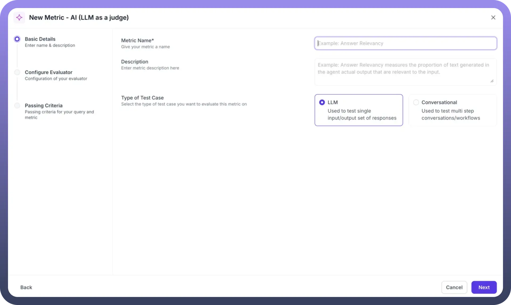
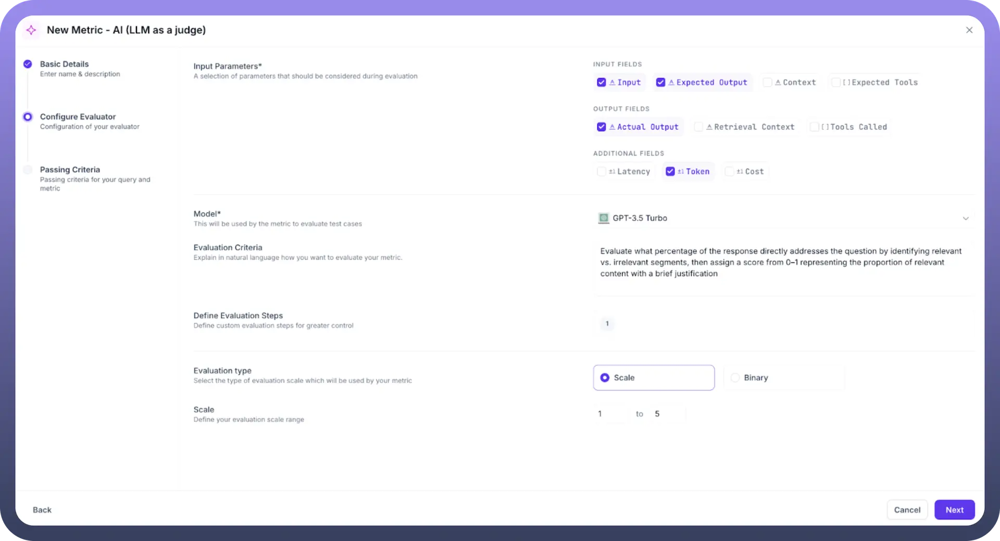
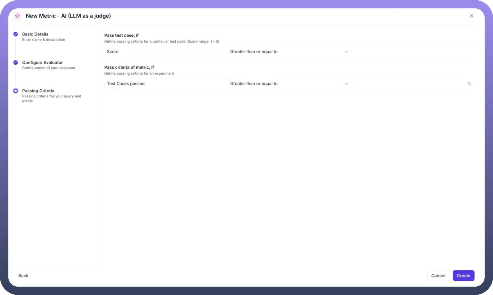
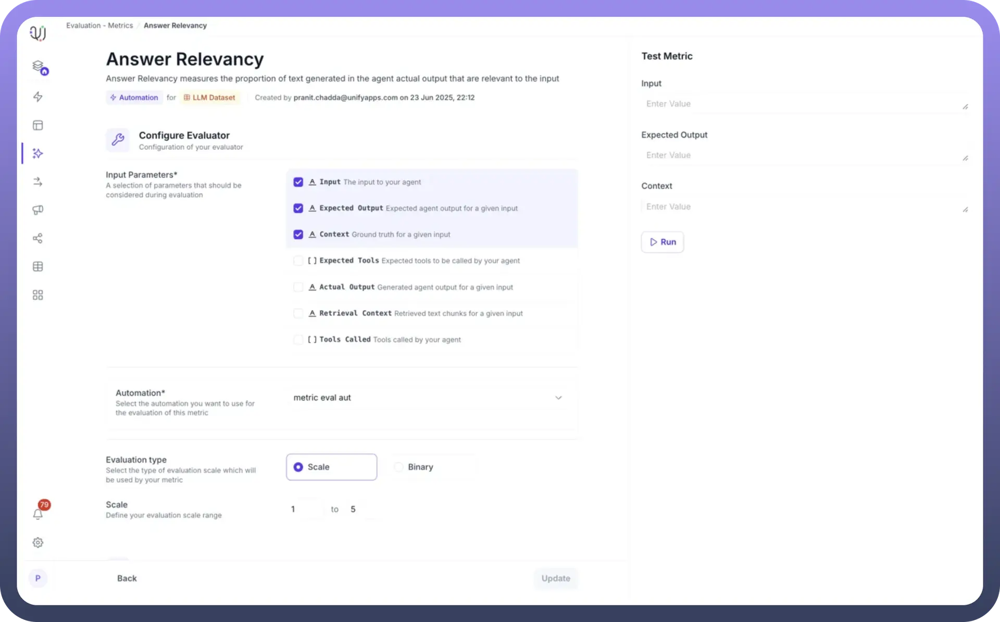
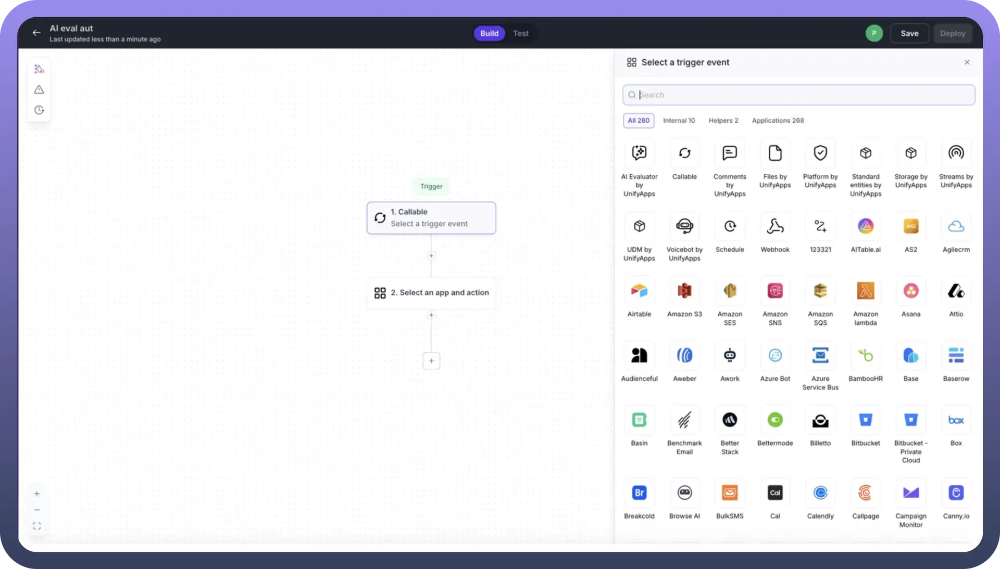
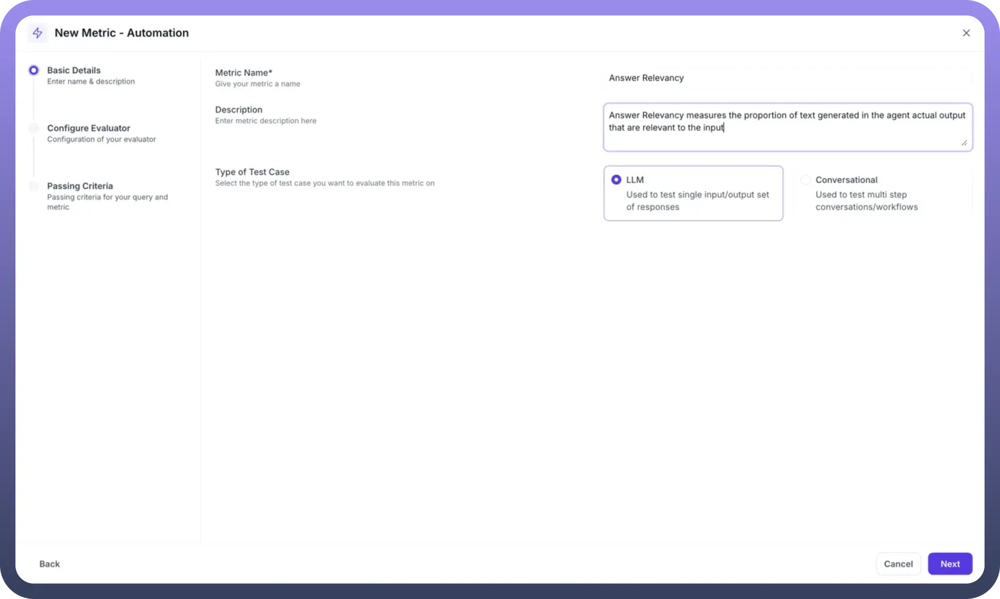
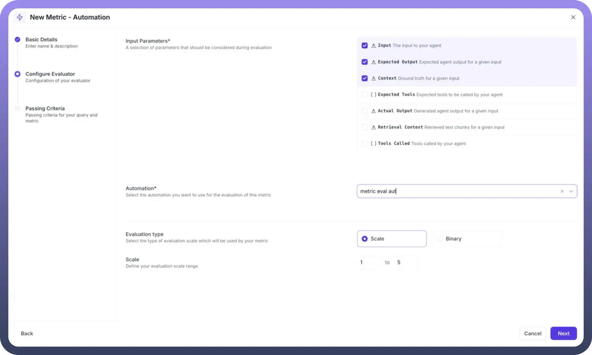
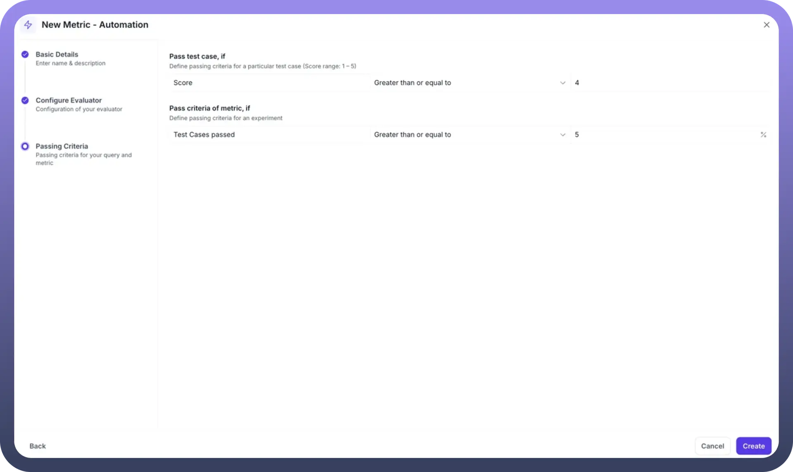

# Metrics

Source: https://www.unifyapps.com/docs/unify-agentic-ai/metrics
Section: agentic-ai

---

UnifyApps provides a comprehensive evaluation framework that enables you to create custom metrics to assess your AI Agent's performance and response quality. Whether you need to measure answer correctness, relevance, or specific tool usage, the platform offers flexible options using either LLM-as-a-judge or automation-based evaluators. Let's explore how to create and configure metrics that ensure your AI Agents meet your quality standards.

## Understanding Evaluation Metrics

Evaluation metrics are quantitative measures that assess various aspects of your AI Agent's performance by comparing actual outputs against expected results. These metrics help you:

- **Validate Response Quality**: Ensure your agent provides accurate and relevant answers
- **Track Performance**: Monitor how well your agent performs across different test cases
- **Identify Improvement Areas**: Pinpoint specific capabilities that need enhancement
- **Maintain Standards**: Set passing criteria to ensure consistent quality

## AI (LLM as a Judge)

The LLM-as-a-Judge approach uses advanced language models like GPT-4 to evaluate your AI Agent's responses with human-like judgment and understanding. This method excels at assessing nuanced aspects of language quality, relevance, and contextual appropriateness.

### Creating an LLM-Based Metric

**Step 1: Initialize Metric Creation:** Navigate to the Metrics section and click `New Metric` to begin. Select `AI (LLM as a Judge)` as your evaluation type.

**Step 2: Basic Configuration**

- **Metric Name**: Provide a descriptive name (e.g., "Answer Relevancy")
- **Description**: Explain what the metric measures in detail
- **Test Case Type**: Select `LLM` for single input/output evaluation or `Conversational` for multi-step workflows

**Step 3: Select Input Parameters:** Choose the parameters necessary for evaluation:

- `Input`: The user's query to your agent
- `Expected Output`: The ideal response for comparison
- `Context`: Ground truth or retrieval context for accuracy assessment
- `Actual Output`: The agent's generated response
- `Expected Tools`: Tools the agent should have called
- `Tools Called`: Tools actually invoked by the agent
- `Retrieval Context`: Retrieved text chunks for relevance evaluation

**Step 4: Configure the LLM Evaluator**

- `Model Selection`: Choose your evaluation model (GPT-3.5 Turbo, GPT-4, etc.)
- `Evaluation Criteria`: Define how the model should assess responses using natural language instructions
- `Evaluation Steps`: Provide detailed step-by-step instructions for the evaluation process

**Step 5: Define Evaluation Scale**

- `Evaluation Type`: Choose between Scale (numerical) or Binary (pass/fail)
- `Scale Range`: Set the range (e.g., 1-5 or 0-1)
- `Passing Criteria`: Define thresholds for individual test cases and overall experiments

**Example: Answer Correctness Implementation**

When implementing an answer correctness metric:

1. **Instruction Design**: Create clear instructions like "Compare the actual output with the expected output, considering semantic similarity and factual accuracy"
2. **Scoring Guidelines**: Define what each score represents (e.g., 5 = perfect match, 1 = completely incorrect)
3. **Context Integration**: Include retrieval context to verify factual accuracy
4. **Pass Criteria**: Set thresholds (e.g., score > 0.7 for pass, 70% test cases for experiment success)

**Best Practices for LLM Evaluation**

1. **Clear Instructions**: Write specific, unambiguous evaluation criteria
2. **Example-Driven**: Include examples of good and bad responses in your instructions
3. **Consistent Scales**: Use standardized scoring scales across similar metrics
4. **Model Selection**: Use more advanced models (GPT-4) for complex evaluations
5. **Iterative Refinement**: Test and refine instructions based on evaluation results

## Automation

Automation-based evaluation provides programmatic control over the evaluation process, enabling complex logic, custom calculations, and integration with external systems. This approach is ideal for technical validations, performance metrics, and business-specific criteria.

### Building Custom Evaluation Automations

Before creating an automation-based metric, you'll need to build an evaluation automation. When creating a new automation workflow:

1. **Select the AI Evaluator Trigger**: Navigate to the automation builder and select `AI Evaluator by UnifyApps` from the available trigger options
2. **Configure Evaluation Logic**: This special trigger enables your automation to:
  - Receive evaluation parameters from the metrics framework
  - Process test case data with custom business logic
  - Perform complex calculations or external validations
  - Return scores and reasoning back to the evaluation system
3. **Define Input/Output Mapping**: Ensure your automation can handle the evaluation parameters and return scores within your defined range

Once your evaluation automation is ready, you can reference it when creating your automation-based metric.

### Creating an Automation-Based Metric

**Step 1: Basic Details Configuration**

- Click `New Metric - Automation` to start
- `Metric Name`: Enter a descriptive name (e.g., "Answer Relevancy")
- `Description`: Provide detailed explanation of what the metric evaluates
- `Type of Test Case`: Select `LLM` for single input/output evaluation

**Step 2: Configure Input Parameters**

Select which data points your automation will need to evaluate:

- `Input`: The user's query sent to your agent
- `Expected Output`: The ideal response for comparison
- `Context`: Ground truth information for validation
- `Expected Tools`: Tools the agent should invoke (optional)
- `Actual Output`: The agent's generated response
- `Retrieval Context`: Retrieved chunks from knowledge base
- `Tools Called`: Actually invoked tools by the agent

Select only the parameters relevant to your evaluation logic. For example, an answer relevancy metric might only need Input, Expected Output, and Context.

**Step 3: Select Your Automation**

- `Automation Dropdown`: Choose from your existing automation workflows
- The selected automation (e.g., "metric eval aut") will receive the chosen parameters
- Ensure your automation is designed to handle these inputs and return a score

**Step 4: Configure Evaluation Type and Scale**

- `Evaluation Type`: Choose between:
  - Scale: Numerical scoring (recommended for granular assessment)
  - Binary: Simple pass/fail evaluation
- `Scale Range`: Define your scoring range (e.g., 1 to 5)
- The automation must return scores within this defined range

**Step 5: Set Passing Criteria Define two levels of success criteria:**

**Individual Test Case Criteria:**

- `Score Threshold`: Set minimum score for a test case to pass
- `Operator`: Choose "Greater than or equal to"
- `Value`: Set threshold (e.g., 4 for a 1-5 scale)

**Experiment-Level Criteria:**

- `Test Cases Passed`: Percentage of test cases that must pass
- `Operator`: Choose "Greater than or equal to"
- `Percentage`: Set threshold (e.g., 75%)

**Example: Answer Relevancy Metric Setup**

1. `Name`: "Answer Relevancy"
2. `Description`: "Answer Relevancy measures the proportion of text generated in the agent actual output that are relevant to the input"
3. `Parameters Selected`: Input, Expected Output, Context
4. `Automation`: "metric eval aut" (pre-configured workflow)
5. `Scale`: 1 to 5
6. `Test Case Pass`: Score ≥ 4
7. `Experiment Pass`: 75% of test cases passing

Your selected automation workflow will:

- Receive the configured parameters as inputs
- Execute custom evaluation logic
- Return a numerical score within your defined range
- Optionally provide reasoning for the score

The metric framework handles:

- Parameter passing to your automation
- Score validation against your scale
- Pass/fail determination based on criteria
- Aggregation for experiment-level results

### Testing Your Automation Metric

Once created, use the Test Metric interface:

1. Enter sample values for your selected parameters
2. Click `Run` to execute the evaluation
3. Review the returned score and pass/fail status
4. Iterate on your automation logic if needed

## Best Practices for Automation Metrics

1. **Parameter Selection**: Only choose inputs your automation actually uses
2. **Clear Descriptions**: Document what your metric measures and how
3. **Appropriate Scales**: Use ranges that provide meaningful differentiation
4. **Realistic Thresholds**: Set passing criteria based on actual performance needs
5. **Automation Validation**: Test your automation separately before creating the metric

## Common Use Cases for Automation Metrics

**Technical Validation:**

- API response format checking
- Data structure validation
- Performance benchmarking

**Business Rule Compliance:**

- Policy adherence verification
- Brand guideline checking
- Regulatory compliance validation

**Complex Calculations:**

- Multi-factor scoring algorithms
- Weighted evaluation criteria
- Statistical analysis of responses

By leveraging both AI-powered and automation-based evaluation methods, UnifyApps provides the flexibility to assess every aspect of your AI Agent's performance. Whether you need nuanced language evaluation or precise technical validation, the platform's dual approach ensures comprehensive quality assurance for your AI deployments.
