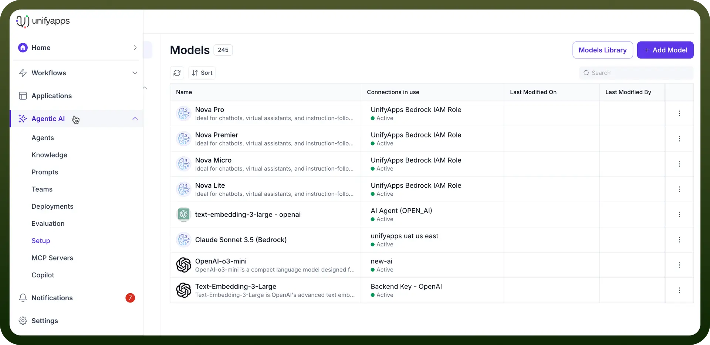
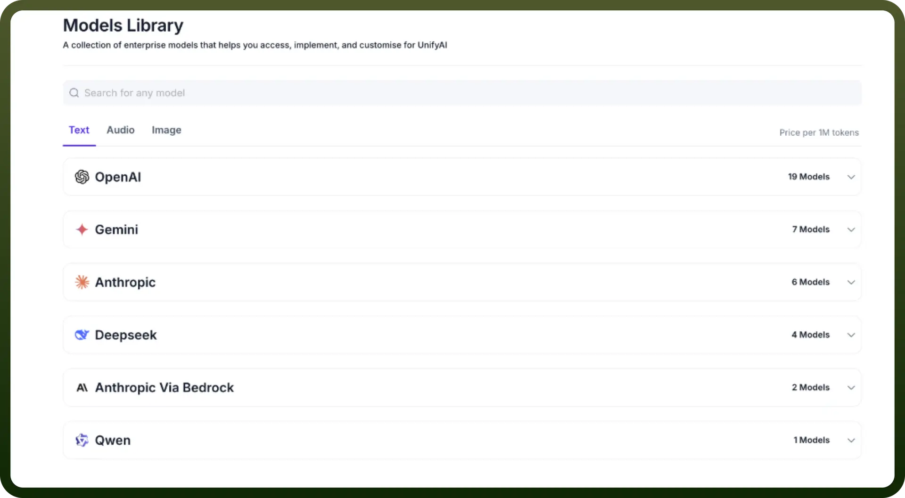
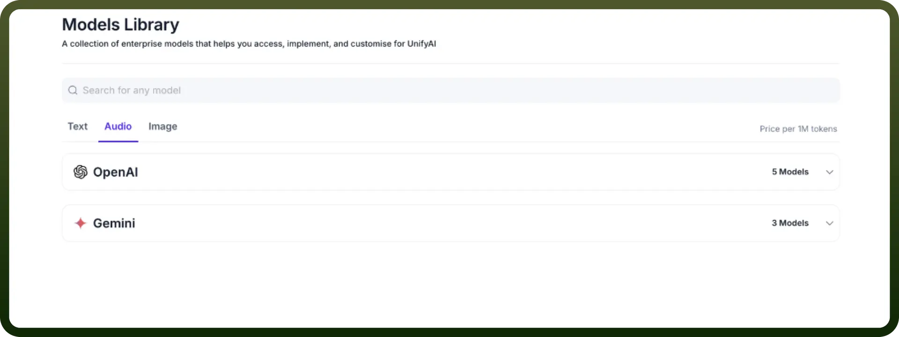

# Model Library

Source: https://www.unifyapps.com/docs/unify-agentic-ai/model-library
Section: agentic-ai

---

## Overview

UnifyApps provides comprehensive AI model support across multiple categories, enabling organizations to choose the most suitable models for their specific use cases and deployment requirements.

## Accessing the Model Library

To get to the Model Library:

1. From the UnifyApps dashboard, click on `Agentic AI` in the left-hand sidebar menu.
2. Under Agentic AI, select `Setup`
3. On the Setup page, click on the `Model Library` button.

## Proprietary Models

UnifyApps offers out-of-the-box (OOTB) connectors for leading proprietary AI models with enterprise-grade API integration:

- **OpenAI:** Access to various GPT models including GPT-4 and GPT-3.5, optimized for various text generation and reasoning tasks.
  - This includes models like `gpt-4o-mini`, `gpt-4o`, `gpt-4`, and `gpt-3.5-turbo`.
  - The model library also lists `whisper-1` for audio processing and `tts-1` for text-to-speech.
- **Azure OpenAI:** Enterprise-ready deployment of OpenAI models through Microsoft's secure cloud infrastructure.
- **Google Gemini:** Google's advanced multimodal AI capabilities for text, image, and code generation.
  - The model library includes various Gemini models such as `models/gemini-2.0-flash-lite, models/gemini-2.0-flash, models/gemini-1.5-pro, models/gemini-1.5-flash-8b, gemini-2.5-pro-preview-03-25`, and `models/gemini-2.5-flash-preview-05-20.`

- **Anthropic Claude:** Constitutional AI models designed for safety and helpfulness in complex reasoning tasks.
  - This includes models like `us.anthropic.claude-3-opus-20240229-v1:0, us.anthropic.claude-3-haiku-20240307-v1:0, us.anthropic.claude-3-sonnet-20250219-v1:0`, and `anthropic.claude-3-5-sonnet-20240620-v1:0.`
- **Amazon Bedrock:** AWS's managed service providing access to multiple foundation models through a unified API.

These proprietary models come with enterprise-level support, guaranteed SLAs, and advanced security features suitable for business-critical applications.

## Open-Source Models

For organizations seeking cost-effective solutions or on-premises deployment, UnifyApps supports popular open-source models:

- **Llama:** Meta's family of large language models available for commercial use, offering strong performance across various tasks.
- **Qwen:** Alibaba's multilingual large language model series, particularly effective for international applications.
  - An example model listed is `Qwen/Qwen2.5-72B-Instruct.`
- **Deepseek:** High-performance models optimized for reasoning and code generation tasks.
  - Deepseek models include `us.deepseek.v1:0, deepseek-reasoner, deepseek-ai/DeepSeek-V3`, and `deepseek-ai/DeepSeek-R1-Distill-Llama-70B.`

These open-source options provide on-premises deployment capabilities, giving organizations complete control over their data and model infrastructure.

## Custom Integration Framework

UnifyApps supports a "`Bring Your Own`" (BYO) model approach through its flexible connector framework:

- **Custom Model Integration:** Organizations can integrate their proprietary or fine-tuned models using UnifyApps' standardized API framework.
- **Flexible Deployment Options:** Support for both cloud-hosted and on-premises custom model deployments.
- **API Compatibility:** The connector framework accommodates various model APIs and response formats.
- **Enterprise Controls:** Custom integrations maintain the same security, monitoring, and governance features as OOTB connectors.

This flexibility allows organizations to leverage specialized models tailored to their industry or use case while maintaining the benefits of the UnifyApps platform.

## Model Selection Considerations

When choosing between model types, consider:

- **Performance Requirements:** Proprietary models often provide superior performance for complex tasks.
- **Data Sensitivity:** On-premises deployment options ensure sensitive data never leaves your infrastructure.
- **Compliance Needs:** Different models offer varying levels of compliance certifications and audit trails.
