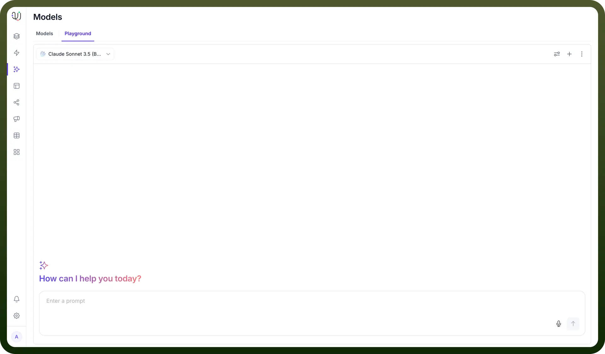
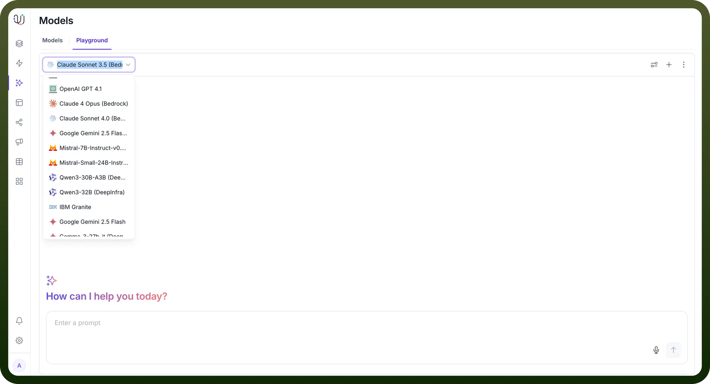
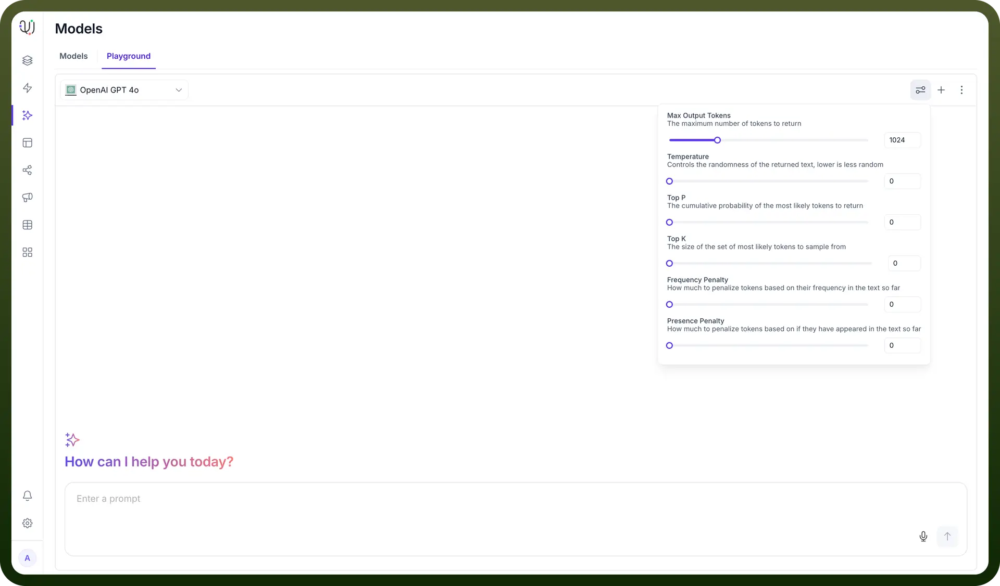
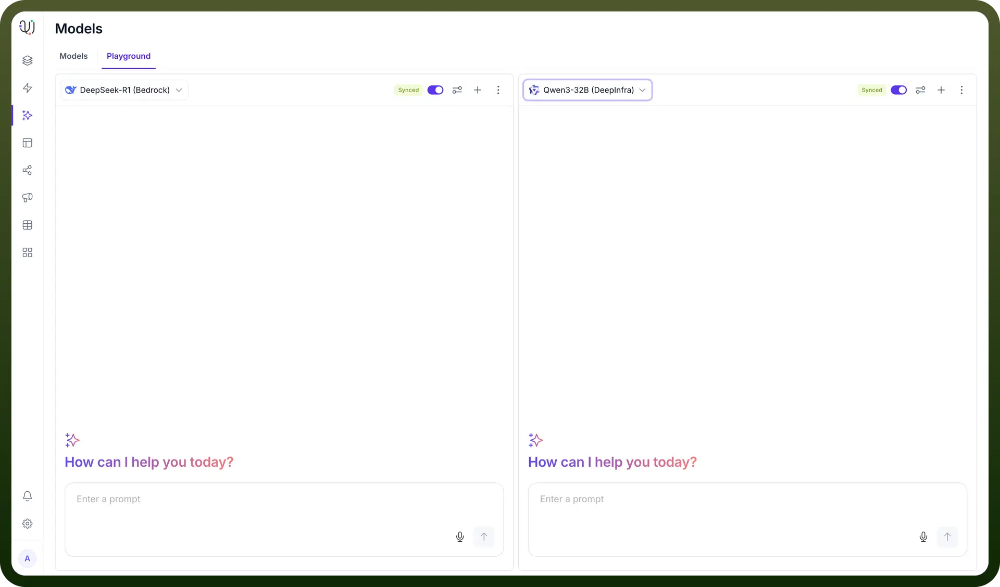

# Model Playground

Source: https://www.unifyapps.com/docs/unify-agentic-ai/model-playground
Section: agentic-ai

---

## How to Try Out and Compare Models in UnifyApps?

Users have multiple use cases which require different kinds of tasks and no tools are available to provide a comparative view where users can decide which model suits best for their specific use case. Users can leverage the power of LLM Models if they know the advantages and weaknesses of each according to needs. UnifyApps Model Playground helps users to use LLM Models to their best advantage.

### Steps for utilizing Model Playground:

1. Under UnifyApps AI Agents head over to Models and Select the Playground Tab to enable the ability to play around with multiple open source and proprietary models.

  

2. Click on the model name drop down to see a wide array of models to choose from including but not limited to **Claude, GPT, Qwen, Deepseek, Gemini, Mistral**, etc.

  

3. Click on the reference button towards the top right to customize settings like Max Output Tokens, Top K, Temperature Frequency Penalty and Presence Penalty.

  

4. To compare responses of 2 models to decide which one caters to your needs better, click on the `+ button` next to preferences to have a comparative overlay where you can compare the responses of the models and play around with them.

  
