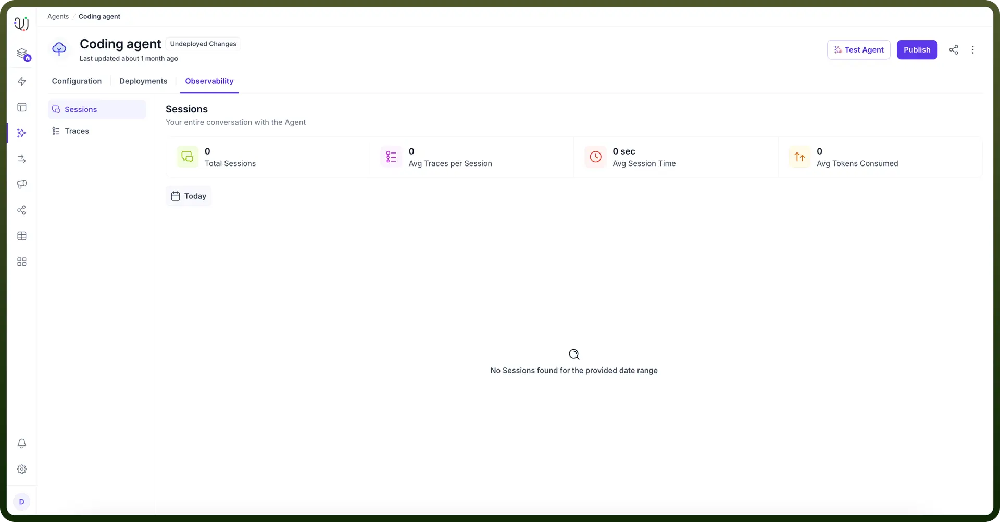
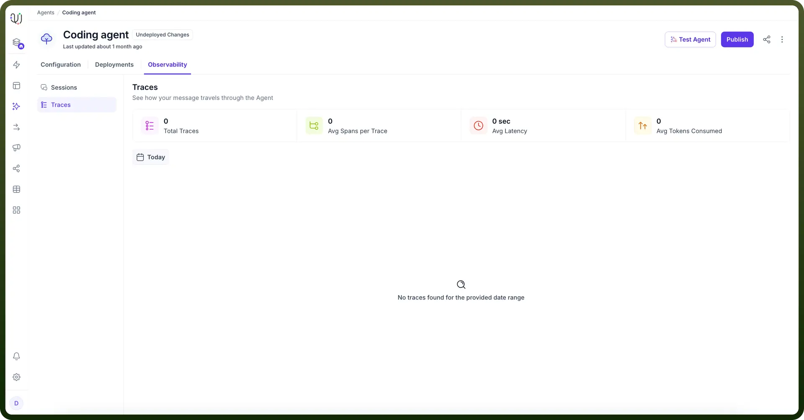

# Observability

Source: https://www.unifyapps.com/docs/unify-agentic-ai/observability
Section: agentic-ai

---

The Observability section provides platform users with comprehensive visibility into agent operations, enabling data-driven insights through session analysis and trace monitoring.

## Sessions

Track and analyze individual user interactions with your agent:

- **Session History**: View complete conversation logs for each session
- **Key Metrics** (filterable by time period):
  - Average session time
  - Total sessions
  - Average traces per session
  - Average token consumption

    

## Traces

Understand the technical flow of agent interactions by examining how messages are processed:

- **Trace Details**: Visualize the complete journey of each query including:
  - LLM processing approach
  - Triggered tasks and tools
  - Step-by-step execution summary
- **Performance Insights** (filterable by time period):
  - Total traces
  - Average span per trace
  - Average latency
  - Average token consumption

    

Both traces and sessions serve different purposes. Sessions just provides the interaction overview between user and agent. Whereas traces focus on summarizing how bot is responding to user query for every conversation pair.

Both sections include time-based filters, allowing you to analyze trends and patterns across different periods for better optimization and troubleshooting.
