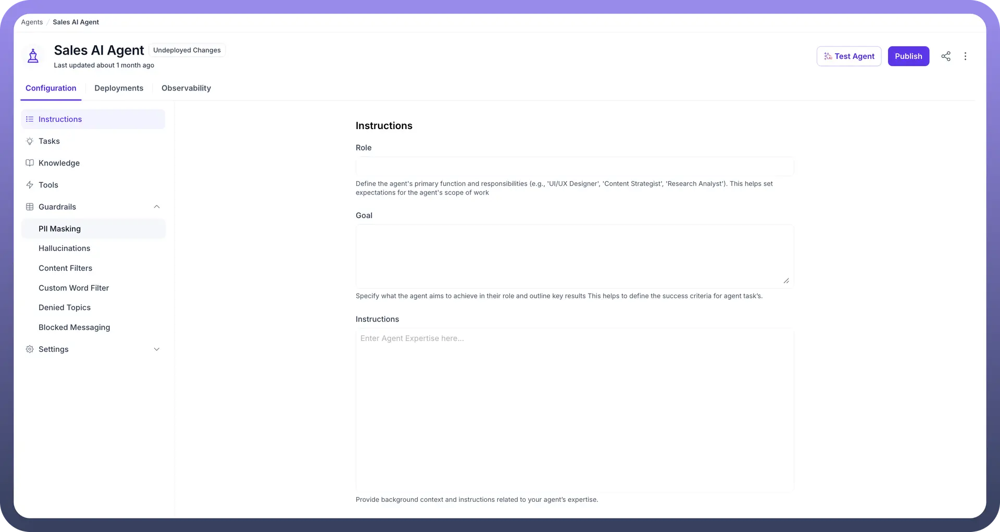
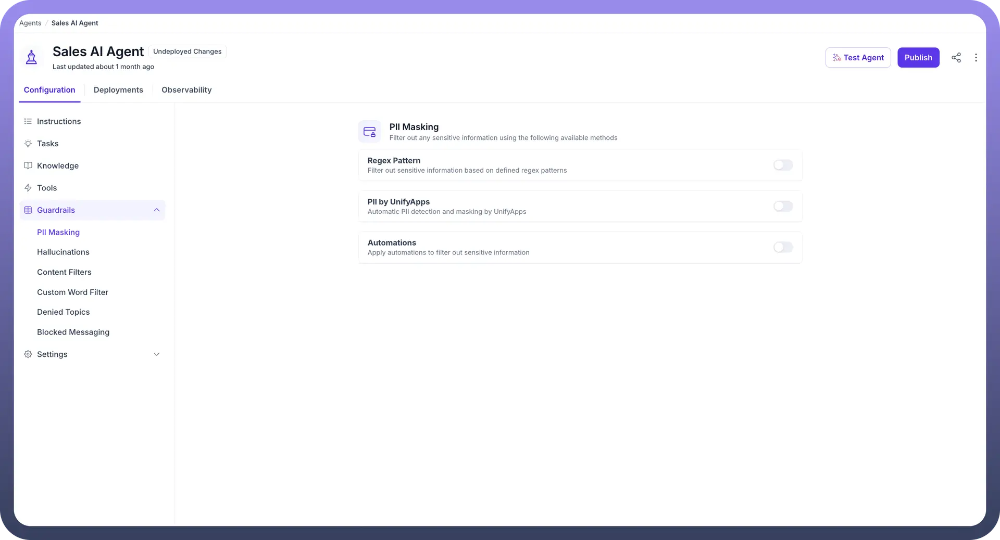
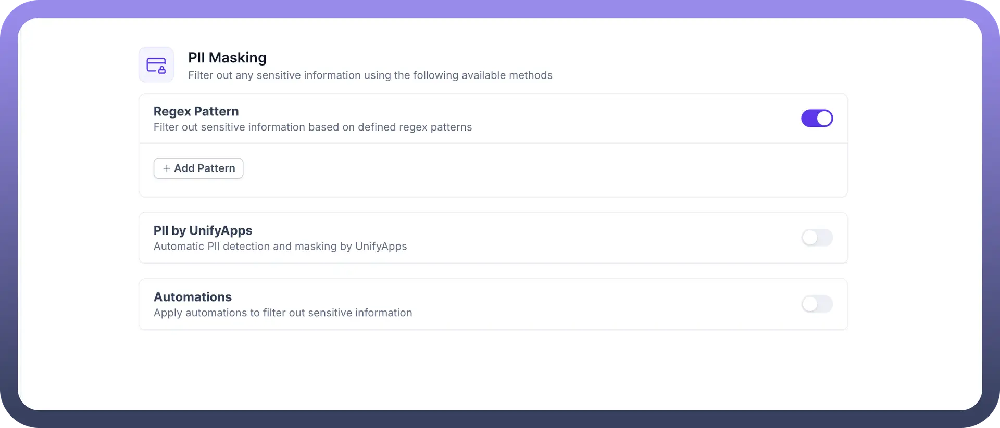
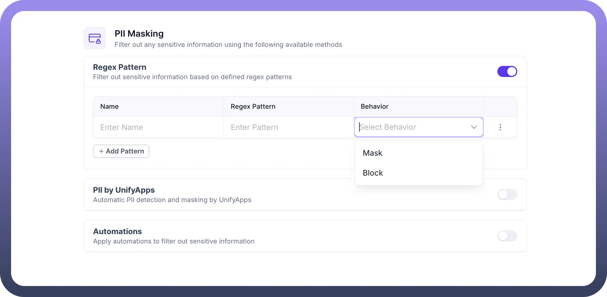
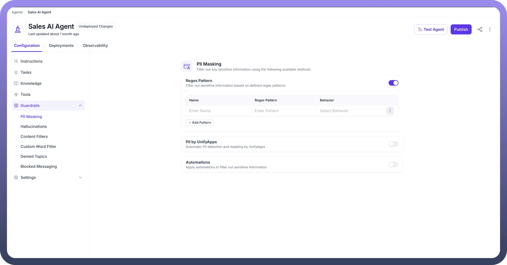
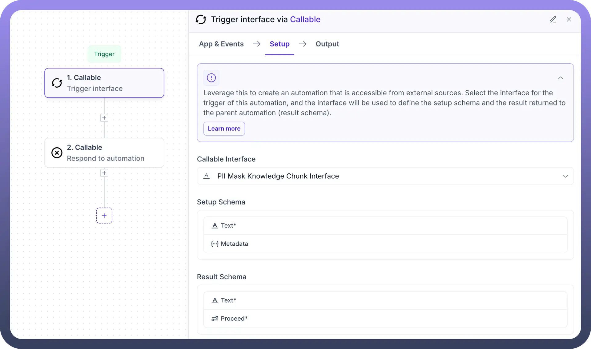

# PII Masking

Source: https://www.unifyapps.com/docs/unify-agentic-ai/pii-masking
Section: agentic-ai

---

PII Masking in AI Agent allows you to filter out sensitive data from both user inputs and LLM responses based on defined patterns. This feature is crucial for maintaining data privacy and compliance, especially when dealing with personal identifiers such as Social Security numbers, phone numbers, or employee IDs.

By configuring PII Masking rules, you can choose whether the sensitive data should be blocked entirely or masked, protecting confidential information while allowing the AI agent to continue operating smoothly.

Consider the following example of a Banking Agent for better understanding.

**Reference Content:** Payment due for Credit card number 4111-1111-1111-1111 is $1000
While accessing the knowledge for user query regarding the bill amount,
**Agent sees:** "Payment due for Credit card number 4111-****-****-1111 is $1000"

## How to Configure PII Masking in your AI Agent?

1. From the Guardrails section in your AI Agents Dashboard, click “`PII Masking`”.

  

2. Choose from three masking options:
  - **Regex Pattern-** Filter sensitive data using predefined regex patterns
  - **PII by UnifyApps-** Automatically detect and mask PII
  - **Automations-** Use custom automations to filter sensitive information

    

### Configure Masking via Regex pattern

1. Click the “`+ Add Pattern`” button to define a new regex pattern for identifying specific types of sensitive information such as Social Security Numbers, phone numbers, or other data unique to your use case.

  

2. Choose the appropriate guardrail behavior for each pattern:
  - `Block`: Prevents the sensitive information from being processed or displayed entirely.
  - `Mask`: Replaces the sensitive data with asterisks or other placeholders to ensure privacy without blocking the flow of conversation.

    

3. You can view and manage your defined patterns under the Regex Pattern section. You can edit or remove patterns as needed by clicking on the three-dot menu.

  

### Configure Masking via Automation

1. In the `Setup` tab of the Callable trigger, Select the **Callable Interface** as "`PII Mask Knowledge Chunk Interface`".

  

2. In the `Setup Schema`, define the expected input:
  - `Text`* – This is the required string input containing the content to be masked.
  - `Metadata` – (Optional) Additional information like source system, content type, etc.
3. In the `Result Schema`, define the output that the automation will return:
  - `Text`* – The masked version of the input text.
  - `Proceed`* – A required field (boolean or string) indicating if the flow should continue or not in the parent automation.

By configuring PII Masking, your AI agent helps maintain privacy and compliance while ensuring that sensitive data is not exposed during interactions.
