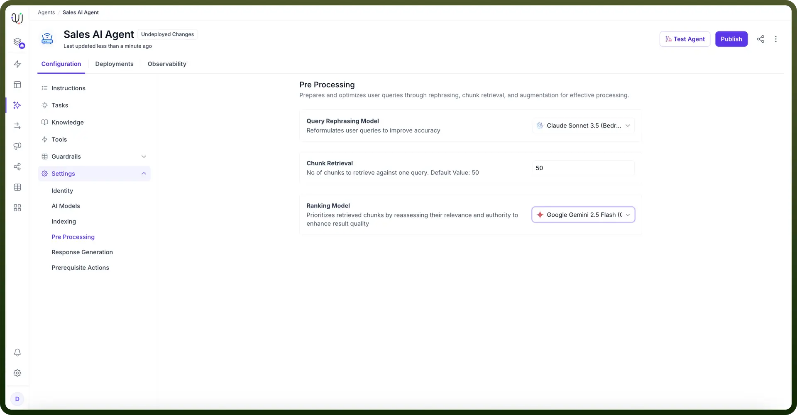
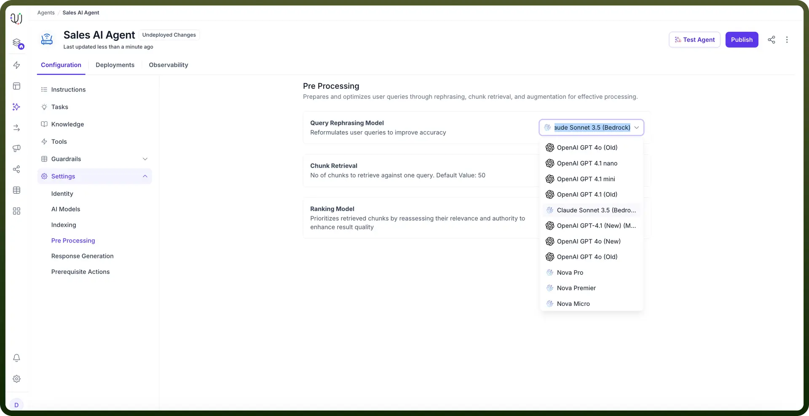
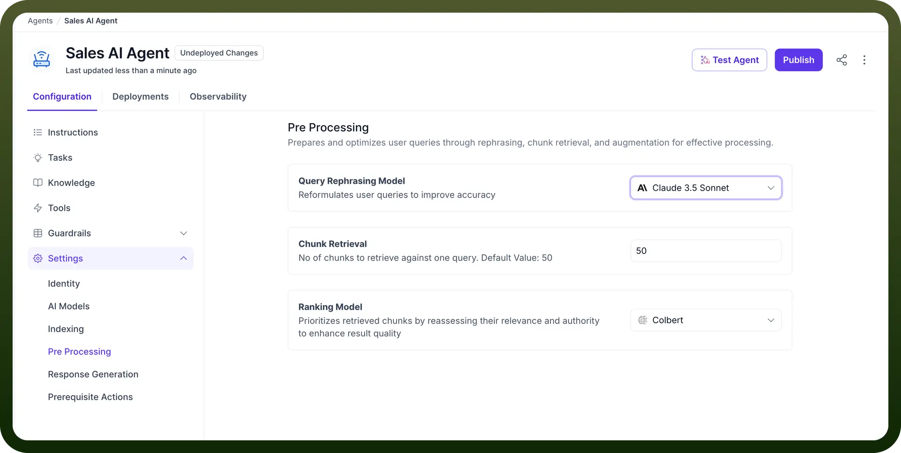
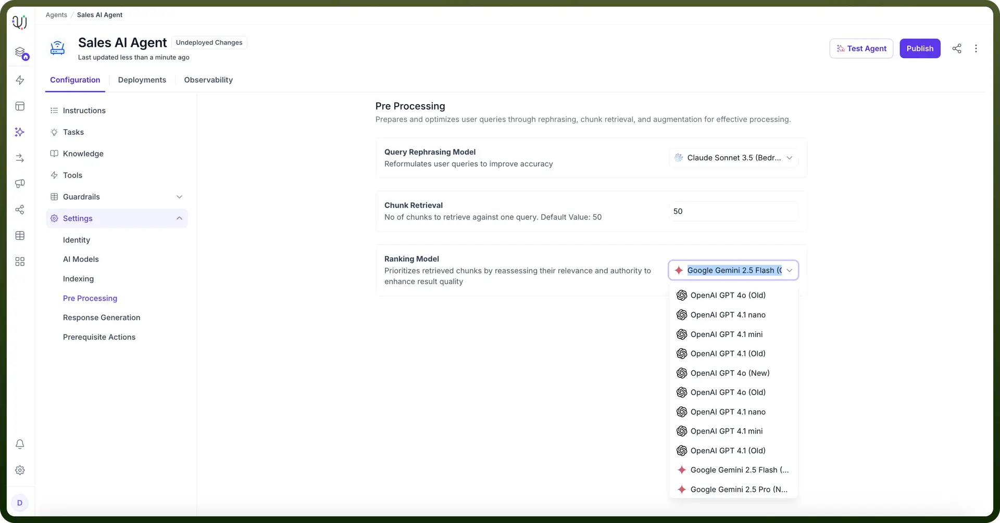

# Pre processing

Source: https://www.unifyapps.com/docs/unify-agentic-ai/pre-processing
Section: agentic-ai

---

## Overview

The complete knowledge management process for an AI agent consists of 3 layers:

AI Agent Response Generation Workflow :

1. **Knowledge Indexing**
  - Document processing
  - Embedding generation
  - Vector storage
2. **Query Processing & Retrieval - Query Rephrasing**
  - Chunk Retrieval
  - Ranking/Reordering
3. **Response Generation**
  - Answer formation
  - Response delivery

The query processing and retrieval system represents the middle layer of the knowledge management process, positioned between knowledge indexing and final response generation

At the pre-processing stage, we define different parameters that manage how user queries are processed to retrieve and rank relevant information from the vector store from the pool of added knowledge sources.

## Stages of Pre-Processing

1. **Query Rephrasing** The query rephrasing serves as the first line of optimization in the pre-processing pipeline. This component employs LLMs to transform user queries into more precise and relatable formats depending on the conversation context. You can define how you want user queries to be rephrased by customizing the rephraser prompt available in the "Prompts" section, and you can choose the query rephraser model from available options like Claude 3.5 Sonnet, GPT-4, and more. **How It Works:**
  - Analyzes the original user query
  - Applies contextual understanding to maintain intent
  - Reformulates the query for optimal information matchingLet’s understand this better with the help of an example.**Original Query:** "What's our WFH policy?" **Rephrased Query:** "What are the current company policies and guidelines regarding working from home?"
2. **Chunk Retrieval** The chunk retrieval is responsible for extracting relevant information segments from the agent's knowledge base based on vector similarity search. This process fetches relevant chunks from the vector store where the knowledge sources are indexed. You can define the number of chunks to be retrieved.Let’s understand this better with the help of an example.For a WFH policy query, the system retrieves:
  - Complete remote work policy documentation
  - Management approval protocols
  - Time tracking and accountability guidelines
  - Related HR procedures
3. **Ranking Chunks** The ranking system prioritizes and organizes retrieved information based on relevance scores and contextual importance along with the flexibility to chose a model of your choice.Lets understand this better with the help of an example.For a password reset query:**Content Type****Relevance Score****Priority**Password Reset Procedure0.95HighAccount Security Guidelines0.82MediumPassword Requirements0.78MediumGeneral Account Information0.45Low

To configure the Pre-processing step in your AI Agents, follow these steps:

1. Choose a “`Rephrasing Model`” to reformulate user queries for improved accuracy. This helps in optimizing how queries are understood and processed.

  

  

2. Next, specify how many chunks to retrieve for one query. The default value is set to 50, but you can adjust this based on the complexity and size of the data you're working with. Increasing the number may enhance retrieval but may also impact performance.

  

3. Then, Select a “`Ranking Model`” for the retrieved chunks by reassessing their relevance and authority. This step ensures that the most relevant chunks are prioritized in the search results.

These settings optimize user queries by improving query reformulation, chunk retrieval, and ranking, ensuring high-quality query processing in AI agents. 

The final step in configuring the AI agent is Response Generation.
