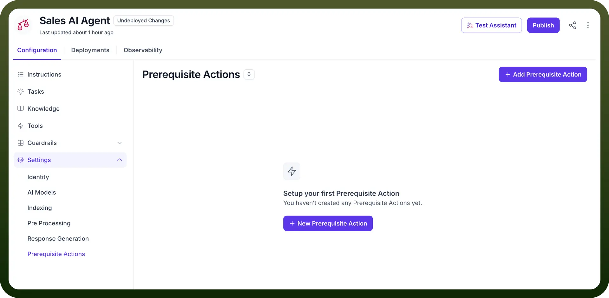
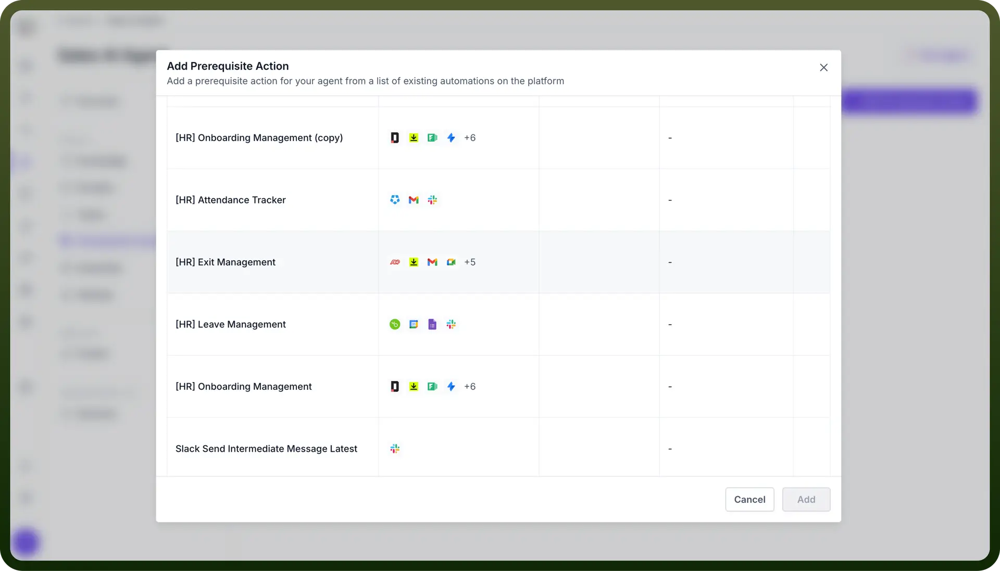
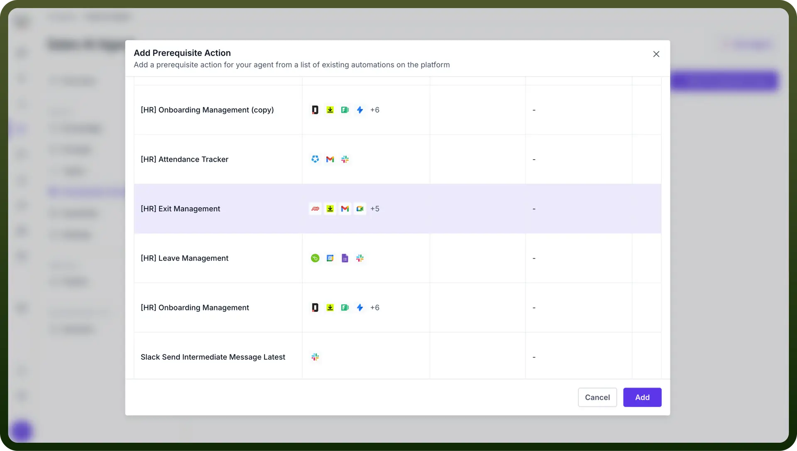

# Prerequisite Actions

Source: https://www.unifyapps.com/docs/unify-agentic-ai/prerequisite-actions
Section: agentic-ai

---

## What are Prerequisite Actions?

Pre-Requisite Actions are mandatory operations or checks that must be executed before the agent proceeds to answer the user query. These actions ensure that necessary conditions are met or required information is gathered before engaging in the main topic flow.

Let’s illustrate this better with the below examples

1. Customer Service Agent Before Starting:
  - Gets your name and contact information
  - Checks if you're an existing customer
  - Loads your previous conversations
2. Banking Assistant Agent Before Starting:
  - Verifies your identity
  - Checks if your account is active
  - Confirms which services you can access

## How to Configure Prerequisite Actions in Your AI Agent?

1. In the AI Agents dashboard, select the "`Prerequisite Action`" option from the left-hand sidebar.
2. Click on the “`+ New Prerequisite Action`” button. This will prompt you to create an action that the AI agent needs to perform before starting its main operations.

  

3. Once you've clicked the “`New Action`” button, you'll be presented with a list of existing callable automations on the platform. Select the appropriate automation by clicking on it.
4. After selecting the necessary automation, click “`Add`” to associate the action with the AI agent. The agent will now perform this action before moving on to other actions.

  

5. You can manage, edit, or delete existing prerequisite actions from the dashboard by clicking on the three-dot menu next to each action.

  

By setting up Prerequisite Actions, UnifyApps AI Agents ensure that all necessary steps are completed before initiating the main actions, enabling smoother and more accurate action execution.
