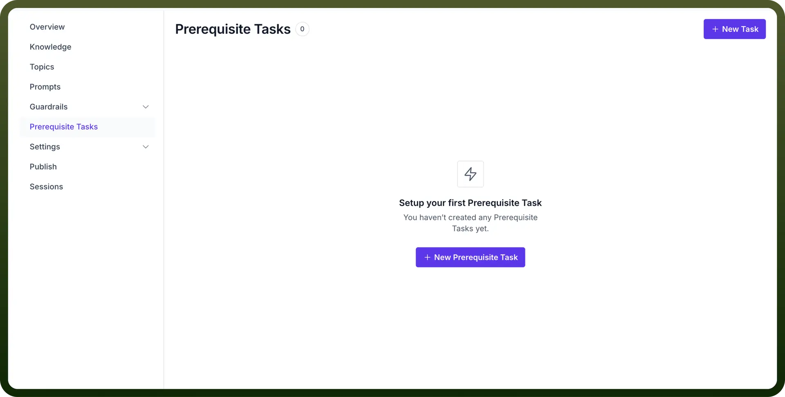
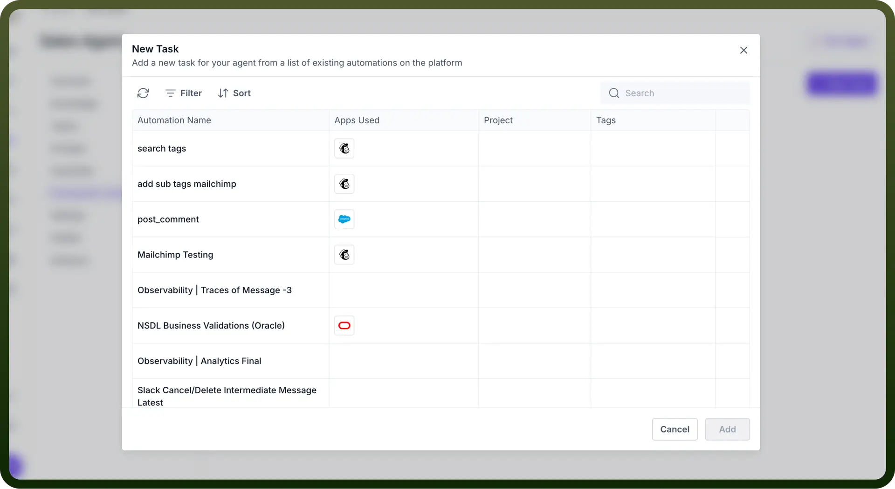
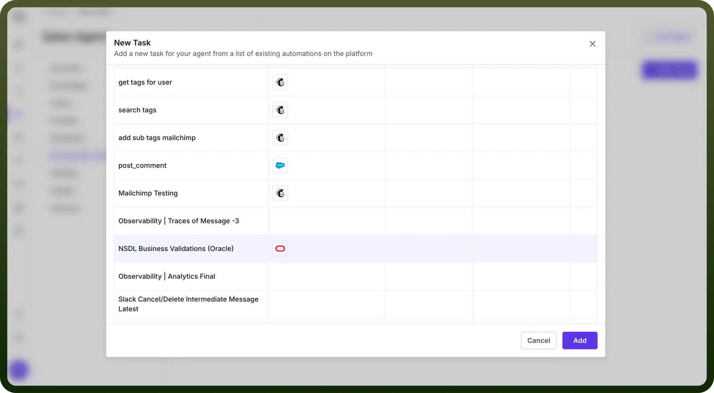

# Prerequisite Tasks

Source: https://www.unifyapps.com/docs/unify-agentic-ai/prerequisite-tasks
Section: agentic-ai

---

## What is Prerequisite Task?

UnifyApps AI Agent’s Prerequisite Tasks are the actions that need to be completed before it can begin its operations. These tasks ensure that all necessary data, settings, and configurations are in place for the AI agent to function effectively.

Common examples include fetching **user** **information**, gathering **permissions**, or setting up **system** **parameters** that the AI agent will need for seamless execution.

## How to Configure Prerequisite Tasks in Your AI Agent?

1. In the AI Agents dashboard, select the "`Prerequisite Task`" option from the left-hand sidebar.
2. Click on the “`+ New Prerequisite Task`” button. This will prompt you to create a task that the AI agent needs to perform before starting its main operations.

  

3. Once you've clicked the “`New Task`” button, you'll be presented with a list of existing automation on the platform. Select the appropriate automation by clicking on it.

  

4. After selecting the necessary automation, click “`Add`” to associate the task with the AI agent. The agent will now perform this task before moving on to other actions.

  

5. You can `manage`, `edit`, or `delete` existing prerequisite tasks from the dashboard by clicking on the three-dot menu next to each task.

By setting up **Prerequisite Tasks**, UnifyApps AI Agents ensure that all necessary steps are completed before initiating the main tasks, enabling **smoother** and more **accurate** task execution.
