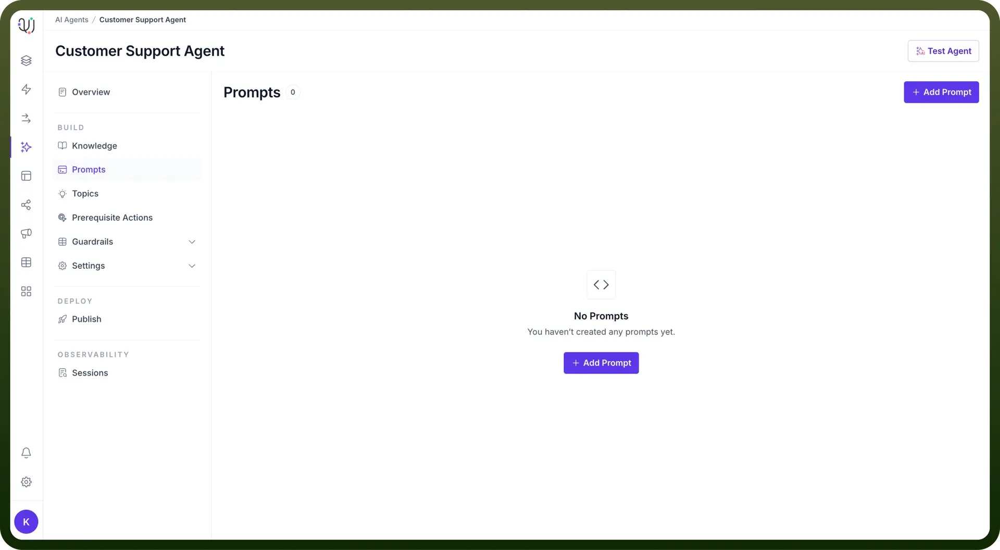
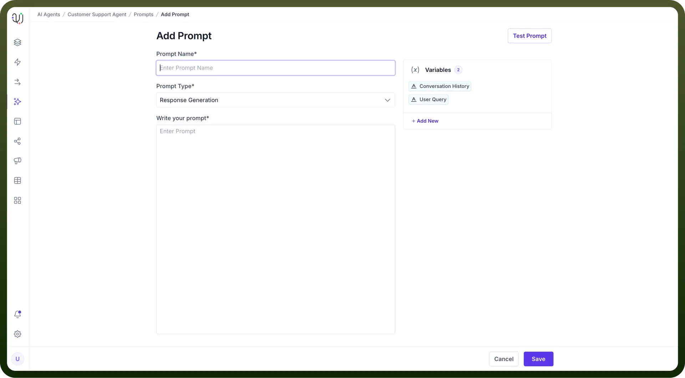
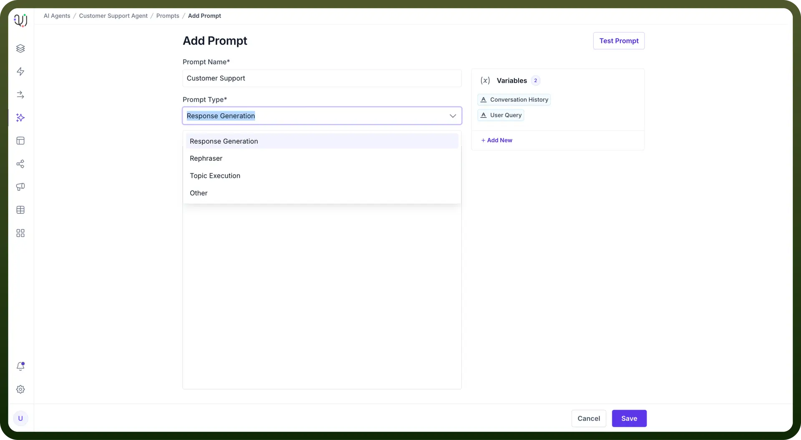
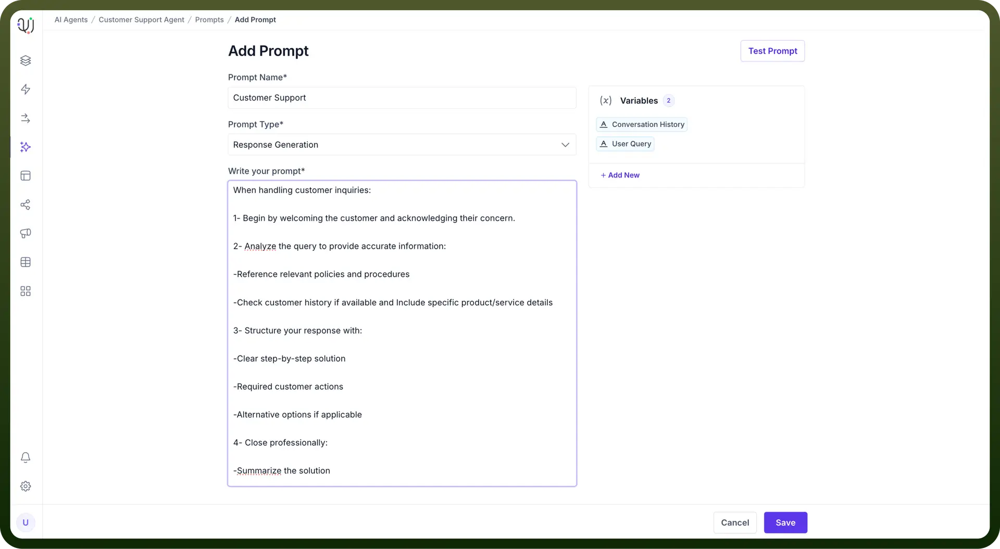

# Prompts

Source: https://www.unifyapps.com/docs/unify-agentic-ai/prompts
Section: agentic-ai

---

## What are Prompts?

Prompts are instructions or queries that help an AI agent determine its next course of action and formulate its responses. The clarity and precision of a prompt directly impact the accuracy and relevance of the agent's output, ensuring proper task completion.

For Example, a clear and precise prompt for a sales AI agent is:

When responding to product inquiries, follow this sequence,

1. Start by acknowledging customer interest and their specific inquiry.
2. Present product details including features, pricing, promotions, and competitor comparisons.
3. Support with relevant success stories, ROI data, and clear purchase steps.
4. Close with a call-to-action, demo option, and your contact details.

## Best Practices to Write Prompts

1. Use simple and straightforward language to ensure the AI agent easily understands the task. Avoid any vague wording that could cause confusion.
2. Provide detailed prompts to help the Agent interpret and deliver exactly what you're asking for.
3. Include relevant contextual information so the AI agent can understand the full scope of the task.
4. Frame your prompts as clear commands or actions to guide the AI agent.
5. Break down complex tasks into smaller, simpler steps for better task execution.
6. Include an example of the type of response you expect to help the AI deliver more accurate results.
7. Test and refine prompts regularly and make adjustments if needed to improve clarity and response quality.

By following these guidelines, you can ensure that your AI agents function properly.

## **Types of Prompts**

1. **Response Generation** The primary type of prompt that shapes how your AI agent responds to user inputs. These prompts help maintain consistency in tone, style, and content of responses.For example, we can add an instruction to format the responses in bullet points or in paragraphs in the response generation prompts.
2. **Rephraser** Specialized prompts that help the AI agent rephrase or reformulate information while maintaining the original meaning. Useful for:
  - Simplifying complex information
  - Adjusting tone and formality
  - Ensuring brand voice consistency
3. **Topic Execution** Prompts that guide the AI in handling specific topics or tasks, ensuring appropriate and accurate responses within defined domains.

## Steps to Add Prompt

1. In the AI Agents dashboard, select the "`Prompts`" option from the left-hand sidebar.
2. On the Prompts page, click the “`+ Add Prompt`” button. This action will lead you to begin adding a new Prompt to your AI Agent.

  

3. In the "`Prompt Name`" field, provide a descriptive name for your prompt that indicates its purpose.

  

4. Click on the **"**`Prompt Type`**"** dropdown menu and choose the most suitable option for your prompt. You can choose from the following options:

  

  - `Response Generation`: It is an instruction provided to the model to set the context, specify the desired behavior, or guide its responses.
  - `Rephraser`: Select this when you need the AI agent to rephrase or restructure the input text, helping to improve clarity or change the tone.
  - `Topic Execution`: This type allows the AI agent to decide the next appropriate action or task based on the input, guiding it through multi-step processes.
  - `Other`: For any custom or non-standard prompt types that don't fit into the above categories, select this option to ensure flexibility in handling tasks.
5. In the "`Write your prompt`" field, enter the specific instructions you want the AI agent to respond to. Be clear and concise to ensure accurate execution.
6. On the right, you will find Variables such as `Conversation History`, `User Query`, `Knowledge`, and `Available Tasks`. Add these to your prompt as needed to make it more dynamic and context-aware.

  

7. Before finalizing, you can test your prompt by clicking the "`Test Prompt`" button to ensure it works as intended.
8. Once you’ve entered all details and tested your prompt, click “`Save`**”** to finalize and add the prompt to your AI agent.
