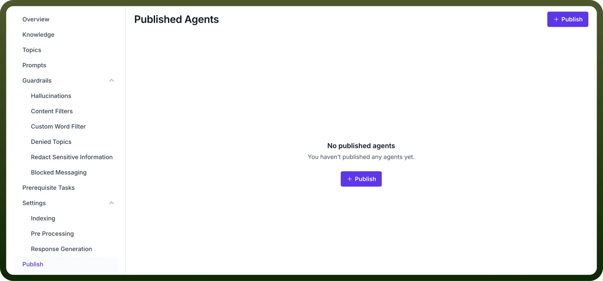
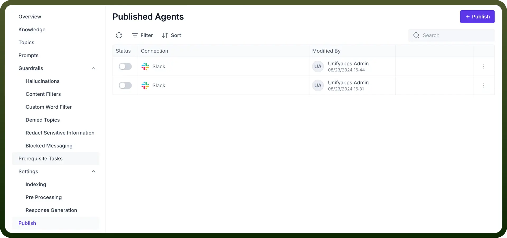
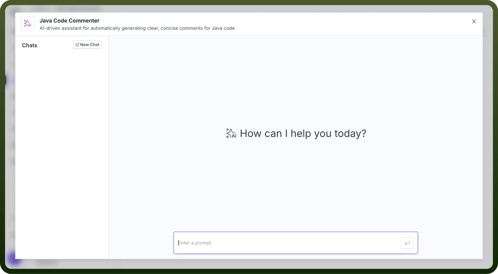

# Publish & Test

Source: https://www.unifyapps.com/docs/unify-agentic-ai/publish-and-test
Section: agentic-ai

---

## Publish your AI Agent

1. After completing the configuration of the AI Agent (Indexing, Preprocessing, and Response Generation), navigate to the "`Publish`" section.
2. Click on the "`+ Publish`" button to make the agent live. Once published, the AI Agent becomes accessible for testing and real-world applications.

  

  

## Test your AI Agent

1. Once the agent is published, you can test it by clicking on the “`Test Agent`” button on the top-right.
2. A test window will open, simulating a chat interface where you can enter a prompt to interact with the Agent.

  

3. After testing the Agent, review its responses. If adjustments are necessary, you can go back to the respective configuration settings (guardrails, indexing, preprocessing, or response generation) to fine-tune the agent's behavior.
4. Once adjustments are made, republish the agent to apply the changes.

By following these steps, you complete the end-to-end process of setting up, publishing, and testing your AI Agent, ensuring it is ready for deployment to assist users effectively.
