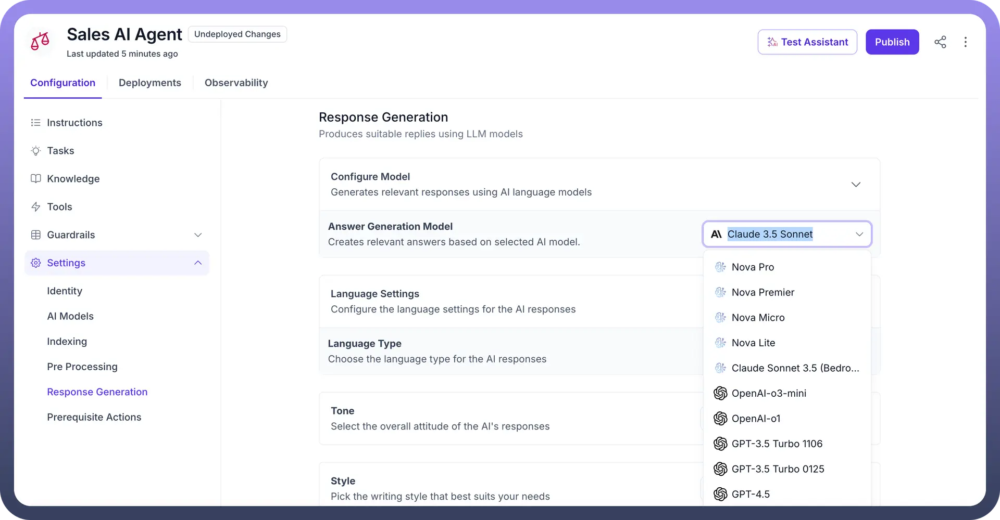
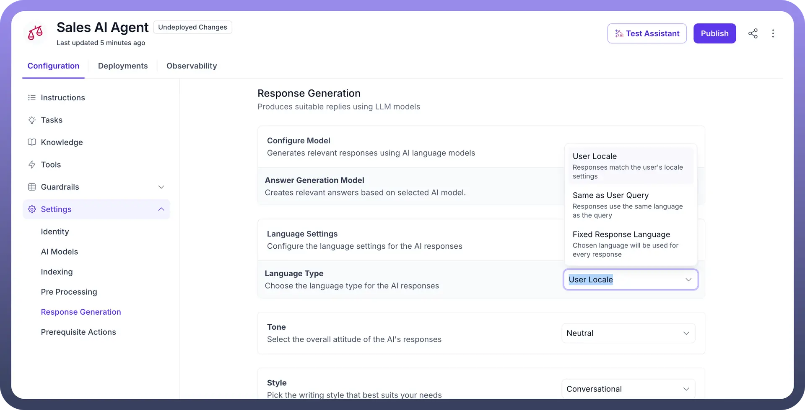
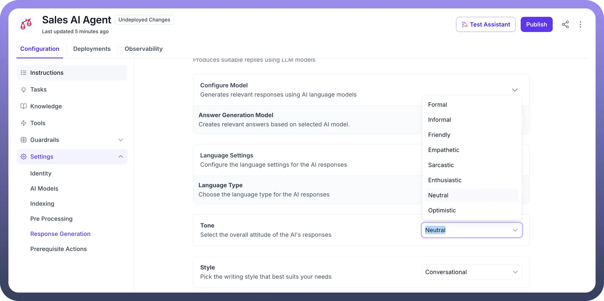
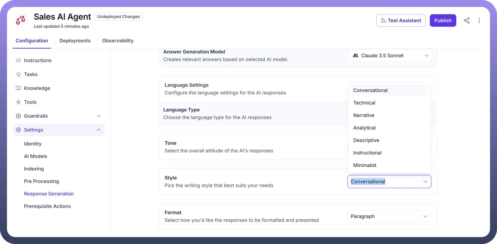
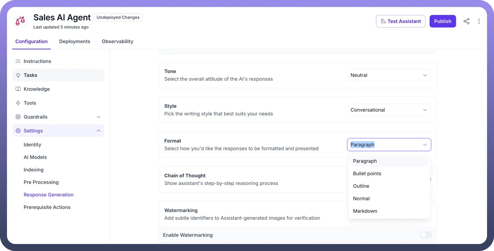
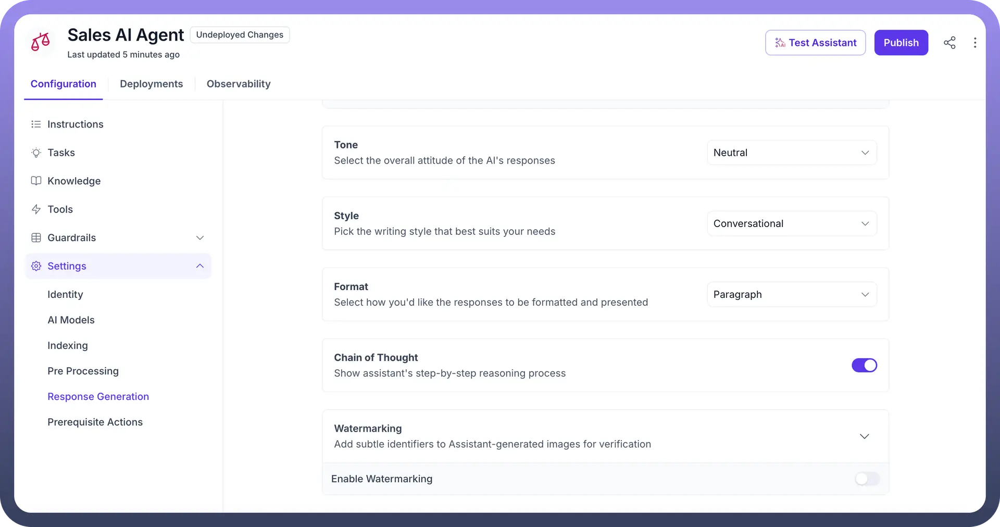

# Response Generation

Source: https://www.unifyapps.com/docs/unify-agentic-ai/response-generation
Section: agentic-ai

---

Response generation represents the culmination of AI agent processing, where understanding transforms into actionable answers. Like a skilled communicator who carefully crafts messages to meet specific needs, this component harnesses the power of Large Language Models (LLMs) to create contextually appropriate, accurate, and meaningful responses. It's the bridge that connects user queries with intelligent, tailored answers.

Raw data and context are transformed into coherent, relevant responses that align with user expectations and business requirements. Through careful selection and configuration of Answer Generation Models, organizations can fine-tune how their AI agents communicate, ensuring responses maintain consistency, accuracy, and appropriate tone.

## Key Components of Response Generation

1. **Language**: Choose the default communication language for your AI agent. This fundamental setting ensures consistent language usage throughout all interactions.
2. **Tone**: Define your AI agent's personality through tone selection, ranging from formal to informal. This setting shapes how your agent communicates, ensuring responses align with your brand voice and user expectations.
3. **Style**: Select the writing style that matches your communication needs, from professional to conversational. This determines how your agent structures and presents information to maintain consistent user engagement.
4. **Format**: Structures your AI's responses in a clear and organized manner, whether in paragraphs, bullet points, or other layouts, making information easily understandable for users.
5. **Watermarking**: Add subtle identifiers to AI-generated images for verification purposes. This optional feature helps maintain transparency and authenticity in visual content generated by your AI agent.

To configure the Response Generation settings for an AI Agent:

1. Select the “`Answer Generation Model`” which is responsible for generating answers based on the input query and available data.

  

2. Choose the `language type` in which the agent will communicate with users.

  

3. Set the overall `Tone` of the Agent’s responses. You can select Neutral, Friendly, Formal, or Empathetic based on how the AI is expected to interact with users.

  

4. Define the writing `Style` for the agent’s replies. It can be Conversational, Technical, Narrative, or Instructional depending on the context of the conversations.

  

5. Specify the `Format` of the responses to be presented.

  

6. Toggle `Chain of Thought` to show agent's step-by-step reasoning process.

  

7. Enable `Watermarking` to add identifiers to any agent-generated images for verification purposes. Choose a watermarking technique and input custom text for the watermark, if necessary.

By configuring these settings, the AI agent can deliver responses that are contextually appropriate, consistent with the desired tone, style, and structure, ensuring a seamless user experience.

With this, you complete the settings configuration process for indexing, preprocessing, and response generation for the AI agent in UnifyApps.
