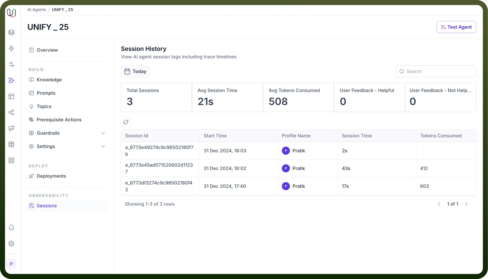
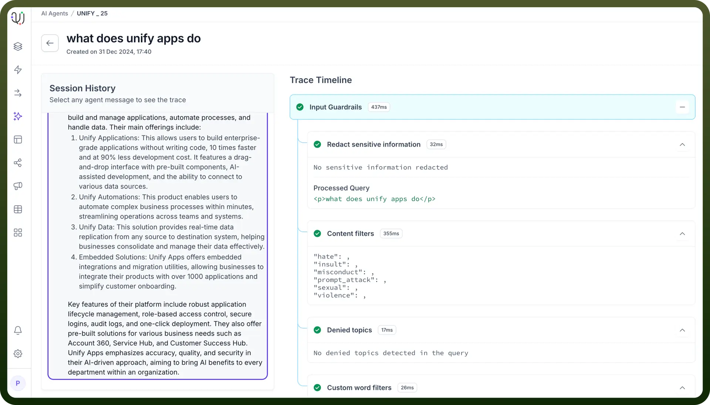
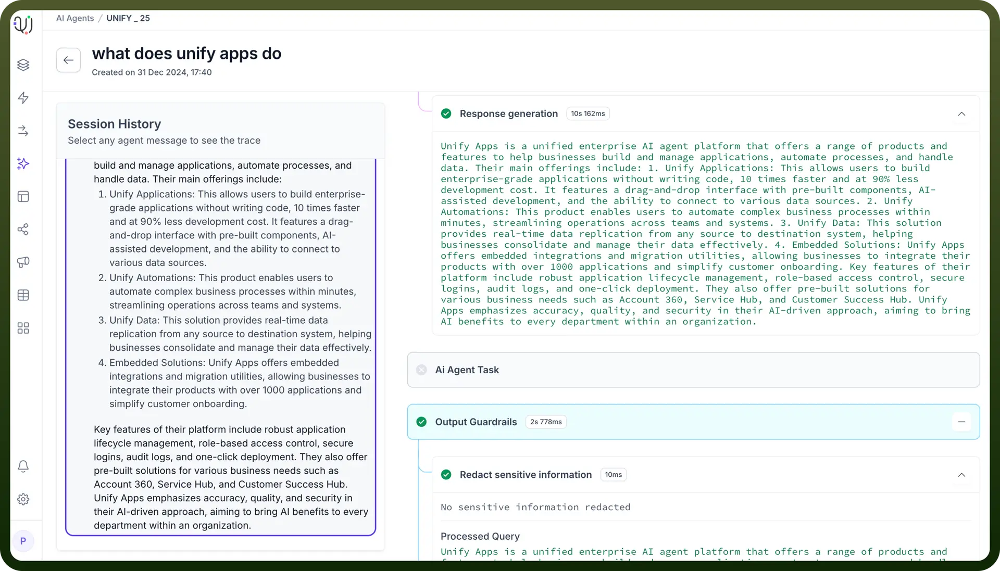
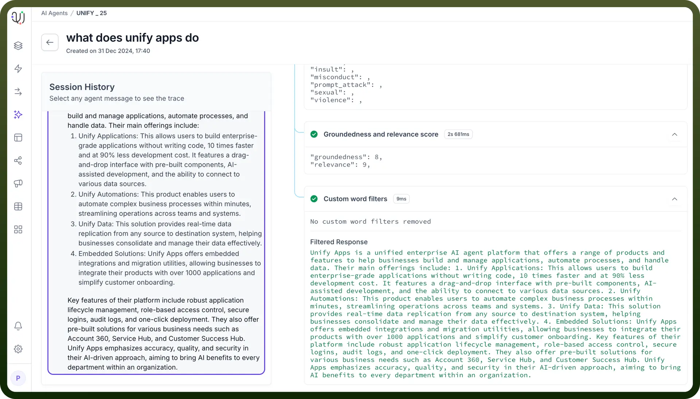

# Sessions and Tracing

Source: https://www.unifyapps.com/docs/unify-agentic-ai/sessions-and-tracing
Section: agentic-ai

---

## Overview

The Session History and Trace Timeline feature provides complete visibility into AI agent interactions, allowing users to monitor, analyze, and understand how the agent processes requests and arrives at responses. This transparency tool helps users track performance metrics and verify the agent's decision-making process.

## Key Metrics at a Glance

1. `Total Sessions`: Sessions are distinct conversations between a user and an AI agent. They represent a continuous sequence of exchanges within a single context or conversation. In the context of "Avg Session Duration," this metric indicates the average length of time users spend interacting with the AI agent in a single conversation.
2. `Avg Session Time`: How long, on average, each AI interaction lasts.
3. `Avg Tokens Consumed`: The average number of tokens used per session.
4. `User Feedback` : Helpful/Not Helpful: The feedback given by users on the agent responses.

  

## Trace Timeline

Traceability via sessions in UnifyApps AI Agents provides a comprehensive debugging and monitoring capability that allows users to understand exactly how their AI agent processes and responds to queries.

1. **Input Guardrails** Functions to ensure query safety and compliance:
  - Validates incoming query format and content
  - Scans for and redacts sensitive information
  - Checks against list of denied or restricted topics
  - Filters custom words or phrases specified by organization
  - Content safety validation (hate speech, insults, inappropriate content)

    

2. **Rephrasing** Optimizes query for processing through:
  - Reformats query for better understanding
  - Standardizes language and terminology
  - Enhances query clarity and intent
  - Maintains original context while improving structure
  - Prepares query for knowledge retrieval

    

3. **Knowledge Pipeline**
  - **Chunk Retrieval**
    - Fetches relevant document segments from knowledge base
    - Extracts information from source documents
    - Assigns unique IDs to document chunks
    - Maps chunks to their source documents
    - Tracks document source and origin
  - **Chunk Reranking**
    - Assigns relevance scores to retrieved chunks
    - Orders chunks based on relevance to query
    - Evaluates content importance
    - Prioritizes most relevant information
    - Prepares ranked content for response generation
  - **Response Generation**
    - Compiles information from ranked chunks
    - Structures response based on query intent
    - Formats content appropriately
    - Ensures coherent and complete answers
    - Prepares response for final validation

      

4. **AI Agent Task** Functions to process and execute specific actions:
  - Interprets user intent and required actions
  - Executes predefined workflows based on query
  - Manages task-specific operations
  - Handles specialized processing requirements
  - Coordinates between different system components
5. **Output Guardrails** Functions to ensure response quality and safety:
  - Validates response content and structure
  - Performs final sensitive information check
  - Checks against list of denied or restricted topics
  - Applies custom word filters
  - Evaluates response quality metrics (groundedness, relevance)
  - Ensures compliance with organizational policies

    

## Key Components of Traceability

1. **Input Processing and Guardrails**
  - Monitors initial query processing through input guardrails
  - Checks for sensitive information redaction
  - Validates queries against denied topics
  - Applies custom word filters
  - Ensures content compliance through multiple filtering layers
2. **Knowledge Pipeline Processing**
  - Shows chunk retrieval from relevant documents
  - Displays source documents being accessed
  - Lists document IDs and their sources
  - Indicates processing time for each step
  - Demonstrates how information is gathered from the knowledge base
3. **Chunk Reranking**
  - Presents relevance scores for retrieved chunks
  - Shows prioritization of information
  - Indicates how different pieces of information are weighted
  - Demonstrates the ranking methodology
  - Helps understand why certain information was selected
4. **Response Generation**
  - Displays the final response creation process
  - Shows how information is compiled and formatted
  - Indicates processing time for response generation
  - Demonstrates final output filtering
  - Ensures response quality and accuracy
5. **Groundedness and Relevance Scoring**
  - Provides metrics for response quality
  - Shows relevance scores
  - Indicates groundedness of responses
  - Helps validate response accuracy
  - Ensures response alignment with source material
