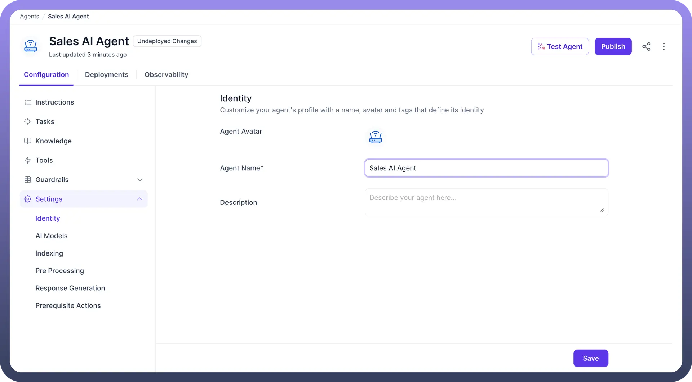
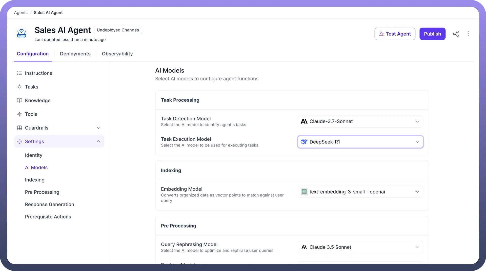
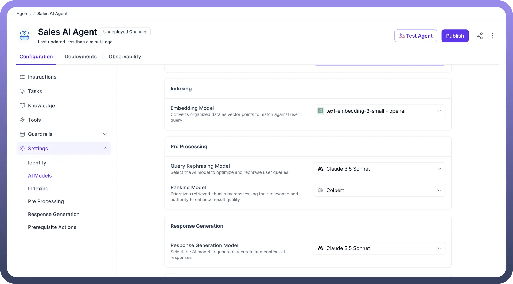
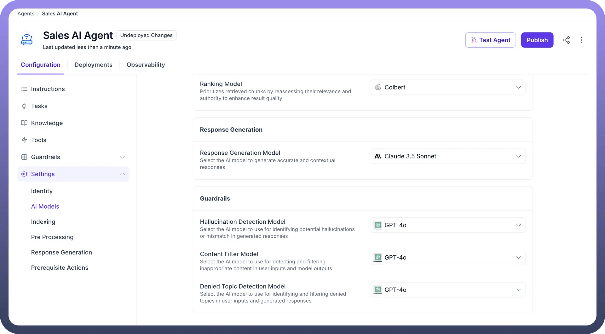
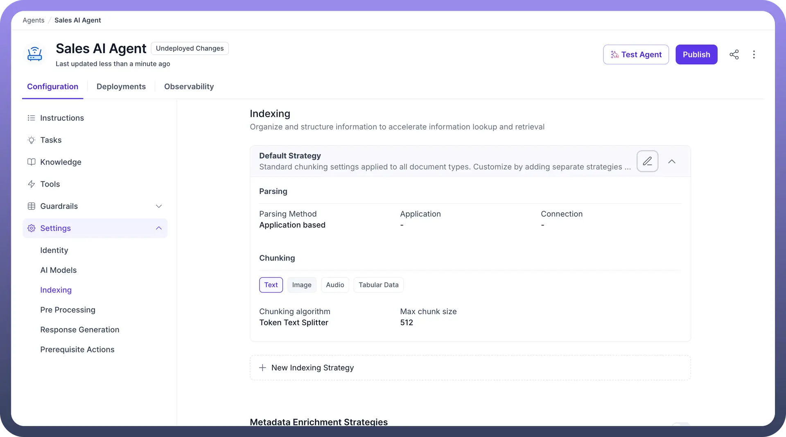
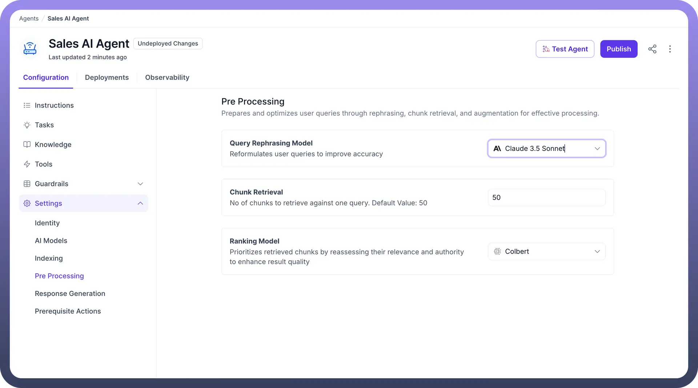
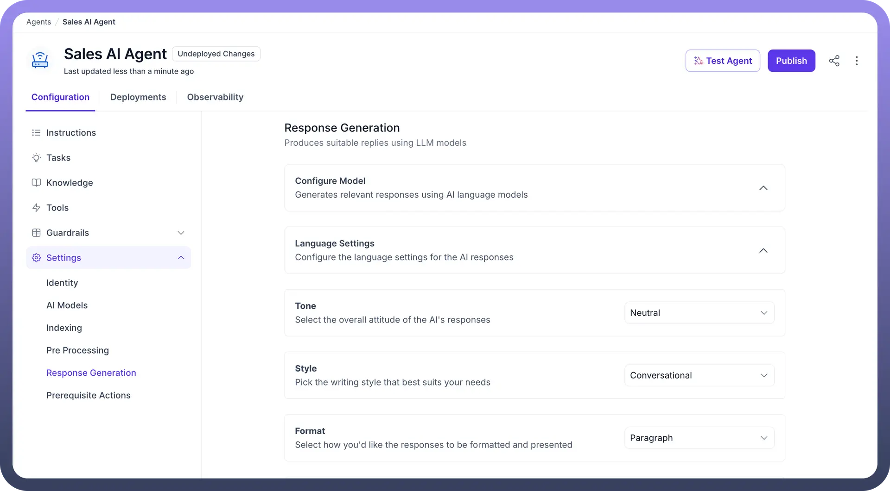

# Overview

Source: https://www.unifyapps.com/docs/unify-agentic-ai/settings-overview
Section: agentic-ai

---

## Overview

Creating an effective AI agent goes beyond just selecting a language model for response generation. It requires careful configuration across multiple dimensions to ensure the agent can understand, process, and respond to user queries effectively. Under agent settings you can customize how your agent handles information, understands questions, and responds to users. This configuration is managed through five key areas:

### 1. Identity

Customize the basic identity of your agent:

- `Agent Avatar` **:** Upload or select an icon to represent your agent in the UI.
- `Agent Name` **:** Name your agent (e.g., *Sales AI Agent*). This is mandatory.
- `Description` **:** Add a short summary of what the agent does (optional but helpful for teams).

  

## 2. AI Models

This section lets you define the models used for various tasks your agent performs at one place.

- **Task Processing**
  - `Task Detection Model` **:** AI model that identifies when the user query contains an actionable task.
  - `Task Execution Model` **:** Model responsible for executing the identified task using connected tools or workflows.

    

- **Indexing**
  - `Embedding Model` **:** Converts knowledge content into vector embeddings used for semantic search. (e.g., text-embedding-3-small)

    

- **Pre Processing**
  - `Query Rephrasing Model` : Rewrites or simplifies user queries for better retrieval accuracy. (e.g., Claude 3.5 Sonnet)
  - `Ranking Model` : Reorders retrieved content to highlight the most relevant and authoritative results. (e.g., ColBERT)
- **Response Generation**
  - `Response Generation Model` : AI model responsible for crafting the final response shown to users. (e.g., Claude 3.5 Sonnet)
- **Guardrails**
  - `Hallucination Detection Model` : Flags potentially hallucinated responses. (e.g., GPT-4o)
  - `Content Filter Model` : Filters unsafe or inappropriate content in both user prompts and AI responses.
  - `Denied Topic Detection Model` : Used for identifying and filtering denied topics in user inputs and generated responses

    

## 3. Indexing

- It is the process of organizing data in a way that makes it more efficient to retrieve information.
- Instead of sequentially searching through every piece of information, indexing converts data into embeddings stored in a vector database, capturing the meaning and relationships between different pieces of information.
- When a user asks a question, the AI Agent can quickly find relevant information by comparing the query with these indexed vectors.
- Users can configure indexing by selecting the appropriate Embedding Model, enriching data with custom metadata, segmenting data through Chunking, and storing vectors for efficient data lookup, thus enhancing the speed and accuracy of AI's responses.

## 4. Pre-Processing

- These settings act as a bridge between indexing and final agent response, serving as the foundation for organizing and prioritizing information to ensure meaningful responses.
- When a user submits a question, the system performs initial analysis and retrieves relevant chunks of information from its knowledge source, where each chunk contains potentially valuable data.
- The retrieved information undergoes a comprehensive scoring process that evaluates factors like relevance, accuracy, and completeness to determine how well each chunk answers the user's question.
- The scoring mechanism prioritizes the most valuable information, ensuring the system leverages the best available knowledge to construct accurate and meaningful responses to users.

## 5 . Response Generation

This section covers attributes related to response generation by the agent. Here users can select the LLM for generating  responses, controlling response style or choosing the language and tone of responses.

