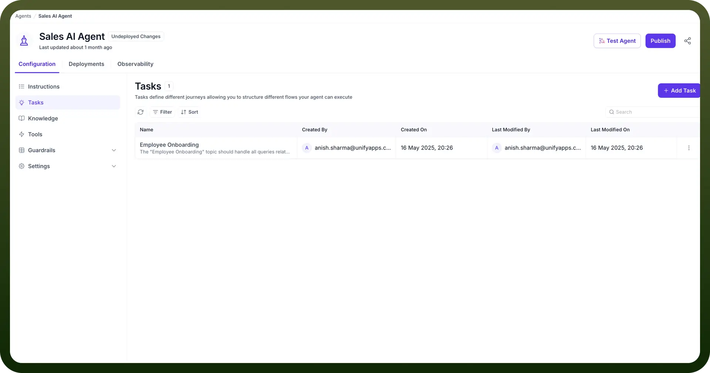
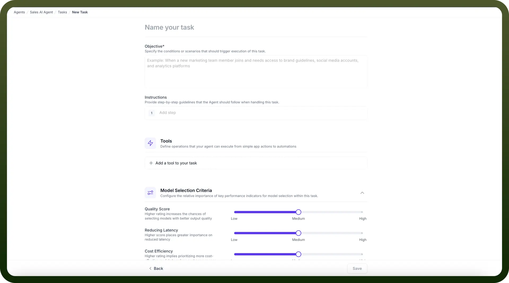
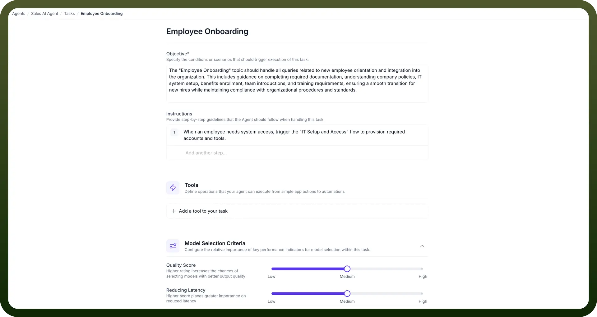
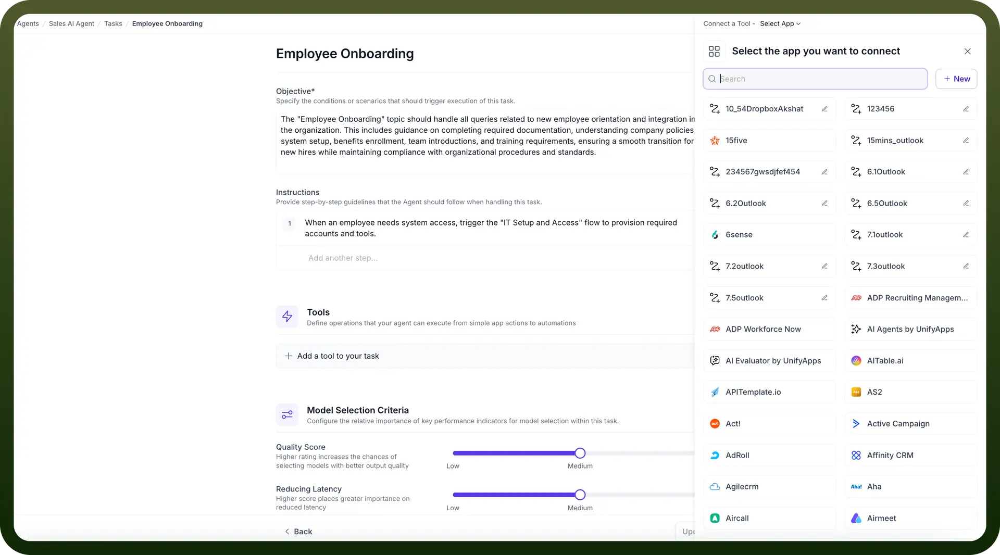

# Setup Tasks

Source: https://www.unifyapps.com/docs/unify-agentic-ai/setup-tasks
Section: agentic-ai

---

## What are Tasks?

Task are defined journeys within an AI agent that organize and structure different types of user interactions. Just like a skilled customer service representative knows how to handle various types of requests, Tasks give AI agents their own set of specialized skills. Each task contains specific instructions and actions that are required to complete one particular journey of the AI through specific types of interactions. This ensures the agent can efficiently understand user needs and provide appropriate solutions, much like having different departments in a company, each specialized in handling specific types of customer needs.

## Task Execution

When a user interacts with the AI agent, the system analyzes the input to identify the most relevant task. Once triggered, the task guides the agent's responses and actions. The AI follows the predefined instructions within the task, engaging in a dialogue to gather necessary information. As the conversation progresses, the agent executes the configured actions, such as creating a support ticket or retrieving data from integrated systems. This flow ensures that the AI provides contextually appropriate responses and performs relevant tasks, maintaining a coherent and productive interaction. The task structure allows for complex workflows, enabling the AI to handle multi-step processes, all while maintaining context and relevance to the user's original query.

## How to Configure Tasks in your AI Agent?

1. In the AI Agents dashboard, select the "`Tasks`" option from the left-hand sidebar.

  

2. Click on the “`+ Add Task`” button. You will be prompted to create a new task that serves as a grouping for related tasks.

  

3. In the "`Name your task`" field, enter a name that reflects the purpose of the task.
4. In the "`Objective`" field, provide a brief description of the task.
5. Under the "`Instructions`" section, you can add specific guidelines or procedures for the agent to follow within this task. Click the "`+ New Instruction`" button to define these procedures. **Note:** Remember that descriptions are different from the instructions. It is used solely to help the system identify the most relevant task and do not affect the actual execution or working of the task.

  

6. Scroll down to the "`Tools`" section, where you can define tasks or operations the agent will execute for this task.
7. Click "`+ Add Tool`" and select from predefined automation tasks. These actions will guide the agent in performing specific tasks within the context of the task.

  

8. Once you've added the necessary actions, save the configuration. Your new task is now set up, and the AI agent will handle tasks under this category.

By adding multiple actions into Tasks, AI agents can manage complex workflows effectively, ensuring accurate task execution autonomously.

## Best Practices

To maximize the potential of your AI agents, consider these best practices when creating and organizing Tasks:

1. **Create Concise Task Names:**
  - Keep task names short and to the point
  - Use clear, descriptive terminology that immediately conveys the task's purpose
  - Avoid lengthy or complex naming conventions
2. **Write Detailed Task Descriptions:**
  - Provide comprehensive descriptions that explain the task's scope and purpose
  - Include relevant keywords and scenarios to improve task matching accuracy
3. **Provide Comprehensive Instructions:**
  - Detail step-by-step processes for each task
  - Include handling for potential exceptions or errors
4. **Group Related Tasks:**
  - Cluster similar actions and processes within a Task
  - Maintain logical coherence in task groupings
5. **Maintain Consistency:**
  - Use uniform formatting and structure across Tasks
  - Ensure consistent language and tone
