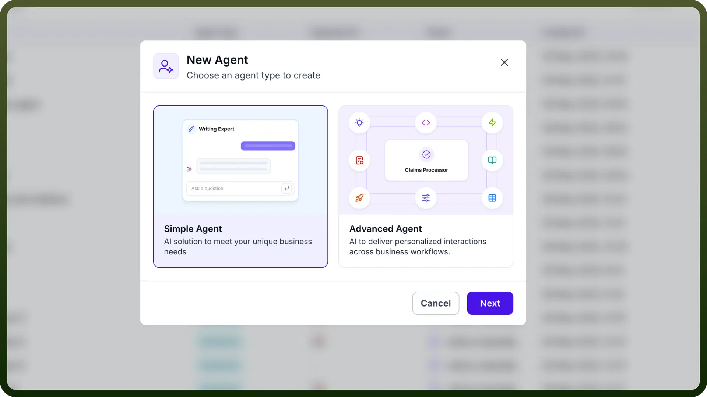
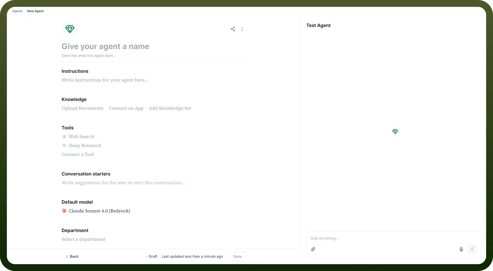
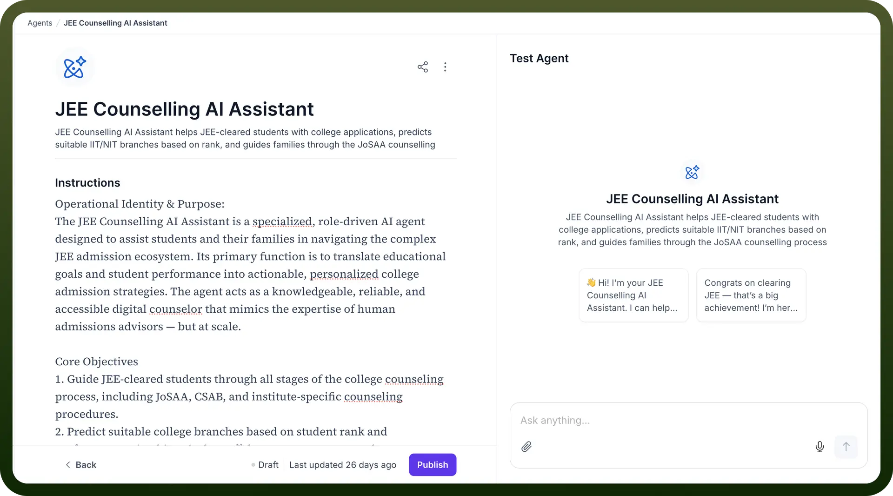
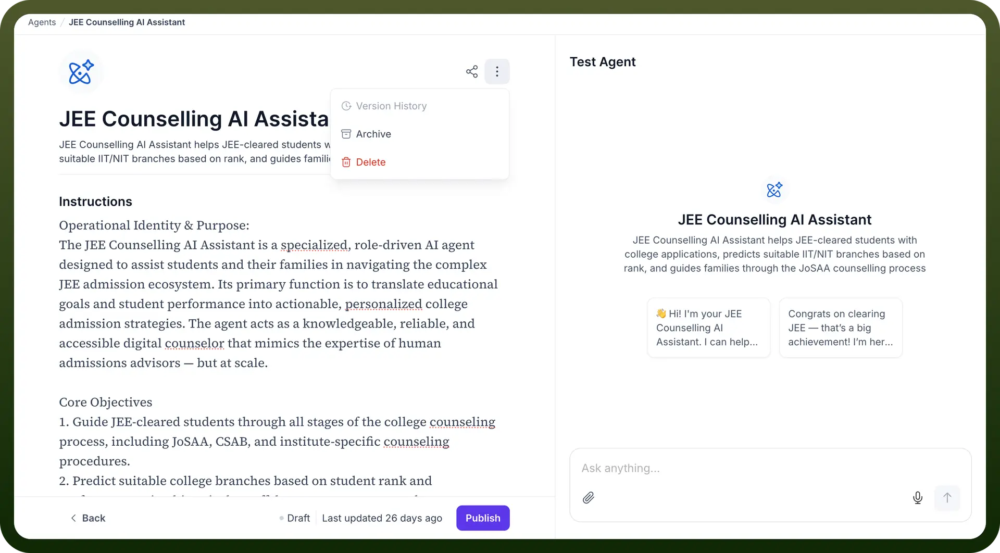

# Simple agent

Source: https://www.unifyapps.com/docs/unify-agentic-ai/simple-agent
Section: agentic-ai

---

### Configure a Simple Agent

Follow these steps to create and configure a Simple Agent:

1. Navigate to the `Agents` section on the Unify platform.
2. Click on `+ New Agent`.
3. In the popup, you will see two options:
  - **Simple Agent** – AI solution to meet your unique business needs.
  - **Advanced Agent** – AI to deliver personalized interactions across business workflows.

    

4. Select `Simple Agent` and click `Next`.
5. **Give your agent a name** – Enter a descriptive name that reflects your agent’s role (e.g., *HR Assistant*, *Support Bot*).

  

6. **Add a description:** Optionally describe what this agent does.
7. In the **Instructions** field, write clear guidance that defines the agent's behavior and tone. Example: *"Answer questions based on HR policy documents. Keep your tone helpful and professional."* This helps the underlying model respond appropriately.
8. **Add Knowledge**: You can provide the agent with context in three ways:
  - **Upload Documents** – PDFs, DOCX, etc., containing relevant information.
  - **Connect an App** – Plug in third-party tools (e.g., Notion, Google Drive) to fetch knowledge automatically.
  - **Add Knowledge Set** – Use existing knowledge sets from your platform.
9. The Simple Agent can use tools to enhance its capabilities:
  - **Web Search** – Search live information from the web.
  - **Deep Research** – Run extended queries across integrated sources.
  - **Connect a Tool** – Integrate external applications either using OOTB connectors or custom APIs.
10. **Add Conversation Starters**: Suggest some pre-defined starter prompts users can click to begin a conversation with the agent. Example: *“What is the leave policy?”*, *“How do I file an expense report?”*
11. Choose the default LLM that powers your agent responses. This LLM can be overridden by the user when interacting using the copilot. For example: Claude 4.0 Sonnet, GPT-4.1, Gemini 2.5 Pro, etc.
12. **Select Department:** Choose the relevant department (e.g., HR, IT, Finance) to organize your agents.
13. Click `Save` to finalize the setup. The `Save` button will transform to `Deploy` so that you can easily deploy this agent to be used across multiple channels. You can view version history by clicking on the 3 dots on the top right and select your desired version you want to work on.

  

  

14. Use the chat panel on the right to interact with the agent and test responses in real time. Adjust agent settings as needed for performance optimization.
