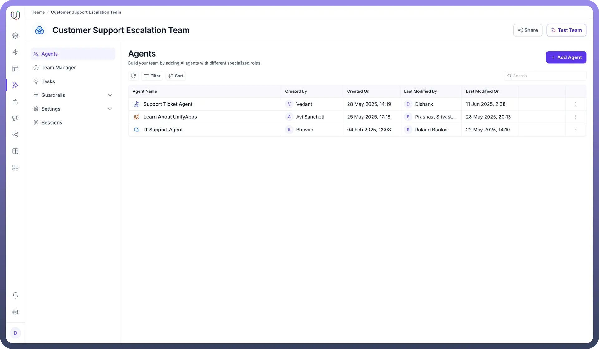
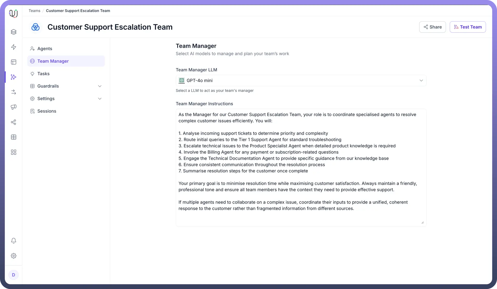
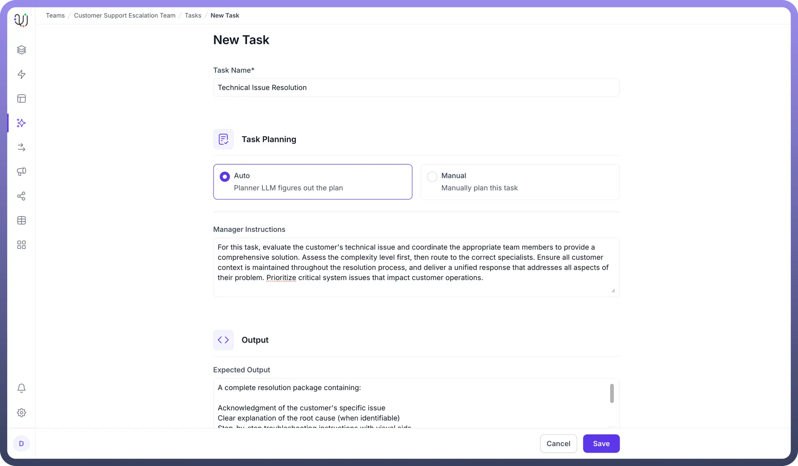
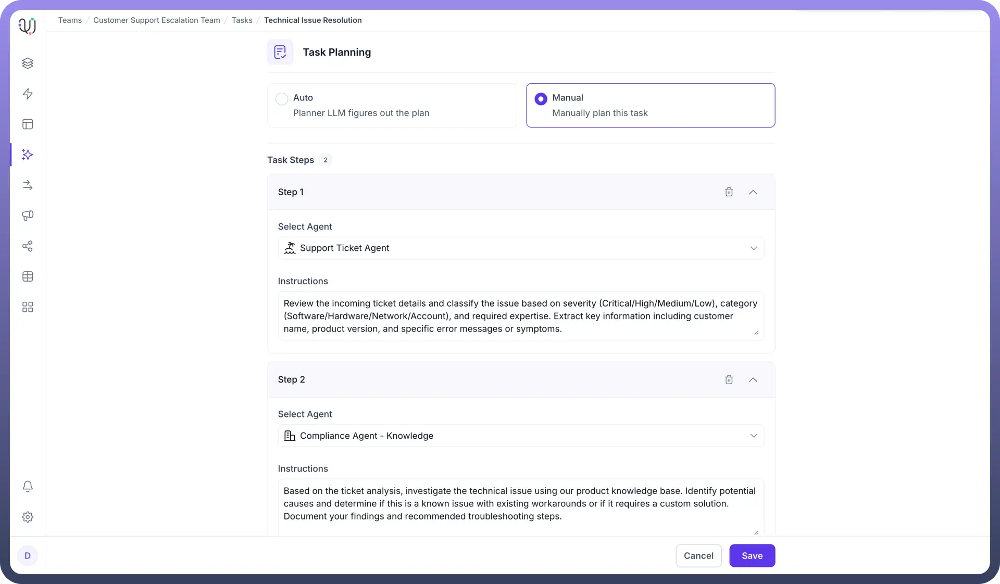

# Overview

Source: https://www.unifyapps.com/docs/unify-agentic-ai/team-of-ai-agents-overview
Section: agentic-ai

---

## Overview

A Team of AI Agents provides a powerful way to orchestrate multiple AI agents working together as a cohesive system. Rather than deploying separate standalone agents or overburdening a single agent with diverse responsibilities, you can create specialized teams managed by a single manager agent, where each agent excels in its particular domain. Ultimately, users experience a seamless interaction while benefiting from the combined intelligence and efficiency of a coordinated team working behind the scenes.

## Core Components

1. **AI Manager** The agent activities and task allocation are managed by a master agent to ensure accuracy and consistency in execution. This manager agent coordinates communication between specialized team members, handles exceptions, and maintains context across multiple agent interactions. UnifyApps allows you to select a specific LLM (like Claude Sonnet 3.5) to act as your team's manager and provide custom instructions to guide its management approach.

  

2. **Task Planning** Tasks define different journeys the team of agents can take, allowing you to structure different flows your agent can execute. UnifyApps provides the option between pre-defining your task workflow or guide an agent to orchestrate it for you:
  - **Auto Planning:** The Planner LLM figures out the plan automatically, determining the optimal execution strategy based on your high-level instructions. These instructions guide the LLM in generating an appropriate execution plan while giving it flexibility to adapt to different scenarios.

    

  - **Manual Planning**: You manually define each step of the task, maintaining complete control over the workflow. This approach allows you to create deterministic processes by specifying exactly which agent handles each step, what instructions they receive, and the precise sequence of operations.

    

The planning approach can be selected for each task, giving you flexibility based on complexity and requirements.

## Why a Team of AI Agents?

Teams of AI agents offer several advantages over single-agent approaches:

**Specialized Expertise**: Individual agents can focus on specific domains, delivering deeper expertise than a generalist agent trying to handle everything.

**Complex Problem Solving**: Difficult challenges can be broken down into manageable components, with each agent addressing the aspect they're best equipped to handle, providing more accurate and reliable results.

**Scalability due to Single Point of Entry**: Add new capabilities by integrating additional specialized agents without disrupting existing functionality or retraining the entire system.

**Graceful Degradation**: If one agent encounters difficulties, others can continue functioning, ensuring the system remains partially operational rather than completely failing.

## Use Cases of Team of AI Agents

Teams of AI Agents excel in complex scenarios requiring diverse expertise and coordinated workflows. Unlike single agents, these collaborative systems can handle multifaceted problems that span different domains and require specialized knowledge. By distributing tasks across purpose-built agents, organizations can tackle sophisticated challenges while maintaining a unified user experience. Here are compelling use cases where teams of AI agents deliver exceptional value:

1. **Research & Analysis**
  - Distributes information gathering across domain-specific agents
  - Combines findings into cohesive insights and recommendations
  - Enables deeper exploration of specialized topics
  - Produces comprehensive reports with diverse perspectivesExample: A market research team where one agent analyzes competitor data, another processes industry trends, while a third synthesizes consumer sentiment to deliver holistic market intelligence.
2. **Content Production Pipeline**
  - Assigns specialized agents to different stages of content creation
  - Ensures consistent quality through dedicated review processes
  - Manages complex formatting and publishing requirements
  - Optimizes for different distribution channels Example: A blog production team where research, writing, editing, fact-checking, and SEO optimization are handled by specialized agents working in sequence to produce polished, accurate content.
3. **Complex Decision Support**
  - Evaluates scenarios from multiple specialized perspectives
  - Generates recommendations based on diverse expertise
  - Provides transparent reasoning across different domains
  - Adapts to changing circumstances through coordinated reassessment Example: A financial advisory team where specialized agents analyze market trends, tax implications, risk profiles, and retirement goals to deliver personalized investment strategies.
