# Trigger and Deploy

Source: https://www.unifyapps.com/docs/unify-agentic-ai/trigger-and-deploy
Section: agentic-ai

---

## Trigger your AI Agent

1. After completing the configuration of the AI Agent (Indexing, Preprocessing, and Response Generation), navigate to the "`Deployments`" section and click on the "`Deploy`" button to start a new deployment.

  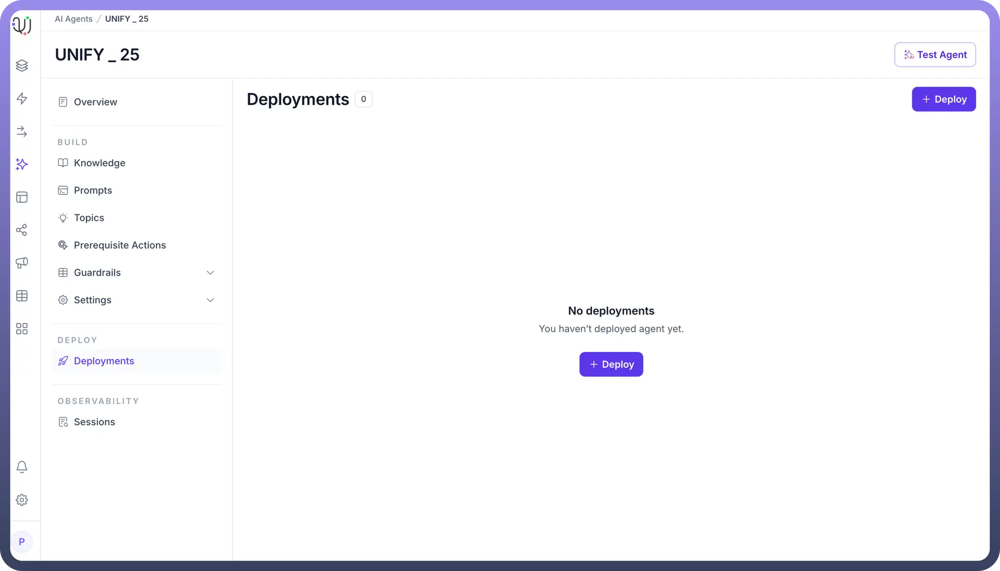

2. Select “`Add a Trigger`” option available.

  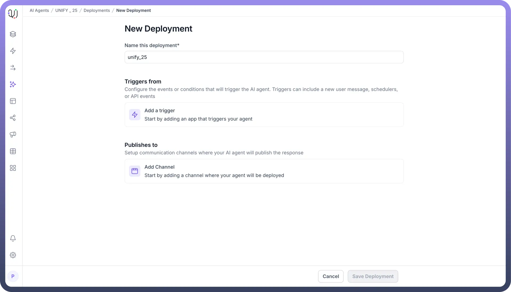

3. Select an application which you would like to use to trigger the agent. For example, we want to use a certain activity on slack to be our trigger.

  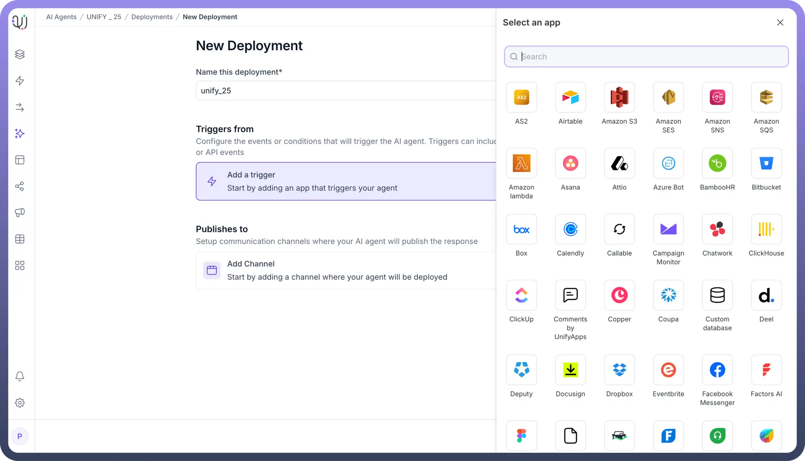

4. Select the available action as trigger. For Slack, select "`Slack Trigger on Every New Message`".

  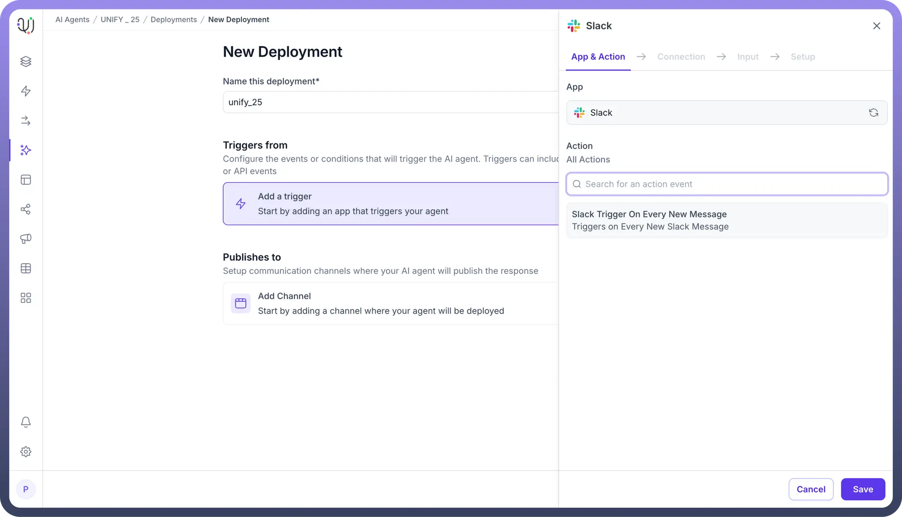

5. Select the connection you have authenticated for Slack, or create a new connection if needed.

  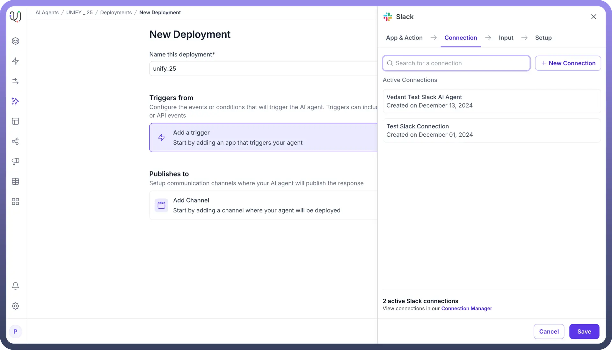

6. Click on “`Next`” and proceed to save the trigger.

  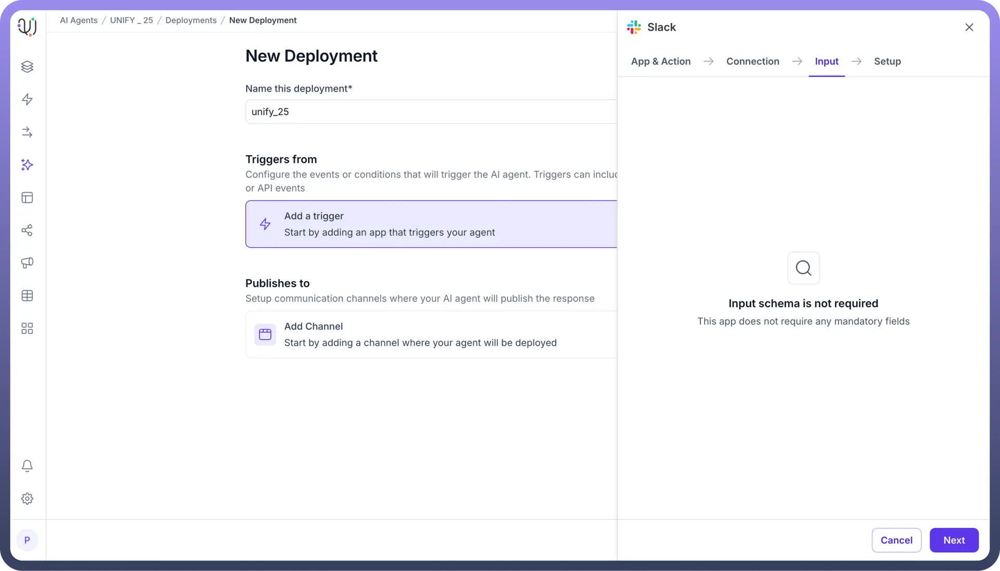

7. After saving the trigger, you have to select a channel where you would like your agent to be deployed. For example, we’ve chosen Gmail here.

  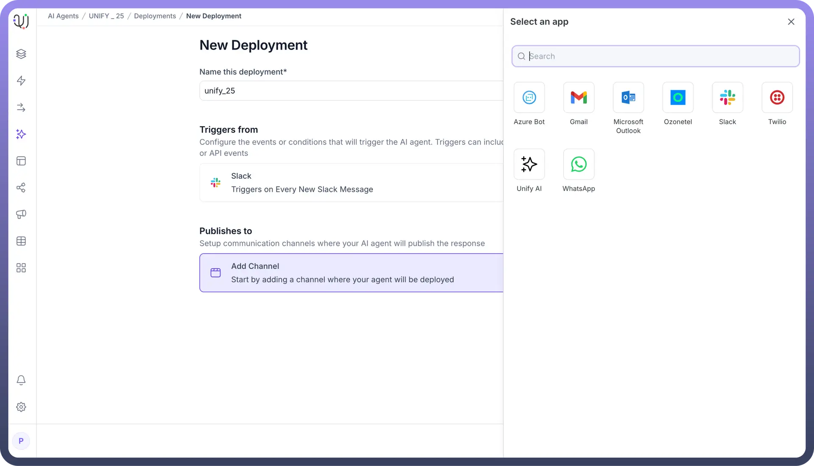

8. Select an action available for the application selected. ( send an email for our example ).

  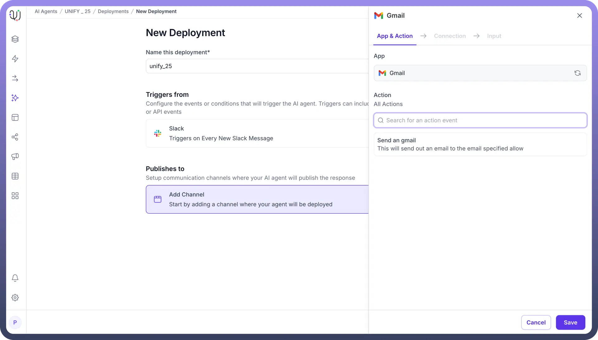

9. Choose an existing connection or create a new connection by authenticating Gmail and click on save.

  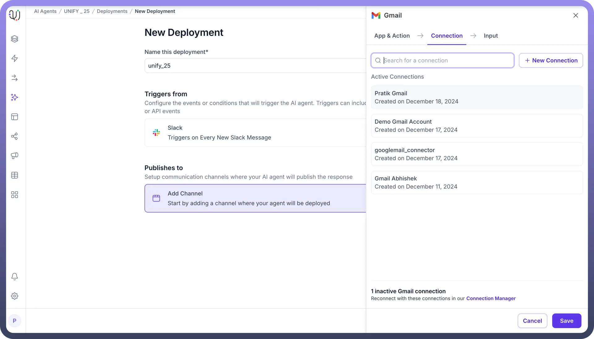

10. Click on save deployment to save the deployment.

  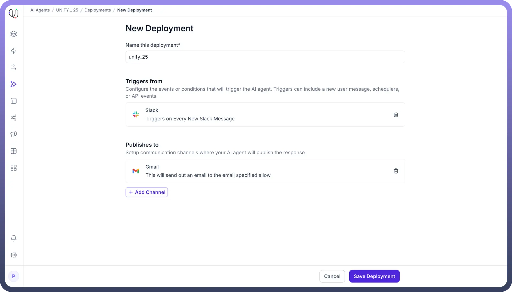

11. Click on the toggle to activate the set deployment.

  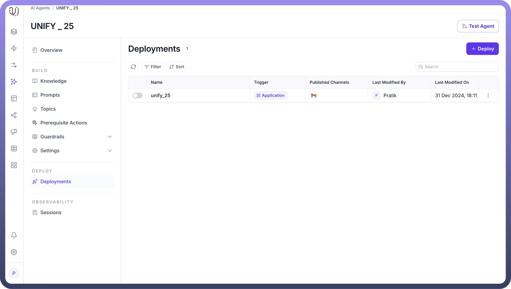

12. The trigger is successfully created to deploy an agent.

  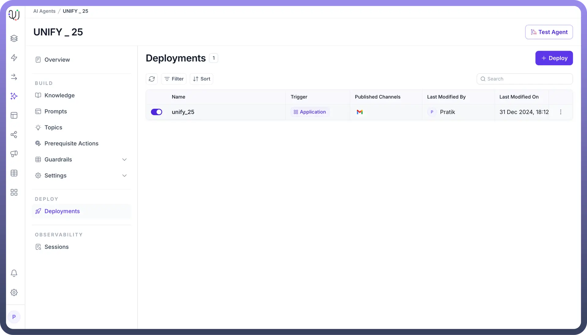
