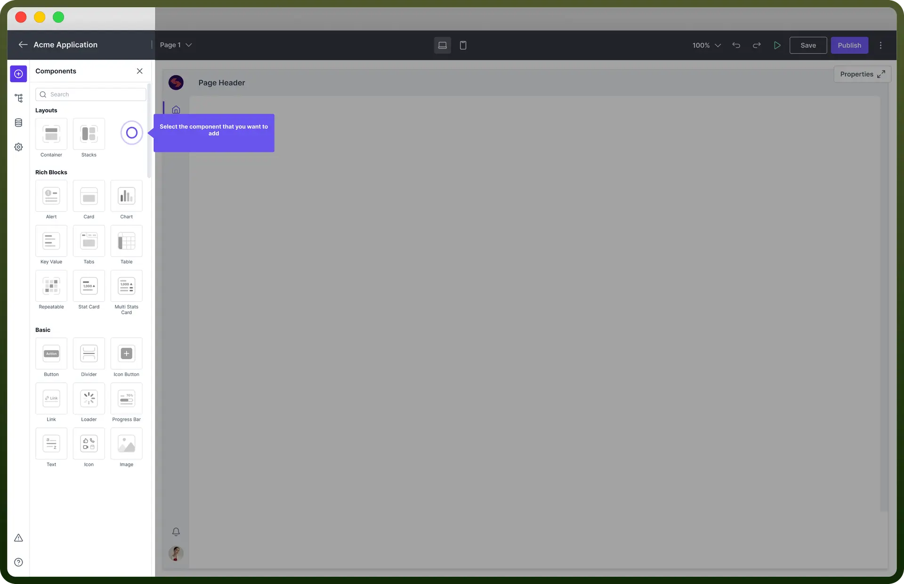
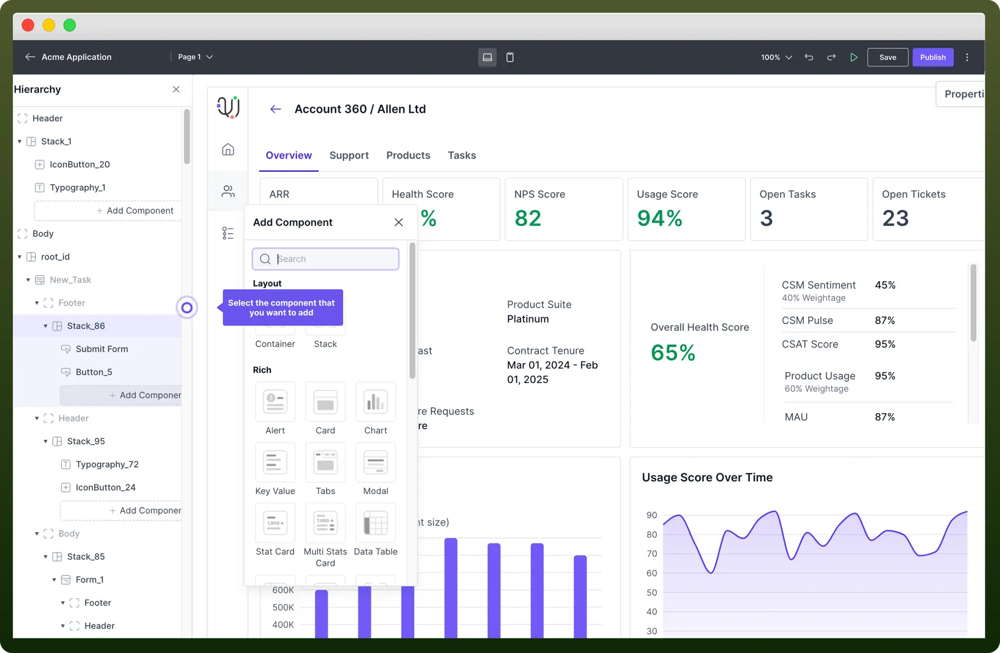

# Add Components to your Interface

Source: https://www.unifyapps.com/docs/unify-applications/add-components-to-your-interface
Section: applications

---

## Overview

Components serve as the building blocks of your application, enabling you to **display** data, **capture** user input, and **perform** various actions.

In this article, you will learn about the types of components and how to add them to your interface.

## Layout Components

These are used to structure and organize other components within the interface.

| Component | Description |
|---|---|
| `Container` | Container provides **structure** to the application interface and is used to **divide** it into a defined rigid layout. 

A container can hold a fixed number of components within it. |
| `Stack` | Stack is a flexible UI component that **groups** and **organizes** components vertically or horizontally. 

Stacks automatically manage **spacing** and **alignment** between child elements and allow an indefinite number of components within them. |

> **Note:** **Avoid** overusing layout components. **Add** components directly to the root section for top-level placement. Use containers or stacks to organize components within sections for better design control.

## Basic Components

They are essential UI elements like **buttons**, **dividers**, **icons**, and **text** for building the core functionality of your application.

| Component | Description |
|---|---|
| `Button` | Adds a **clickable** button to perform actions. |
| `Divider` | Adds a **horizontal** or **vertical** divider to separate content. |
| `IconButton` | Adds a button with an **icon** to perform actions. |
| `Link` | Adds a **hyperlink** to navigate to different external URLs. |
| `Loader` | Displays a loading **indicator**. |
| `Progress Bar` | Shows **progress** in a visual bar format. |
| `Text` | Displays text **static** or **dynamic**. |
| `Icon` | Adds an icon to the application for **visual** emphasis. |
| `Image` | Displays an **image**. |
| `Tag` | Adds a **tag** or **label** for categorization or emphasis. |
| `Filters` | Adds **filtering** options for data displayed in other components. |

## Rich Components

Rich Components are ready-to-use UI components that pack multiple features into single, easy-to-implement packages.

These components offer sophisticated functionality like **interactive tables**, **customizable charts**, and **advanced form inputs** - all pre-built and easily configurable.

| Component | Description |
|---|---|
| `Alert` | Displays **important** messages to users in a visually distinct way. |
| `Card` | A **modular** content container featuring customizable header, body, and footer sections. |
| `Chart` | Visualizes data in various **chart** formats such as bar, line, pie charts etc. |
| `Key Value` | Used for displaying **paired** data, presenting a key alongside its corresponding value in a clear, structured format |
| `Tabs` | Organizes content into **multiple** tabs for better navigation and structure. |
| `Modal` | Modal box is a **popup** dialog that overlays the main application and is used to capture user input, display important information, or prompt user actions without navigating away from the current page. |
| `Stat Card` | Displays **statistical** information with visual emphasis. |
| `Multi Stats Card` | Shows **multiple** statistical metrics in a single card. |
| `Data Table` | Presents data in a **tabular** format with various customization options. |
| `Drawer` | Creates a slide-in **drawer** for additional content or options. |
| `Form` | Collects user **input** through various form fields. |
| `CodeEditor` | Allows users to **write** and **edit** code within the application. |
| `Timeline` | Displays a **timeline** of events or activities. |

## Repeatable Components

These elements are designed for repeating patterns, such as lists or grids, enabling dynamic data display.

| Component | Description |
|---|---|
| `Repeatable` | Allows **repeating** a set of components for multiple items. |
| `Repeatable List` | Displays a **list** of repeatable items. |

## Add Components into Interface

1. **Access the Component Library** Navigate to the left sidebar to explore various categories of components such as **Layout**, **Rich**, **Repeatables**, and **Basic**. Browse through the available components and select the ones that best fit your application’s needs. **Note:** It’s always recommended to rename the component. Click the component in the hierarchy panel, select "**Rename**" from the three-dot menu, type the new name, and the name of your component will be changed.

  

2. **Configure Component Properties** Click on the component to open its properties panel on the right side, where you can modify settings like **data bindings**, **appearance**, and **interactions**, **permissions** & much more. You can read more about properties of each component in their specific articles. **Note:** Before you start adding components, create a **rough sketch** of your application layout. This will help you visualize the structure and placement of various elements.

## Best Practices

1. **Use Layout Components Wisely:** Use containers, stacks, and other layout components to logically organize your application. However, avoid overusing these components when they are unnecessary.
2. **Use Meaningful Names for your components:** Name your components descriptively to reflect their purpose. This makes it easier for others to understand and maintain your application.
3. **Break Down Complex UI:** Divide complex user interfaces into smaller, manageable components. This modular approach makes it easier to debug, test, and maintain your application
