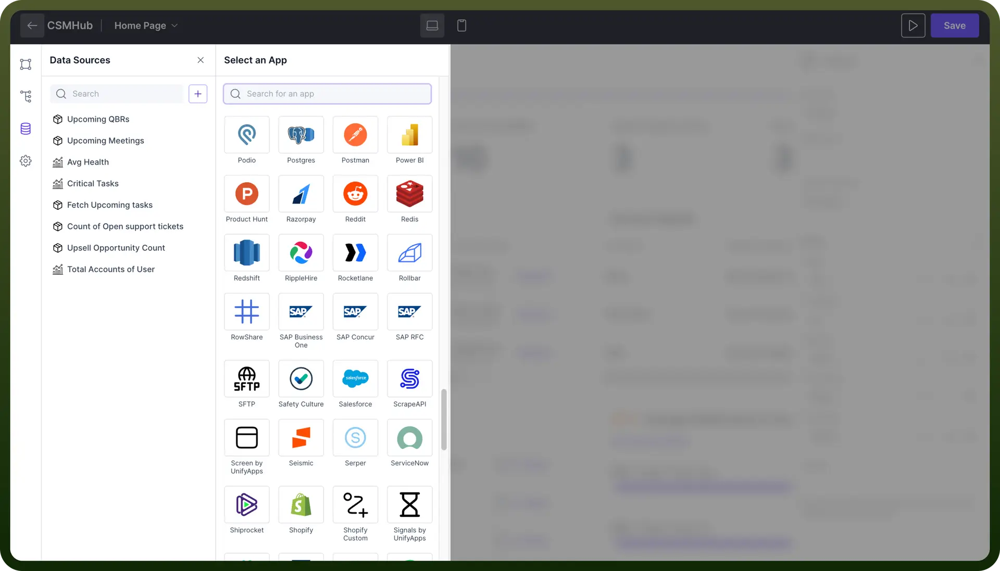

# Add data Sources component

Source: https://www.unifyapps.com/docs/unify-applications/adding-data-sources
Section: applications

---

## Introduction

Data sources are essential for connecting and utilizing various external applications and databases, enabling your app to access and integrate data.

This article will show you how to `add`, `setup`, and `manage` data sources in the interface. It ensures your application gets all the data it needs to work well and offer useful insights.

## Compatible Data Sources

UnifyApps supports **multiple data sources**, each offering different functionalities. You can choose the data source based on where your data resides.

1. **Storage by UnifyApps:** If your data is stored within Unify Objects, you can fetch it directly using Storage by UnifyApps. "This option provides access to your stored data, allowing for efficient retrieval and usage within your applications."
2. **Analytics by UnifyApps:** For performing analytics and querying on top of the data stored in Unify Objects, you can use Analytics by UnifyApps. "This option is ideal for obtaining analytical insights and generating reports from your existing data sources."
3. **Direct Application Connectors**: If you need to fetch data directly from various external applications. "These connectors enable straightforward integration with third-party applications, allowing you to pull in data without additional processing." **Note:** Please refer to the [Connectors](/docs/unify-automations/salesforce) in UnifyAutomation section for more details.
4. **Callable by Automations:** In cases where you need to fetch data from multiple applications and perform post-processing or use a combination of data sources, Callable by Automations is the ideal choice. "This feature lets you write the entire logic within an automation script, which can then be called within the interface. It provides flexibility and control over complex data integration and processing tasks."

## Steps to Add Data Sources

1. **Access the Data Sources Panel**
  - Open your UnifyApps interface and navigate to the '`Data Sources`' section on the left panel.
  - Click on the '`+`' button to add a new data source.
2. **Select an App**
  - Browse through the list of available apps or use the search bar to find the specific data source you want to add.

    

3. **Define Actions and Queries**
  - Configure the actions you want to perform with your data source. For example, you can set up analytics queries or execute SQL queries for data retrieval and manipulation.
4. **Configure the Data Source**
  - Once selected, follow the prompts to connect your data source. This may involve entering API keys, authentication tokens, or other credentials.
5. **Save and Test**
  - After configuring the data source and actions, save your settings. Test the connection to ensure everything is set up correctly.

For detailed information on writing automations or learning about specific connectors, please refer to the [Unify Automations](/docs/unify-automations/build-your-first-automation)section.

> **Note:** Always rename your data connections with **clear** and **descriptive** names. This practice helps you easily identify and manage them, especially when you have multiple data connections added.

## Best Practices

1. **Plan Your Data Source and Schema:** Before implementing data sources in your app, it's recommended to define the data source and its schema. This helps ensure a clear and organized data structure.
2. **Ensure Proper Access for External Data:** If you need to fetch data from an external application,
  - Make sure you have developer access and the necessary API keys or admin credentials.
  - Always review the detailed connector guidelines before proceeding. Please refer to the [Connectors](/docs/unify-applications/adding-data-sources) Section in Unify Automation.
3. **Storing Data in UnifyApps:** If your goal is to store data within UnifyApps, you can create an object in Unify Objects with a well-defined schema.
  - As mentioned in **point 1**, you need to consider your app's design and how different objects will relate to each other. Please refer to the [Creating Object](/docs/unify-applications/adding-data-sources) section in Unify Automations.
4. **Test Automations Thoroughly:** When using automations, always test them thoroughly before integrating them into your interface. This ensures they work as expected and prevents issues in your live application. Please refer to the [Testing Automations](/docs/unify-automations/test-your-automation) section in Unify Automations.
