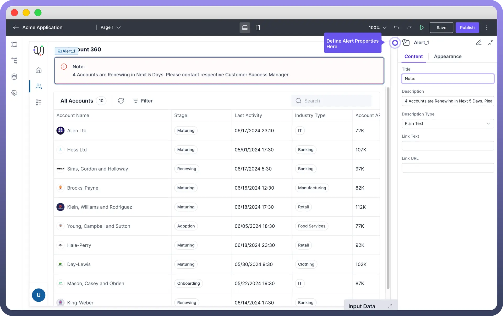
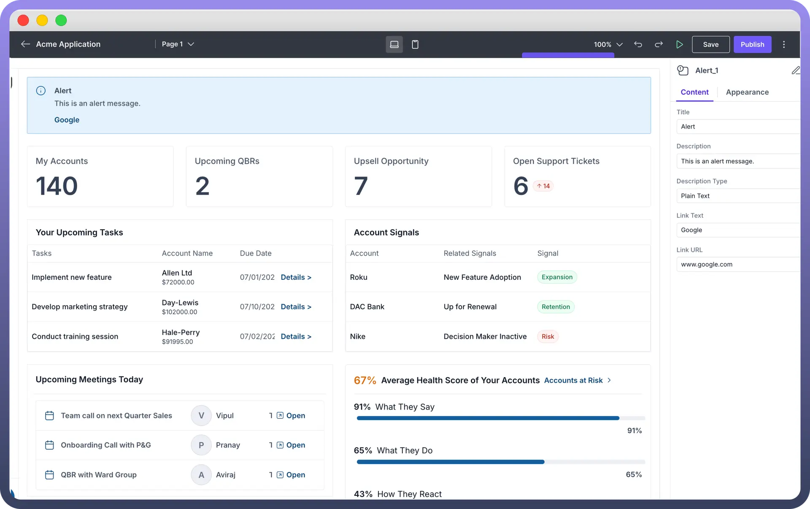

# Alert Component

Source: https://www.unifyapps.com/docs/unify-applications/alert-component
Section: applications

---

## **Overview**

The Alert component is used to display important messages to the user. It can be used for various purposes such as error messages, warnings, success messages, and informational alerts. This article will guide you through configuring and customizing the Alert component.

## Add Content to Your Alert Box

To add content to your alert box, follow these steps:

1. Select the Alert component from the component list and add it to your desired location within your interface.
2. Click on the Alert component to open the configuration panel where you can add a Title to your alert box by entering text in the Title field.
3. Add your message in the Description field. You can choose the format of the description by selecting either Plain Text or Markdown from the Description Type dropdown.

> **Note:** You can use the data pills from the input data tab while configuring the text to be shown. This can be used to update the data dynamically

## Add a Link to Your Alert Box

You can include a link with text and URL to direct users to further details, resources, or actions they can take in response to the alert.

1. `Link Text`: In the Alert component configuration panel,you can enter the text you want to display as the link in the "Link Text" field.
2. `Link URL`: You can enter the URL you want the link to point to in the "Link URL" field.

  

## Customize the Alert Appearance

- **Changing the Alert Variant**: In the Alert component configuration panel, locate the "`Variant`" dropdown menu. Select the variant for the alert to indicate its type. The options include:

| **Variant** | **When to Use** |
|---|---|
| `Default` | Use for general notifications and information. |
| `Brand` | Use for alerts that align with your brand's identity. |
| `Error` | Use for error messages, failures, or urgent issues that need immediate attention. Red-themed alert indicating errors or critical issues. |
| `Warning` | Use for warnings or potential issues that users should be aware of. Yellow-themed alert signaling caution. |
| `Success` | Use for confirmation messages, successes, or completed actions. Green-themed alert indicating success. |

> **Note:** Use the appropriate variant to ensure the alert is easily recognizable by users.

- Choose an icon to be displayed alongside the alert message.
- There are other styling options which allow you to customize the appearance and layout of the alert component.

| **Property** | **Description** |
|---|---|
| `Border Width` | You can adjust the thickness of the border around the alert box. |
| `Width` | You can set the width of the alert box by either choosing the pre-built options or entering the custom value. |
| `Flex Layout` | You can control how elements size and align themselves within their container, allowing flexible positioning of components in the interface. |

## Best Practices for Using Alert Boxes

1. **Keep Messages Concise:** Ensure that alert messages are brief and to the point to maintain clarity and avoid overwhelming users with too much information.
2. **Provide Actionable Information:** Whenever possible, include instructions or next steps within the alert to help users understand how to respond to the message.
3. **Use Descriptive Titles:** Provide a clear and concise title for the alert to quickly convey the main point of the message.
4. **Consider Placement:** Place alert boxes in prominent areas where users are most likely to see them, ensuring important messages are not missed.
5. **Consistent Styling:** Maintain consistent styling across all alert boxes to create a cohesive user experience and avoid confusion.
