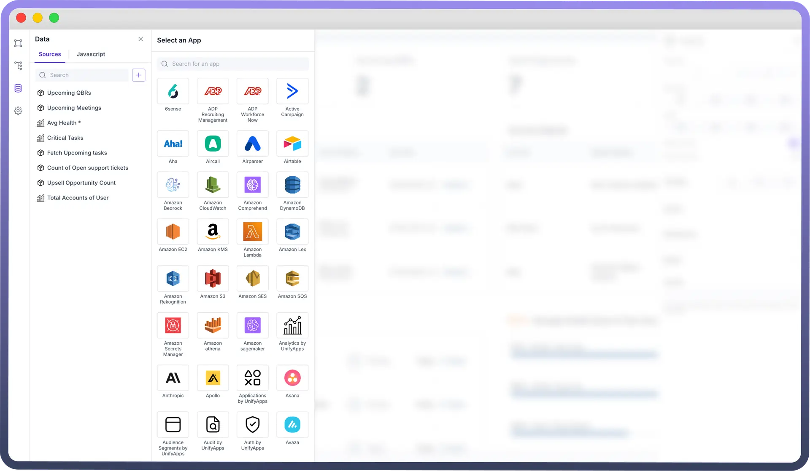
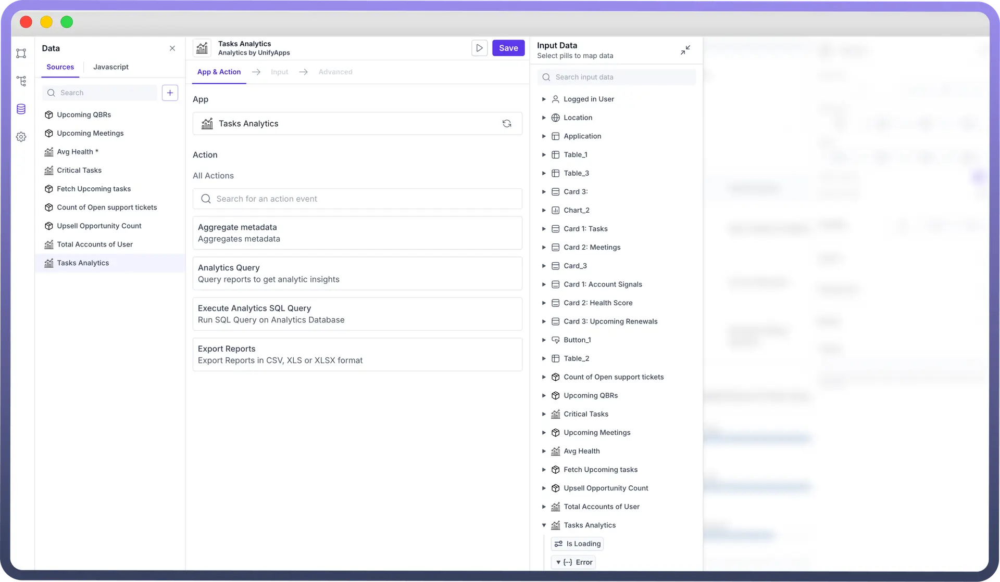
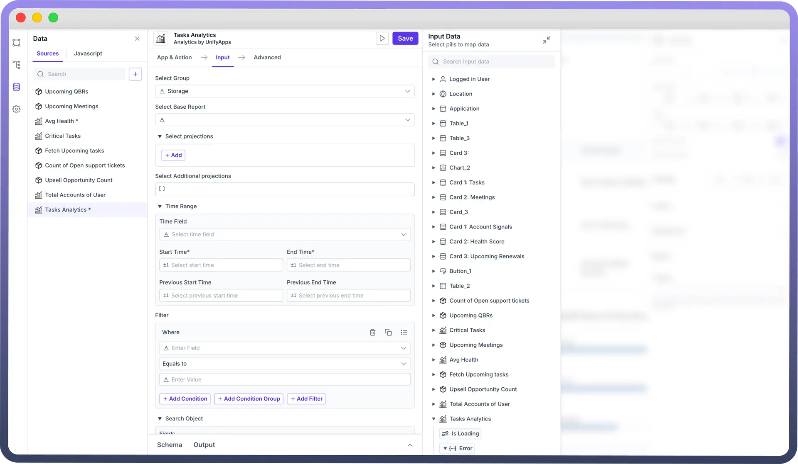
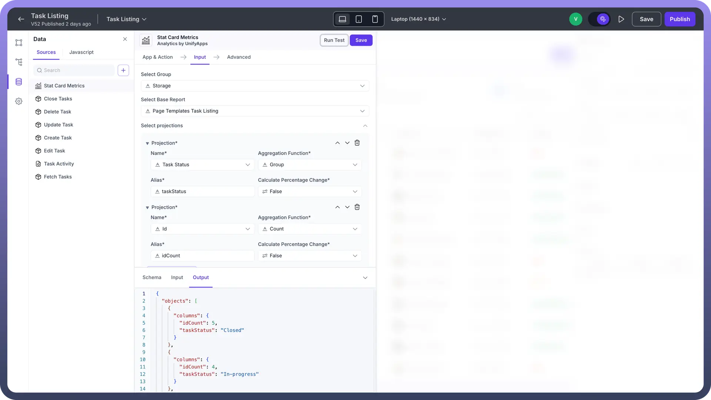
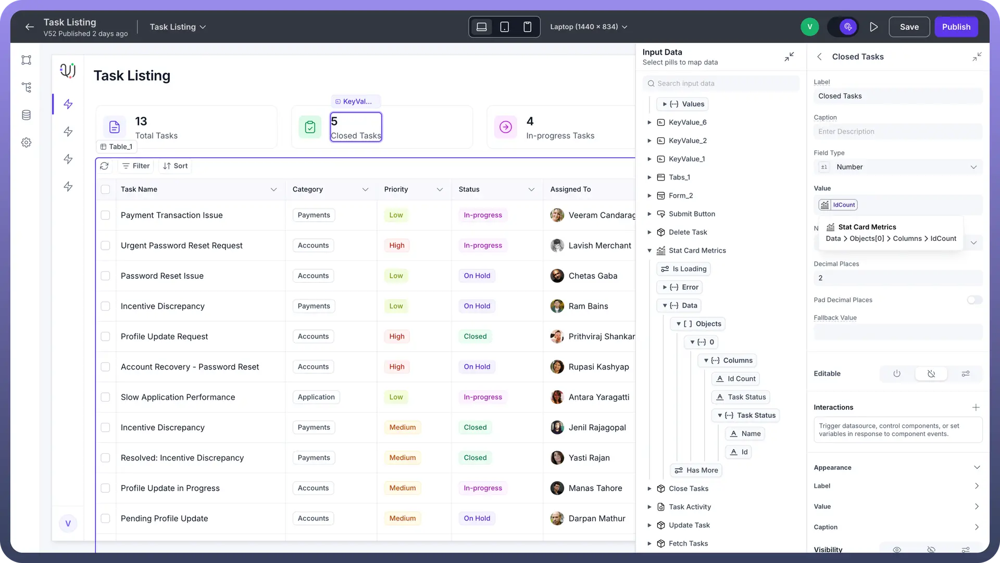

# Analytics by UnifyApps

Source: https://www.unifyapps.com/docs/unify-applications/analytics-by-unifyapps-data-source
Section: applications

---

## Overview

Analytics by UnifyApps is a data source that allows you to run queries and apply aggregation functions on your data stored in Unify Objects or Standard Platform Objects. The Analytics queries can be directly used within your low-code application for creating Reporting Dashboards. This article covers how to set up and use Analytics by UnifyApps.

## Adding “Analytics” Data Source in Application

For creating a reporting dashboard (perform aggregation functions on data stored in UnifyApps) or displaying stats in your application, you should use Analytics Node as the Data Source.

To add Analytics by UnifyApps as a data source:

1. Navigate to the "`Data`" section in your application. You would find it in the left pane of your application below the hierarchy section.
2. Click the "`+`" button to add a new data source.
3. Search for and select "`Analytics by UnifyApps`" from the available options.

This integration enables you to work with data stored in UnifyApps Objects directly within your application.

## Configuring “Analytics by UnifyApps” Data Source

- **Choose an action**: Select an action for your data source. These are the list of commonly used actions.

| **Action** | **Action Description** |
|---|---|
| `Analytics Query` | Use the "Analytics Query" action for running a Query on the reports. |
| `Execute Analytics SQL Query` | The "Execute Analytics SQL Query" action allows you to write any custom SQL Query to run on our Analytics Databases |

**Advanced Actions**

| **Action** | **Action Description** |
|---|---|
| `Aggregate Metadata` | The "Aggregate Metadata" action provides the Metadata and summarization on the fields of the stored reports. This can be useful for custom filtering, sorting and searching through reports and gaining insights directly from the UI of the Low Code Application. |
| `Export Records` | The "Export records" feature allows you to define a query on any report and extract data from our Analytics Node in CSV, XLS, or XLSX formats. |

- **Choose the Report Group & Base Report:** Based on the selected action, you need to define the input for the Analytics Node to fetch the output from the required Object. The required inputs will vary depending on the chosen action. For instance, for the "Analytics Query" action, the following input fields are necessary.

  

  - **Select Group:** Choose the Group from the dropdown list from where you want to choose the report. **Note:** Reports of all Custom Objects with Reporting Enabled are present under Storage Group and All Reports created on Platform Usage are present under Platform Group.
  - **Select Base Report:** Select the Base Report you want to configure and run the Query on. **Note:** If your object created from Unify Objects is not present in the Reports dropdown, check if reporting is enabled for the object and wait for a few minutes post enabling reporting.
- **Define Projections:** You can define the Aggregation Projections necessary for the Analytics Query.
  - `Name`**:** Select a field from the dropdown. This dropdown consists of fields from the base report and reports which are in relation with the base report, for eg - Unify Objects connected by a look up.
  - `Aggregation Function`**:** Select a standard aggregation function from the dropdown or use a custom aggregation function for defining the desired output of your query.
  - `Alias`**:** Write a Name for the selected field to further customize the output of the query.
  - `Calculate Percentage Change`**:** Choose whether you want to fetch the percentage change of the field selected in projection.
  - `Select Additional Projections`**:** This input field provides an option to write any Custom Projection
- **Conditional Counting:** Specify the criteria for the fields you want to create projections on.
  - **Where:** Set conditions to fetch and aggregate records that meet specific criteria.
    - **Enter Field:** Specify the field name you want to filter on.
    - **Operator:** Choose the operator for the filter (e.g., equals to, contains, greater than, etc.).
    - **Enter Value:** Provide the value for the filter condition.
- **Search Object:** Search Object enables users to search for a string across multiple fields. This matches records which contain the string and is always case insensitive.
  - **Field:** Select the fields you want to search within the selected object.
  - **Value:** Enter the value you are looking for in the specified field.
- **Reviewing Output:** After configuring the input, review the expected output fields. These will be available as data pills in your application.

## Mapping Data to UI Components

Data fetched through Analytics by UnifyApps becomes available as data pills. These can be used throughout your application in various components and logic flows.

> **Note:** You can refer to Map Data to UI Components Documentation to know more about it.

## Using Analytics Node in Stat Cards

1. **Add Analytics by UnifyApps Data Source:** Select “`Analytics Query`” action & choose your object from the dropdown.

  

2. **Configure Appropriate Projections:** You should choose the correct combinations of fields and their aggregation function in your projections to create the desired statistics.
  - **Using Group Aggregation Function:** Group Function returns the list of all values of the field present in Object Records.
  - **Using Count Aggregation Function:** Count Function returns the count of records where the field is present in Object Records.
  - **Using Combination of Group & Count Aggregation Functions:** Grouping a field and using count function on primary key of the object returns unique values of the field present in the Object Records and the count of records against each value.

    

3. **Mapping Output of Analytics Node:** Output of Analytics Node can be configured in the Stat Card by selecting the pill for Input Data Pills.

## **Best Practices**

- Keep your Object schemas well-organized and documented.
- Use meaningful names for objects and fields.
