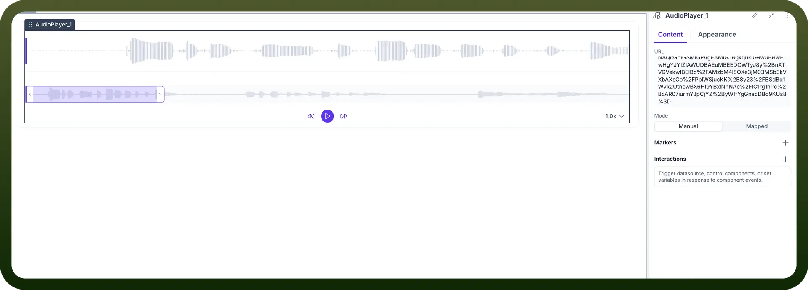

# Audio Player component

Source: https://www.unifyapps.com/docs/unify-applications/audio-player
Section: applications

---

## Overview

The Audio Player component provides a standardized and interactive way to embed and control audio playback within your application. It allows users to play, pause, seek, and visualize audio content seamlessly. The player can be configured to load audio from a URL, offering flexibility for various use cases such as playing back recordings, podcasts, or instructional audio.

## Audio Player Interface

The Audio Player component has two primary states: an initial state when no audio source is provided and an active state when a valid audio source is loaded.

### Initial State: Audio Source Missing

When an Audio Player component is first added to your application, it will be in an "Audio Source Missing" state.

Interface Components:

- **Message Display:** A central message `Audio Source Missing` clearly indicates that a valid audio URL needs to be provided.
- **Instruction Text:** Subtext guides the user with: `Please enter a valid URL to load and play the audio`.

### Active State: Audio Loaded

Once a valid URL is provided in the URL property, the Audio Player becomes active and displays the audio waveform and playback controls.

Interface Components:

- **Waveform Visualization:** A visual representation of the audio file's sound waves, allowing users to see the audio structure.
- **Selection & Zoom:** A highlighted section of the waveform indicates the current view, which can be zoomed for detailed inspection.
- **Playback Controls:**
  - `Play`**/**`Pause` **Button:** Toggles the audio playback.
  - `Seek Forward/Backward` **Buttons:** Allows users to jump forward or backward in the audio track.
- **Playback Speed:** A control (e.g., `1.0x`) to adjust the speed of the audio playback.

## Configuration Properties

The Audio Player's behaviour and content are managed through the properties panel, which is divided into `Content` and `Appearance` tabs.

### Content Tab

**URL**

- **Field Type:** Text input.
- **Purpose:** To specify the source of the audio file.
- **Requirement:** Must be a valid and accessible URL pointing to an audio file (e.g., .mp3, .wav, .ogg).

**Mode**

- **Manual:** The URL is entered directly into the text field.
- **Mapped:** The URL is dynamically bound from a data source, such as a database query or an API response. This allows for displaying different audio files based on user interaction or other application logic.

**Markers**

- **Functionality:** Allows you to define specific points of interest within the audio timeline. These markers can be used to trigger events or highlight sections of the audio.

**Interactions**

**Purpose:** Configure actions that respond to component events. You can trigger datasources, control other components, or set variables in response to events like `onPlay`, `onPause`, or `onEnd`.
