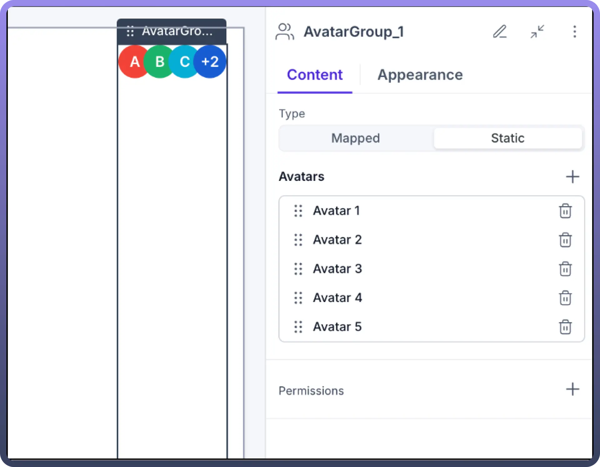

# Avatar Group

Source: https://www.unifyapps.com/docs/unify-applications/avatar-group
Section: applications

---

## Overview

The Avatar Group component provides a visual representation of multiple users or entities in a compact, organized display. It allows you to showcase a collection of avatars with customizable appearance and behavior. Avatar Groups can display both static lists of avatars or dynamically mapped data from your application sources, making them perfect for team displays, user lists, and collaborative interfaces.

## Key Properties

**Type Selection**

The Avatar Group offers two primary configuration types:

- **Mapped**: Connects to dynamic data sources to populate avatars automatically
- **Static**: Manually configured avatars with fixed properties

**Avatar Representation**

Each avatar within the group can be customized with:

- **Icon or Image**: Choose between symbolic icons or actual images
- **Avatar ID**: A unique identifier for each avatar in the group
- **Fallback Text**: Alternative text displayed when images fail to load

**Appearance Controls**

- **Size**: Multiple size options from xxs to 2xl to fit your design needs
- **Max Visible Avatars**: Control how many avatars are visible at once
- **Layout**: Customize the arrangement and spacing of avatars
- **Background**: Set custom background colors and styles
- **Border**: Apply border styling to visually separate avatars

## Configuring an Avatar Group

**Creating a Static Avatar Group:**

1. Add the Avatar Group component to your page from the component library
2. Select "`Static`" as the Type option
3. Use the Avatars section to add individual avatars:
  - Click the "`+`" button to add a new avatar
  - Configure each avatar's properties (Avatar 1, Avatar 2, etc.)
  - Use the trash icon to remove unwanted avatars

**Creating a Mapped Avatar Group:**

1. Add the Avatar Group component to your page from the component library
2. Select "`Mapped`" as the Type option
3. Configure the Mapped Avatars section:
  - Select your data source
  - Map the Avatar ID field to your data
  - Choose between Icon or Image representation
  - Set fallback text options

**Setting Avatar Appearance:**

- Navigate to the Appearance tab
- Select the appropriate size for your avatars
- Set the maximum number of visible avatars
- Configure layout settings including spacing and alignment
- Customize background and border styling as needed

## Use Cases

**Team Member Display**

Use Avatar Groups to represent team members working on a project or assigned to a task. Configure the component to display user profile images with appropriate fallback text for accessibility.

**Collaborative Workspaces**

Implement Avatar Groups to show active participants in collaborative documents or workspaces. Connect to live data sources to dynamically update as users join or leave the space.

**Activity Indicators**

Pair Avatar Groups with interaction components to create interactive user listings that display activity status, online presence, or participation levels.

**User Selection Interfaces**

Use Avatar Groups in user selection interfaces, allowing users to quickly identify and select colleagues for sharing, permissions, or collaboration.

## Best Practices

**Optimal Visual Presentation**

- **Size Consistency**: Maintain consistent avatar sizes throughout your application
- **Limited Visibility**: Set appropriate "`Max Visible Avatars`" to prevent overcrowding
- **Adequate Spacing**: Ensure enough spacing between avatars for clear visual separation

**Performance Considerations**

- For large datasets, implement pagination or filtering when displaying Mapped Avatar Groups
- Use appropriate image optimization for avatar images to ensure fast loading times

**Accessibility**

- Always provide meaningful fallback text for each avatar
- Ensure sufficient color contrast between avatars and background

## Interactive Capabilities

Avatar Groups can be enhanced with interactive features:

- **Click Actions**: Configure what happens when users click on an avatar
- **Hover States**: Define visual feedback when users hover over avatars
- **Selection States**: Implement visual indicators for selected avatars

## Permissions

Control who can see or interact with Avatar Groups by setting visibility permissions based on user roles or other contextual factors. This ensures that only authorized users can view or interact with specific Avatar Groups.
