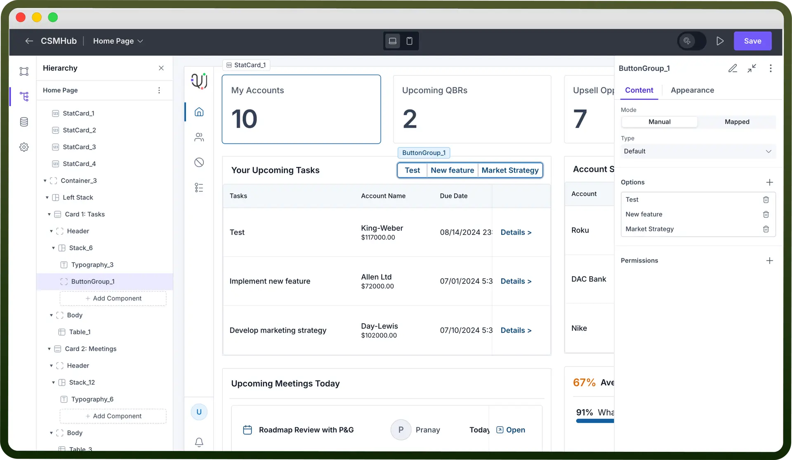
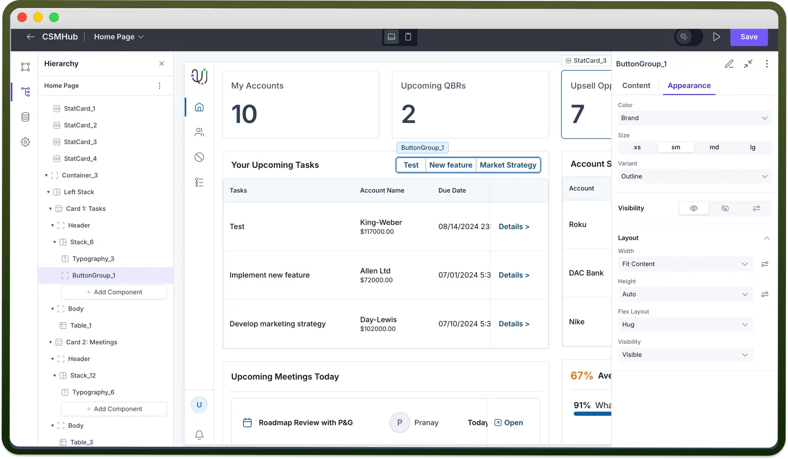
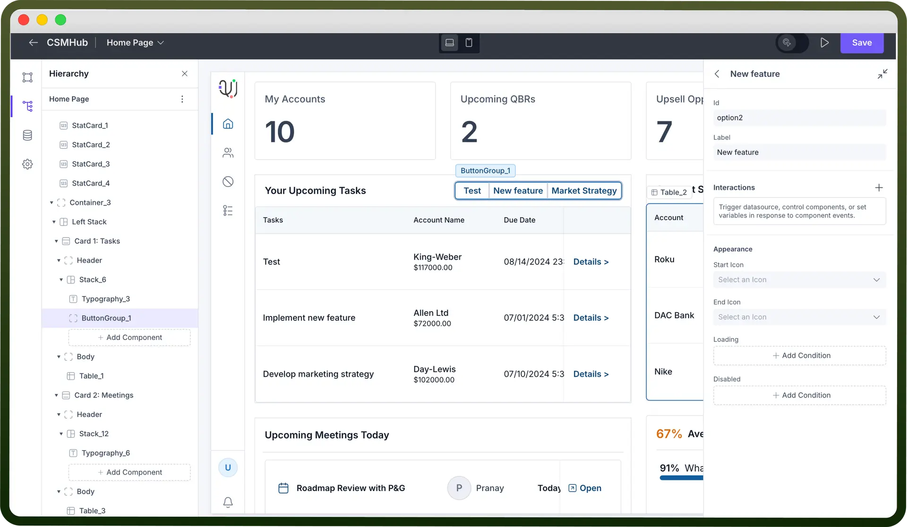

# Button group component

Source: https://www.unifyapps.com/docs/unify-applications/button-group
Section: applications

---

## Overview

The Button Group is an interactive component that lets users perform multiple actions through a set of buttons. It allows users to trigger different actions, navigate to other pages, redirect to URLs, and interact with various data sources within the application.

## Key Properties

Once the Button Group component is added to the canvas, you can configure it with the following key actions:

1. **Mode**: There are two modes for Button Groups—Manual and Mapped.
  - `Manual`**:** You can manually add buttons by adding slots under Options.
  - `Mapped`**:** Map an array of objects either manually or through a data source, where each object in the array will generate a separate button.
2. **Type:** There are 2 types of button group — Default and Dropdown.
  - `Default`**:** Buttons appear side-by-side in a row.
  - `Dropdown`**:** Buttons are displayed in a dropdown list when the Button Group is clicked.
3. **Label of a Button:** Enter the text for each button in the “`Label`” field. This is the text that will appear on each button.
4. **Interactions on Each Button:** Specify the interactions that should occur when a button is clicked. Click the “`+`” button under "`Interactions`" to add actions such as triggering a data source, navigating to another page, and more. **Note:** You can refer to interactions article to know more about setting up event handlers in your application.

  

## Add Loading State

The Loading State option lets you show that a process is in progress after the button is clicked.

This is helpful for actions that take time to complete, like submitting a form or fetching data from an API. The button will stay in this loading state until the action finishes.

## Conditional Display

Control the button group’s availability and visibility based on specific conditions in the "`Disabled`" and "`Visibility`" sections.

- **Disabled:** Use this option to make the button non-interactive based on certain conditions. For instance, disable the button if a required field is left empty. To set this, click “`Add Condition`” in the Disabled section and define the criteria. **Note:** You can refer to Visibility condition article for configuring Visibility conditions for any component in your application.

## Customizing the Appearance

Use the appearance settings to align the look and functionality of the button group component to fit your application’s needs.

- **Color:** Select a color from the “`Color`” dropdown. Available options include brand colors, neutral (black), or danger (red).
- **Size:** Pick the button size from options: `small` (sm), `medium` (md), or `large` (lg).
- **Variant:** Choose the button style from options like `Solid` (with background fill), `Outline` (border only), or `Ghost` (text-only).
- **Visibility:** Set visibility controls to display or hide the component based on conditions or user roles, enabling a more interactive experience.

  

## Defining Permissions

Each component supports visibility permissions based on the logged-in user’s permissions. This ensures only authorized users can see and interact with the component.

> **Note:** You can refer to Permissions article for the same.
