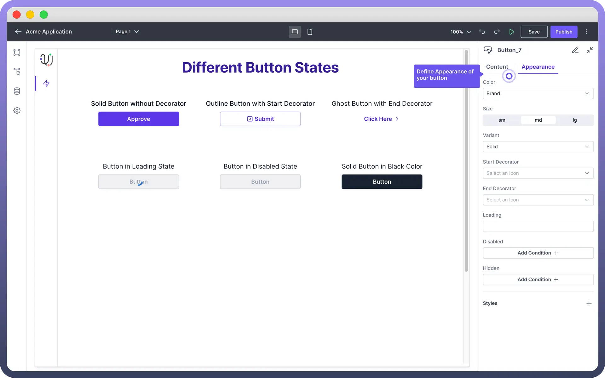

# Button

Source: https://www.unifyapps.com/docs/unify-applications/button
Section: applications

---

## Overview

Button is an interactive component that performs an **action** when pressed. 

The Button component allows users to **trigger** **actions**, **navigate pages**, and **interact** with various data sources within the application.

## Key Properties

Once the Button component is placed on the canvas, you can configure it with following key actions:

1. **Text**: Enter the label text for the button in the "`Text`" field. This is the text that will be displayed on the button.
2. **Interactions**: Define the interactions that should occur when the button is clicked. Click the "`+`" button under "`Interactions`" to add a new interaction, such as triggering a data source or navigating to another page & many more.

> **Note:** You can refer to the [Interactions](/docs/unify-applications/handle-interactions-in-interface) Article for the same.

## Appearance Customization

The Button component can be styled to match your application's design:

| **Property** | **Description** |
|---|---|
| `Color` | Select the color from the "**Color**" dropdown. Options include brand colors, neutral (black) or danger color (red). |
| `Size` | Choose the size of the button from the available options: **small** (sm), **medium** (md), or **large** (lg). |
| `Variant` | Select the button variant from options like **Solid** (with background fill), **Outline** (with outline border), or **Ghost** (with just text). |
| `Decorators` | Add icons to the start or end of the button text by selecting from the "**Start Decorator**" or "**End Decorator**" dropdowns. |
| `Width` | Define width, minimum width & maximum width under styles. To define width, you need to click on the “**+**” icon under the  "**Styles**" section. |

## Add Loading State

The Loading State option allows you to indicate that a process is occurring after the button is **clicked**.

This is useful for actions that take time to complete, such as submitting a form or fetching data from an API. The button will display this state until the action is completed.

## Conditional Display

Set conditions to disable or hide the button based on specific criteria by using the "`Add Condition`" buttons under the "`Disabled`" and "`Hidden`" sections.

1. **Disabled**: Use the Disabled condition to make the button **non-interactive** based on specific criteria. For example, you can disable the button if a required form field is empty. To set this, click "`Add Condition`" under the Disabled section and specify the condition.
2. **Hidden**: The Hidden condition allows you to **hide** the button entirely based on certain conditions. For example, you might want to hide the button if a specific field in your application has a particular value. To configure this, click "`Add Condition`" under the Hidden section and define the condition. **Note:** It is always recommended to implement **loading** and **disable** state to provide feedback to users. You can use data pills in your condition and write complex formulas like you would write in Excel.

## Define Permissions

Every component allows you to set visibility permissions based on the permissions granted to the logged-in user. This ensures that only **authorized users** can view or interact with the button.

> **Note:** You can refer to the [Permissions](/docs/unify-applications/button) article for the same.
